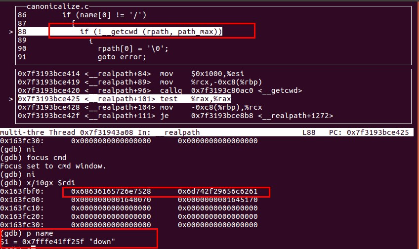
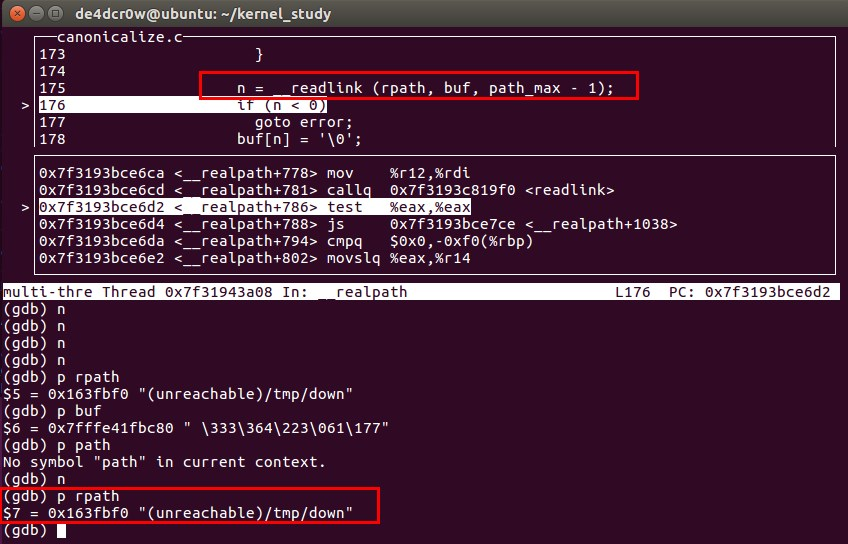
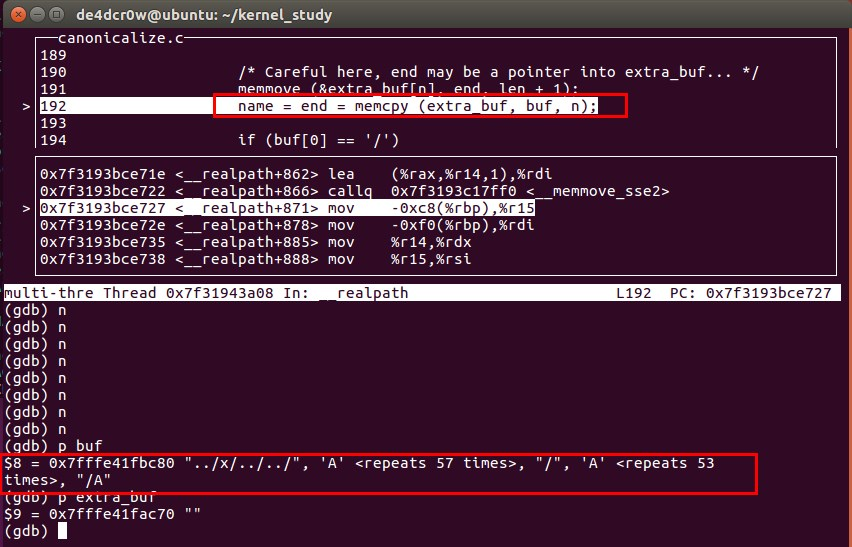
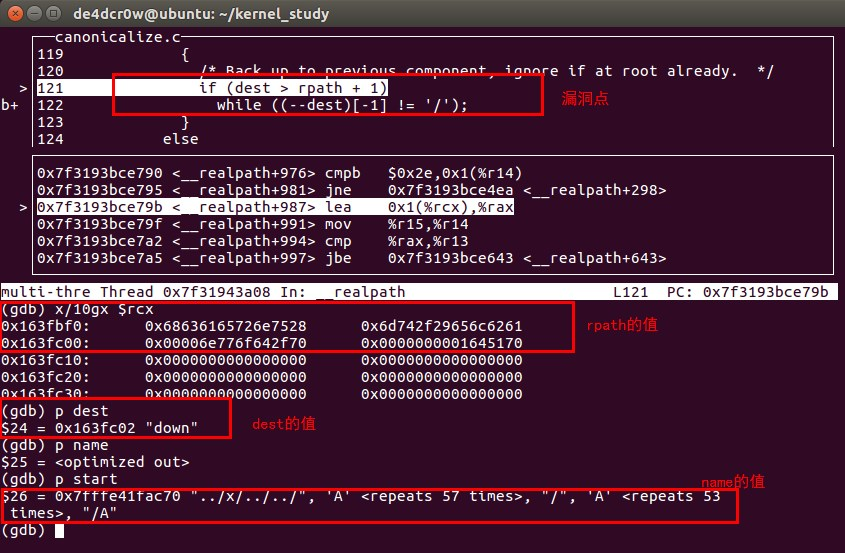
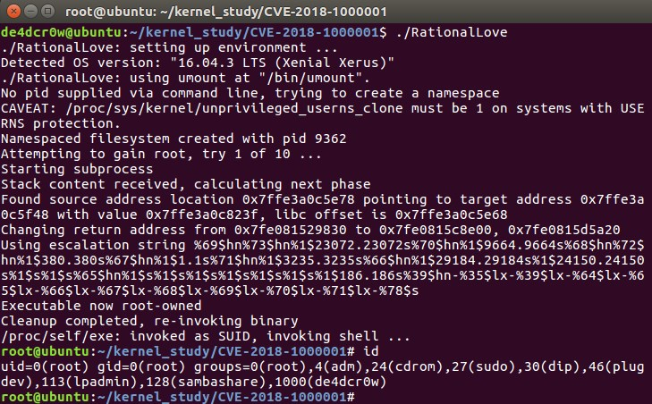
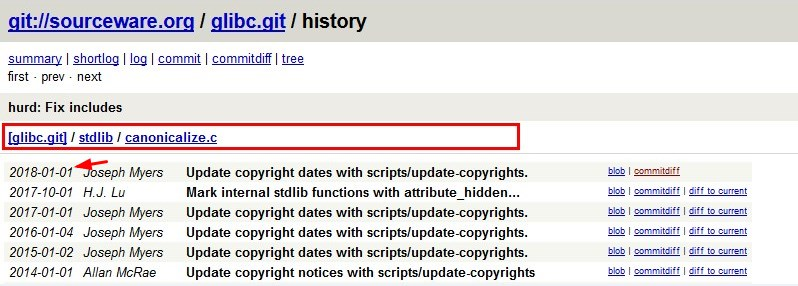
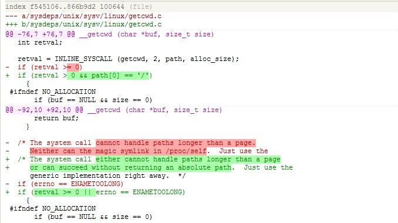

### 0x00漏洞背景

2018年1月11日由Jakub Wilk发现并公布该漏洞，CVE编号为CVE-2018- 1000001，利用该漏洞可以实现Linux系统本地提权。

CVE-2018-1000001是一个Libc Realpath缓冲区下溢漏洞，漏洞的产生是由于GNU C库没有正确处理getcwd()系统调用返回的相对路径，其他库也很可能受此影响。 在受影响的系统中，通过SUID binary可以获得root权限

<!-- more -->

### 0x01漏洞分析

该漏洞涉及到两个方面：（1）kernel的getcwd系统调用（2）glibc的realpath函数  

(1)内核方面：  

getcwd()会返回当前工作目录的绝对路径，如果当前目录不属于当前进程的根目录（例如：该进程使用chroot设置了一个新的文件系统根目录，但是没有将当前目录的根目录替换成新的）。从linux 2.6.36开始，getcwd会返回“(unreachable)”。通过改变当前目录到另一个挂载的用户空间，普通用户可以完成上述的行为。所以当处理不可信来源的路径时，应该检查返回的路径是否以"/"或"("开头，避免返回一个不可达地址，被认为是相对地址。

getcwd会返回“(unreachable)”的实现代码：  

https://github.com/torvalds/linux/commit/8df9d1a4142311c084ffeeacb67cd34d190eff74

所以getcwd()返回值不应该不含"."、".."或符号链接

（2）glibc方面

realpath函数原型：char *realpath(const char *path, char *resolved_path)  
头文件：#include <stdlib.h>  

返回值： 成功则返回指向resolved_path的指针，失败返回NULL，错误代码存于errno  

realpath是用来将参数path所指的相对路径转换成绝对路径，然后存于参数resolved_path所指的字符串数组或指针中的一个函数。

glibc 仍然认为getcwd()返回的是绝对地址。

漏洞发生处：glibc stdlib/canonicalize.c 的__realpath函数：

如果解析的是一个相对路径，不是以'/'开头的路径时，就会调用getcwd系统调用

```
 if (name[0] != '/')
    {
      if (!__getcwd (rpath, path_max))
	{
	  rpath[0] = '\0';
	  goto error;
	}
      dest = __rawmemchr (rpath, '\0');
    }
  else
    {
      rpath[0] = '/';
      dest = rpath + 1;
    }
```
如果getcwd此时返回的是"(unreachable)"，则在接下来在解析路径时，发现路径开头并不包含'/'，会在while循环中不断读取dest之前的地址，产生缓冲区下溢。
```
  else if (end - start == 2 && start[0] == '.' && start[1] == '.')
	{
	  /* Back up to previous component, ignore if at root already.  */
	  if (dest > rpath + 1)
	    while ((--dest)[-1] != '/');
	}

```

之后操作的dest地址就是溢出的地址。

### 0x02 调试过程

调试前需要将poll的等待时间改成-1，设置跟踪子进程，就能调试到漏洞触发点。

exp中是通过调用umount来执行realpath函数，触发漏洞。

当处理"down"路径时，会调用__getcwd函数，此时返回"(unreachable)"



通过readlink获取新的rpath：



将name的值变成预先设好的字符串，包含".."



执行到漏洞点，此时rpath为"(unreachable)/tmp/down"，dest为"down"，name为"0x7fffe41fac70 "../x/../../", 'A' <repeats 57 times>, "/", 'A' <repeats 53
 times>, "/A"
"



根据name来处理路径，当dest处理到(unreachable)时，开头没有'/'，while会一直循环，直到找到'/'为止。

漏洞攻击效果图：



### 0x03 补丁分析

halfdog网站提供的补丁：

```
************************************************************
--- stdlib/canonicalize.c       2018-01-05 07:28:38.000000000 +0000
+++ stdlib/canonicalize.c       2018-01-05 14:06:22.000000000 +0000
@@ -91,6 +91,11 @@
          goto error;
        }
       dest = __rawmemchr (rpath, '\0');
+/* If path is empty, kernel failed in some ugly way. Realpath
+has no error code for that, so die here. Otherwise search later
+on would cause an underrun when getcwd() returns an empty string.
+Thanks Willy Tarreau for pointing that out. */
+      assert (dest != rpath);
     }
   else
     {
@@ -118,8 +123,17 @@
       else if (end - start == 2 && start[0] == '.' && start[1] == '.')
        {
          /* Back up to previous component, ignore if at root already.  */
-         if (dest > rpath + 1)
-           while ((--dest)[-1] != '/');
+         dest--;
+         while ((dest != rpath) && (*--dest != '/'));
+         if ((dest == rpath) && (*dest != '/') {
+           /* Return EACCES to stay compliant to current documentation:
+           "Read or search permission was denied for a component of the
+           path prefix." Unreachable root directories should not be
+           accessed, see https://www.halfdog.net/Security/2017/LibcRealpathBufferUnderflow/ */
+           __set_errno (EACCES);
+           goto error;
+         }
+         dest++;
        }
       else
        {
************************************************************
```

补丁对产生溢出的地方加了一个判断，一旦发现路径不是以'/'开头，便产生报错。

但是glibc官方并没有采用上述的补丁：



https://sourceware.org/git/gitweb.cgi?p=glibc.git;h=52a713fdd0a30e1bd79818e2e3c4ab44ddca1a94



思想是一样的，只是将对getcwd返回的内容的判断移到了函数内部。

### 0x05参考链接

https://mp.weixin.qq.com/s/x69eDc8ke0wcUcwRdhsk4Q

https://www.halfdog.net/Security/2017/LibcRealpathBufferUnderflow/

https://cert.360.cn/warning/detail?id=f28c70a8e4905ec0c912f5cfa02ad198

exp地址：https://github.com/5H311-1NJ3C706/local-root-exploits/tree/master/linux/CVE-2018-1000001

http://www.freebuf.com/column/162202.html