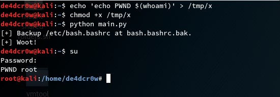
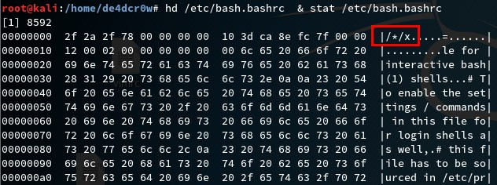
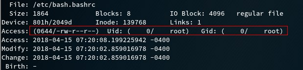

<!-- more -->

### 漏洞背景

Holey Beep网站提供了补丁，但是beep在github上的项目并没有commit补丁，最新提交显示是2013年的，该项目应该已经不再维护了。

#### 漏洞影响面

笔者试了几个发行版，发现都没有默认装beep程序，估计该漏洞影响面并不大。

关于网上检测漏洞的命令：

curl https://holeybeep.ninja/am_i_vulnerable.sh | sudo bash

```
#!/bin/sh
modprobe pcspkr
beep -l 1000 -r 10 -f 4400

//pcspkr是驱动系统喇叭的模块

```
网上下载的am_i_vulnerable.sh中-f参数指定的数值过大无法运行成功，需要改小。

其实该检测命令只是打开了系统扬声器，然后运行beep程序，如果听到蜂鸣声就说明安装了beep，就有可能存在漏洞。

关于打上补丁更严重的说法：

http://www.sohu.com/a/227849824_468696

笔者认为这完全是两个漏洞，beep存在的漏洞编号为CVE-2018-0492，而补丁会受到GNU patch代码执行漏洞(CVE-2018-1000156)的影响。但并不是beep补丁引入的漏洞，而是GNU patch本身存在漏洞。

接下来对漏洞CVE-2018-0492进行简要分析：

### 漏洞分析

do_beep函数：

```
void do_beep(int freq) {
  int period = (freq != 0 ? (int)(CLOCK_TICK_RATE/freq) : freq);

  if(console_type == BEEP_TYPE_CONSOLE) {
    if(ioctl(console_fd, KIOCSOUND, period) < 0) {
      putchar('\a');  
      perror("ioctl");
    }
  } else {
     /* BEEP_TYPE_EVDEV */
     struct input_event e;

     e.type = EV_SND;
     e.code = SND_TONE;
     e.value = freq;

     if(write(console_fd, &e, sizeof(struct input_event)) < 0) {
       putchar('\a'); /* See above */
       perror("write");
     }
  }
}
```

信号处理部分：

```
/* If we get interrupted, it would be nice to not leave the speaker beeping in
   perpetuity. */
void handle_signal(int signum) {

  if(console_device)
    free(console_device);

  switch(signum) {
  case SIGINT:
  case SIGTERM:
    if(console_fd >= 0) {
      /* Kill the sound, quit gracefully */
      do_beep(0);
      close(console_fd);
      exit(signum);
    } else {
      /* Just quit gracefully */
      exit(signum);
    }
  }
}
```

漏洞利用思路：
利用do_beep()中的write函数，则console_type必须为BEEP_TYPE_EVDEV，才能进入else部分，调用write。
console_type是在play_beep()中被设置,根据ioctl(console_fd, EVIOCGSND(0)的返回值决定。

```
void play_beep(beep_parms_t parms) {

  /* ... */

  /* try to snag the console */
  if(console_device)
    console_fd = open(console_device, O_WRONLY);
  else
    if((console_fd = open("/dev/tty0", O_WRONLY)) == -1)
      console_fd = open("/dev/vc/0", O_WRONLY);

  if(console_fd == -1) {
    /* ... */
  }

  if (ioctl(console_fd, EVIOCGSND(0)) != -1)
    console_type = BEEP_TYPE_EVDEV;
  else
    console_type = BEEP_TYPE_CONSOLE;

  /* Beep */
  for (i = 0; i < parms.reps; i++) {                    /* start beep */
    do_beep(parms.freq);
    usleep(1000*parms.length);                          /* wait...    */
    do_beep(0);                                         /* stop beep  */
    if(parms.end_delay || (i+1 < parms.reps))
       usleep(1000*parms.delay);                        /* wait...    */
  }                                                     /* repeat.    */

  close(console_fd);
}
```

每次调用play_beep()，如果ioctl调用成功，则console_fd和console_type的值将会保存上一次的，因为进入play_beep()后没有进行初始化。

这就意味着下次调用play_beep()，运行下面这段代码时：

```
 if(console_fd == -1) {
    fprintf(stderr, "Could not open %s for writing\n",
      console_device != NULL ? console_device : "/dev/tty0 or /dev/vc/0");
    printf("\a");  /* Output the only beep we can, in an effort to fall back on usefulness */
    perror("open");
    exit(1);
  }
```

console_fd是新的值，而console_type还是上一次的值。这个间隔就可以利用条件竞争，通过一直产生的信号处理,触发do_beep()。在这个间隔里，console_type为BEEP_TYPE_EVDEV，而console_fd为目标文件，就可以对任意文件进行写操作。

但是由于一启动beep程序，console_device就不能改变了，我们可以一开始指向有效的设备，使console_type为BEEP_TYPE_EVDEV，绕过验证，之后再通过软链接来指向目标文件，使得console_fd为目标文件，就可以对目标文件进行写入。

接下来看看write函数会写入什么内容？

```
if(write(console_fd, &e, sizeof(struct input_event)) < 0) {
  putchar('\a'); /* See above */
  perror("write");
}
```

input_event定义在linux/input.h，如下：

```
struct input_event {
        struct timeval time;
        __u16 type;
        __u16 code;
        __s32 value;
};

struct timeval {
        __kernel_time_t         tv_sec;         /* seconds */
        __kernel_suseconds_t    tv_usec;        /* microseconds */
};

// On my system, sizeof(struct timeval) is 16.

```
写入的第一个参数是time，表示要蜂鸣多长时间，可以通过-l参数来指定，-l后面可以跟一个int类型（4个字节）的数据，我们就可以在任意文件写入4个字节。例如在/etc/bash.bashrc写入“/*/x”，则在切换到root用户时，会启动bash，读取/etc/bash.bashrc配置文件，执行/*/目录下第一个x文件，由于登录的是root用户， 所以运行/tmp/x文件里的命令也是root权限，这样我们就获得登录用户的权限了。如果是root用户，就达到权限提升的目的。

### 运行效果







可以/etc/bash.bashrc只有root用户才有写权限，但是在通过该漏洞可以在/etc/bash.bashrc中写入“/*/x”字符串，从而在切换到root用户时，运行/tmp/x。

### 补丁分析

补丁下载地址： https://holeybeep.ninja/beep.patch

补丁如下：

```
diff --git a/beep.c b/beep.c
index 7da2e70..4323d31 100644
--- a/beep.c
+++ b/beep.c
@@ -109,6 +109,7 @@ void do_beep(int freq) {
      /* BEEP_TYPE_EVDEV */
      struct input_event e;
 
+     memset(&e, 0, sizeof(e));
      e.type = EV_SND;
      e.code = SND_TONE;
      e.value = freq;
@@ -124,10 +125,6 @@ void do_beep(int freq) {
 /* If we get interrupted, it would be nice to not leave the speaker beeping in
    perpetuity. */
 void handle_signal(int signum) {
-
-  if(console_device)
-    free(console_device);
-
   switch(signum) {
   case SIGINT:
   case SIGTERM:
@@ -257,7 +254,7 @@ void parse_command_line(int argc, char **argv, beep_parms_t *result) {
       result->verbose = 1;
       break;
     case 'e' : /* also --device */
-      console_device = strdup(optarg);
+      console_device = optarg;
       break;
     case 'h' : /* notice that this is also --help */
     default :
@@ -276,26 +273,6 @@ void play_beep(beep_parms_t parms) {
 	"%d delay after) @ %.2f Hz\n",
 	parms.reps, parms.length, parms.delay, parms.end_delay, parms.freq);
 
-  /* try to snag the console */
-  if(console_device)
-    console_fd = open(console_device, O_WRONLY);
-  else
-    if((console_fd = open("/dev/tty0", O_WRONLY)) == -1)
-      console_fd = open("/dev/vc/0", O_WRONLY);
-
-  if(console_fd == -1) {
-    fprintf(stderr, "Could not open %s for writing\n",
-      console_device != NULL ? console_device : "/dev/tty0 or /dev/vc/0");
-    printf("\a");  /* Output the only beep we can, in an effort to fall back on usefulness */
-    perror("open");
-    exit(1);
-  }
-
-  if (ioctl(console_fd, EVIOCGSND(0)) != -1)
-    console_type = BEEP_TYPE_EVDEV;
-  else
-    console_type = BEEP_TYPE_CONSOLE;
-  
   /* Beep */
   for (i = 0; i < parms.reps; i++) {                    /* start beep */
     do_beep(parms.freq);
@@ -305,8 +282,6 @@ void play_beep(beep_parms_t parms) {
     if(parms.end_delay || (i+1 < parms.reps))
        usleep(1000*parms.delay);                        /* wait...    */
   }                                                     /* repeat.    */
-
-  close(console_fd);
 }
 
 
@@ -328,6 +303,26 @@ int main(int argc, char **argv) {
   signal(SIGTERM, handle_signal);
   parse_command_line(argc, argv, parms);
 
+  /* try to snag the console */
+  if(console_device)
+    console_fd = open(console_device, O_WRONLY);
+  else
+    if((console_fd = open("/dev/tty0", O_WRONLY)) == -1)
+      console_fd = open("/dev/vc/0", O_WRONLY);
+
+  if(console_fd == -1) {
+    fprintf(stderr, "Could not open %s for writing\n",
+      console_device != NULL ? console_device : "/dev/tty0 or /dev/vc/0");
+    printf("\a");  /* Output the only beep we can, in an effort to fall back on usefulness */
+    perror("open");
+    exit(1);
+  }
+
+  if (ioctl(console_fd, EVIOCGSND(0)) != -1)
+    console_type = BEEP_TYPE_EVDEV;
+  else
+    console_type = BEEP_TYPE_CONSOLE;
+
   /* this outermost while loop handles the possibility that -n/--new has been
      used, i.e. that we have multiple beeps specified. Each iteration will
      play, then free() one parms instance. */
@@ -365,8 +360,8 @@ int main(int argc, char **argv) {
     parms = next;
   }
 
-  if(console_device)
-    free(console_device);
+  close(console_fd);
+  console_fd = -1;
 
   return EXIT_SUCCESS;
 }
```

补丁在do_beep()入口处初始化了input_event结构，则要改写的内容也被清空了，无法达到攻击的效果。

### 参考链接

https://sigint.sh/#/holeybeep

https://github.com/johnath/beep/blob/master/beep.c

https://gist.github.com/Arignir/0b9d45c56551af39969368396e27abe8

https://bugs.debian.org/cgi-bin/bugreport.cgi?bug=894667#19

http://seclists.org/oss-sec/2018/q2/18

https://cve.mitre.org/cgi-bin/cvename.cgi?name=CVE-2018-1000156

https://gitlab.com/Creased/cve-2018-0492 （exp）