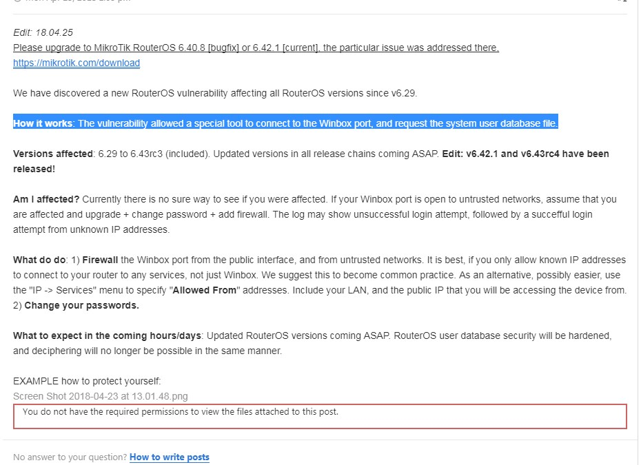
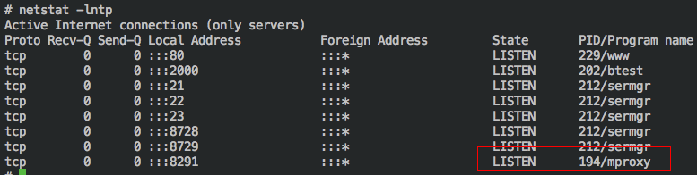
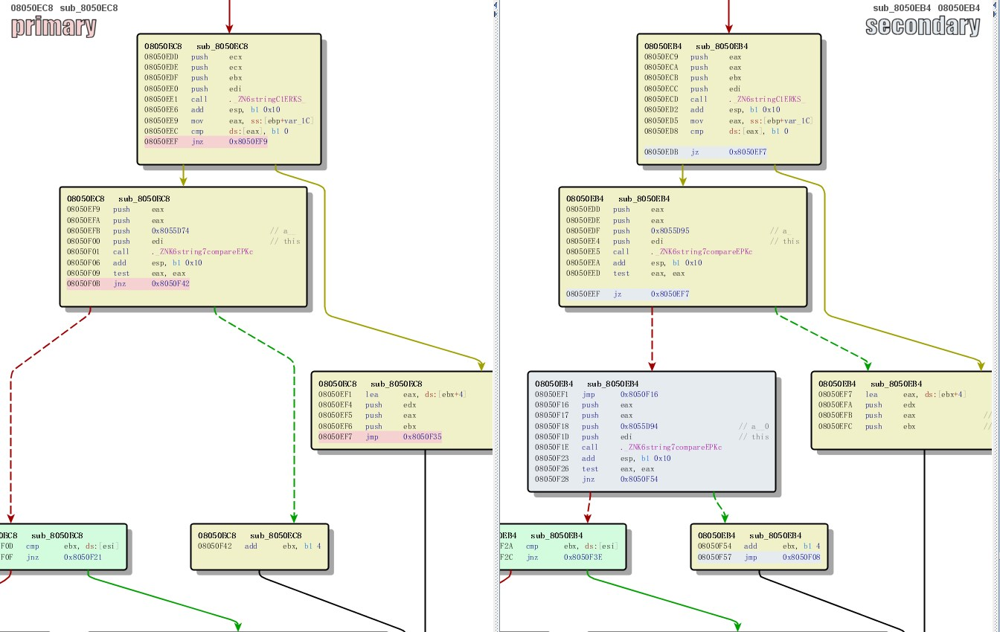
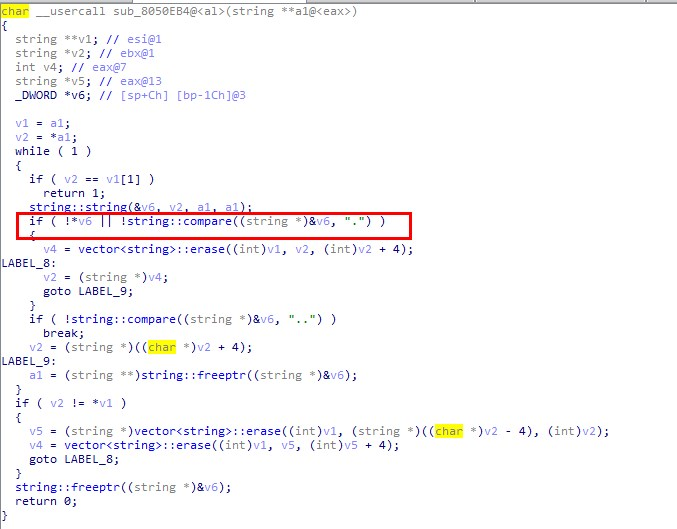

<!-- more -->

### 漏洞影响

影响版本：v6.29~v6.43rc3

更新版本：v6.42.1 和 v6.43rc4

论坛说明：



### 环境搭建

1. 下载RouterOS iso镜像，在虚拟机中安装，硬盘格式要选择IDE格式，按 a选择所有 ，然后按 i 进行安装，然后一直输入 y 确定即可。用户名为admin，密码为空

2. 进入后配置ip

```
ip
address
add address=192.168.148.*/24 interface=ether1 
```

3. 通过参考链接2中的越狱工具连接RouterOS的shell，但是只能调6.41版本以下的，我调的是6.40.5版本。之后通过参考链接1中方法，通过试用ubuntu镜像，挂载RouterOS的磁盘分区：

```
mkdir /tmp/d2
sudo mount /dev/sda2 /tmp/d2
```

将gdbserver传入RouterOS 中

4. 再用gdb或ida连接就可以了

### 官方更新说明

```
What's new in 6.42.1 (2018-Apr-23 10:46):

!) winbox - fixed vulnerability that allowed to gain access to an unsecured router;
*) bridge - fixed hardware offloading for MMIPS and PPC devices;
*) bridge - fixed LLDP packet receiving;
*) crs3xx - fixed failing connections through bonding in bridge;
*) ike2 - use "policy-template-group" parameter when picking proposal as initiator;
*) led - added "dark-mode" functionality for hAP ac and hAP ac^2 devices;
*) led - improved w60g alignment trigger;
*) lte - allow to send "at-chat" command over disabled LTE interface;
*) routerboard - fixed "mode-button" support on hAP lite r2 devices;
*) w60g - allow to manually set "tx-sector" value;
*) w60g - fixed incorrect RSSI readings;
*) w60g - show phy rate on "/interface w60g monitor" (CLI only);
*) winbox - fixed bridge port MAC learning parameter values;
*) winbox - show "Switch" menu on cAP ac devices;
*) winbox - show correct "Switch" menus on CRS328-24P-4S+;
*) wireless - improved compatibility with BCM chipset devices;
```

### 补丁分析

#### 前期准备

1. 提取RouterOS系统

下载https://download2.mikrotik.com/routeros/6.40.5/routeros-x86-6.40.5.npk

用7z打开，可以直接解压缩出来。

打过补丁的版本：  

https://download2.mikrotik.com/routeros/6.42.1/routeros-x86-6.42.1.npk

2. diff -r rootfs/ ../fmk_7/rootfs > diff.txt

比较两个文件下所有不同的文件 

#### 补丁比较

8291端口对应winbox的bin 文件：



通过bindiff 比较补丁前后两个版本的mproxy文件，只找到下面一处不同。补丁增加了对'.'的判断：





这里只是找到疑似的漏洞点，具体分析不动了。。。。

往8291端口发送数据根本不触发那里的函数

### 参考链接

搭建环境：https://xz.aliyun.com/t/1907

RouterOS越狱工具：https://github.com/0ki/mikrotik-tools

Mikrotik官网：https://mikrotik.com/

论坛讨论：https://forum.mikrotik.com/viewtopic.php?f=21&t=133533

http://blog.seekintoo.com/chimay-red.html

之前的老漏洞：http://133tsec.com/2012/04/0day-ddos-mikrotik-server-side-ddos-attack/

gdbserver下载地址：https://pan.baidu.com/s/1ylmVq_SVpYAhuMgB1iGpag

静态编译后的busybox下载地址：https://pan.baidu.com/s/1YPp13WZKY5k2-MQ6g8mVSA

diff 用法：http://man.linuxde.net/diff

样本相关信息：https://twitter.com/craiu/status/989052729480876032