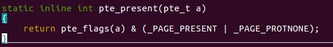
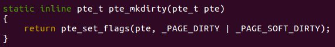
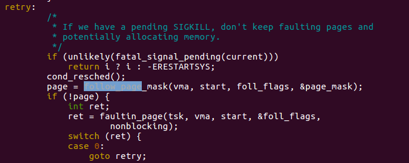
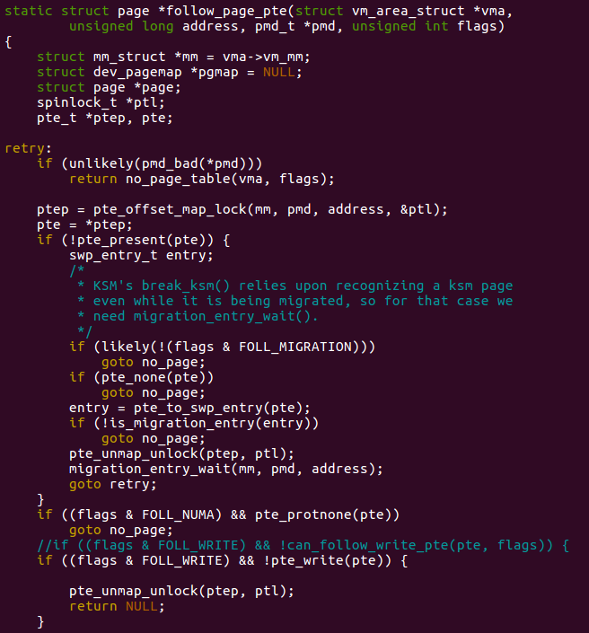
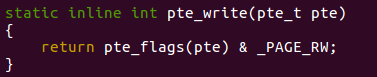
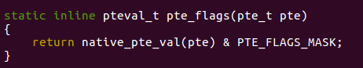
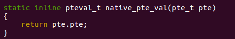
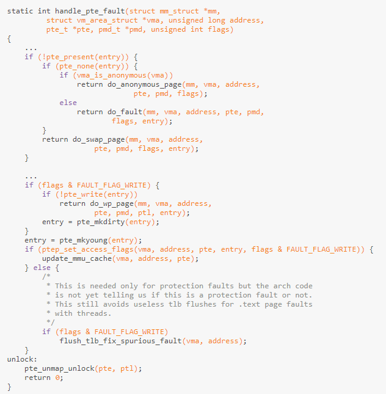
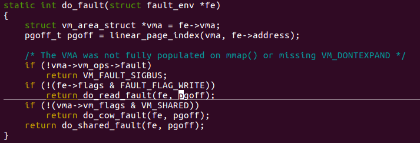
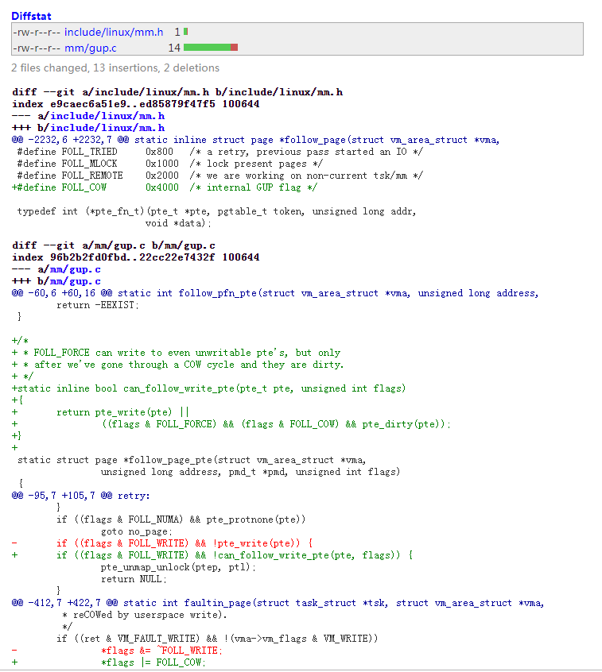

---

layout: post

title: 'CVE-2016-5195 分析'

date: '2020-07-20'

header-img: "img/home-bg.jpg"

tags:
     - kernel cve analyze  
author: 'De4dCr0w'

---

<!-- more -->

### 前言

(Linux kernel>2.6.22 (released in 2007))

#### 写时拷贝

COW(copy on write)技术即写时拷贝技术是linux程序中用的一个技术，在程序fork进程时，内核只为子进程创建虚拟空间结构，虚拟空间拷贝父进程的对应段内容，也就是说子进程对应段和父进程指向同一块物理内存，直到父进程/子进程中有改变段内容的操作再为子进程相应段分配物理空间(如exec)。

基本原理是将内存页标为只读，一旦父子进程要改变内存页内容，就会触发页异常中断，将触发的异常的内存页复制一份(其余页还是同父进程共享)。

dirty bit，这个标志位是Linux中的概念，当处理器写入或修改内存的页，该页就被标记为脏页。这个标志的作用是提醒CPU内存的内容已经被修改了但是还没有被写入到磁盘保存。

漏洞涉及的相关函数和全局变量：

```
FAULT_FLAG_WRITE，表示这是写异常
#define FAULT_FLAG_WRITE	0x01	/* Fault was a write access */
FOLL_WRITE，表示在寻页的时候需不需要页具有写权限
#define FOLL_WRITE	0x01	/* check pte is writable */
VM_WRITE，表示该页可不可写
#define VM_WRITE	0x00000002
```





__get_user_page中的retry:
 
 


 
flags变量是一开始传入的FOLL_FORCE，代表强制读写， pte_write(pte)检测页表里的可写位
因为此块内存是只读映射，所以pte_write返回false。进入if ((flags & FOLL_WRITE) && !pte_write(pte))  条件分支。
 
 


 





 
 
漏洞成因在于：进程的写请求标志移除后，要对COW进行写入时，由于条件竞争，调用madvise，清空页表项，触发pagefault，此时可以対页进行写入，所以不再进行COW操作，对原文件进行写入。

#### 代码流程梳理

第一次会检测是否获得page，如果page为空，就会触发页错误，调用fault_page，第一次是通不过if(!pte_present(pte))条件，因为页表不存在，进入faultin_page，进行了COW操作:

```
__get_user_pages
follow_page_mask
follow_page_pte 
	goto no_page  <- if(!pte_present(pte))
faultin_page <- if(!pte_present(pte))
  handle_mm_fault
    __handle_mm_fault
      handle_pte_fault 
          do_fault  <- pte is not present  if (!pte_present(entry)) { if (pte_none(entry)) {
      		do_cow_fault  <- FAULT_FLAG_WRITE=1， if(!(vma->vm_flags&VM_SHARED))
        		alloc_set_pte
          			maybe_mkwrite(pte_mkdirty(entry), vma) <- mark the page dirty
   /*but keep it RO , VMA的vm_flags属性不具有可写属性，因此这里不会设置pte_entry为可写，只是设置为可读和dirty*/

```

第二次触发faultin_page，此时页表不为空，FOLL_WRITE为1，pte不可写，返回NULL，再次触发一个pagefault，faultin_page会再次调用handle_mm_fault进行处理：

```
__get_user_pages(retry)
-> follow_page_mask
 follow_page_pte  <- if(flags&FOLL_WRITE) && !pte_write(pte)
	return NULL;
faultin_page <- if(flags&FOLL_WRITE) && !pte_write(pte) ，此时FOLL_WRITE为1 
handle_mm_fault
    __handle_mm_fault
      handle_pte_fault
		do_wp_page  <- if (flags & FAULT_FLAG_WRITE) {if (!pte_write(entry))
			PageAnon() <- this is CoWed page already
        	reuse_swap_page <- page is exclusively ours
        	wp_page_reuse
          		maybe_mkwrite <- dirty but RO again
          		ret = VM_FAULT_WRITE
一直return 到faultin_page
if((ret&VM_FAULT_WRITE)&&!(vma->vm_flags&VM_WRITE))                                                                                       
*flags &= ~FOLL_WRITE;       
	return 0; 
```

此时ret= VM_FAULT_WRITE， VM_WRITE为0（表示该页不可写），满足条件，所以flags中的FOLL_WRITE被置0，即第一个bit被置0，返回到follow_page_pte。

第三次:

```
__get_user_pages(retry)-> cond_resched -> different thread will now unmap via madvise
->follow_page_mask
 follow_page_pte 
	goto no_page; <-!pte_present(pte) & pte_none(pte)
faultin_page <-!pte_present(pte) & pte_none(pte)
	handle_mm_fault
    __handle_mm_fault
      handle_pte_fault
		do_fault  <- pte is not present  if (!pte_present(entry)) { if (pte_none(entry)) {
			do_read_fault <- if(!(fe->flags)&FAULT_FLAG_WRITE)
(this is a read fault and we will get pagecache page!)
```
					
因为FOLL_WRITE被置为0，在寻页的时候不再需要页具有写权限，但是madvise(Mappedmem,DONT_NEED)系统调用，通知内核Mappedmem在接下来不会被使用。内核会将Mappedmem所在页的页表项置为空，再次导致了pagefault。此时不再进入COW流程，所以此时没有写时复制操作，直接写入原文件。正常只是在映射的内存上进行写操作，不会影响原文件。

如果接下来get_user_pages第四次调用follow_page_mask进行寻页的话，会成功返回对应的页表项，接下来的写入操作会被同步到只读的文件中。从而造成了越权写。

```
unsigned int foll_flags = gup_flags;
page = follow_page_mask(vma, start, foll_flags, &page_mask);
ret = faultin_page(tsk, vma, start, &foll_flags, nonblocking);
faultin_page：
   if (*flags & FOLL_WRITE)
        fault_flags |= FAULT_FLAG_WRITE;
ret = handle_mm_fault(vma, address, fault_flags);//处理缺页的函数
static int __handle_mm_fault(struct vm_area_struct *vma, unsigned long address,
        unsigned int flags)
{
    struct fault_env fe = {
        .vma = vma,
        .address = address,
        .flags = flags,
    };

```

从上面可以看出if(!(fe->flags)&FAULT_FLAG_WRITE)中的flags值和*flags &= ~FOLL_WRITE;中的相同，所以flag的第一个bit（FOLL_WRITE）为0，导致进入do_read_fault，而不是do_cow_fault。


补丁：
 
 

（1）补丁中增加了FOLL_COW标志用以标识所映射页面是否已进行过COW，即不用移除写请求标志来标识COW，而是或上新的标识位，这样进程的写请求标志属性依然存在，避免了后面错误地转换成读请求处理。

（2）在判断进程请求标识与页面属性是否匹配时（决定是否进入新的缺页异常），会综合考虑FOLL_FORCE标志位与COW是否匹配，即只有COW后的页面才能强行读写。（保证COW过的页面不会再进入异常，可以正常对COW页面进行写）

### 参考链接

分析文章：

https://xz.aliyun.com/t/7561 有完整的相关函数代码

https://github.com/dirtycow/dirtycow.github.io/wiki/VulnerabilityDetails 
https://www.youtube.com/watch?v=kEsshExn7aE

Exp代码：https://github.com/FireFart/dirtycow/blob/master/dirty.c 测试可用

https://github.com/gbonacini/CVE-2016-5195/blob/master/dcow.cpp 可稳定提权

漏洞补丁：

https://git.kernel.org/pub/scm/linux/kernel/git/torvalds/linux.git/commit/?id=19be0eaffa3ac7d8eb6784ad9bdbc7d67ed8e619

补丁commit：19be0eaffa3ac7d8eb6784ad9bdbc7d67ed8e619

