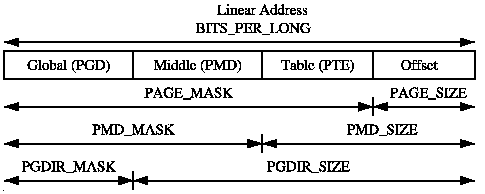
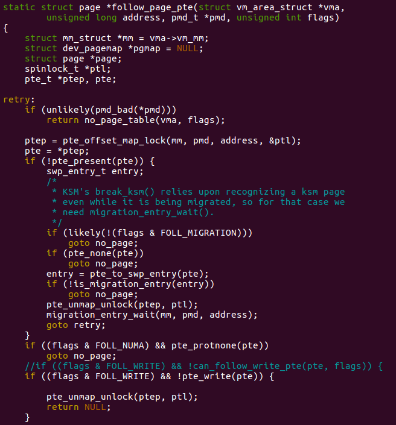
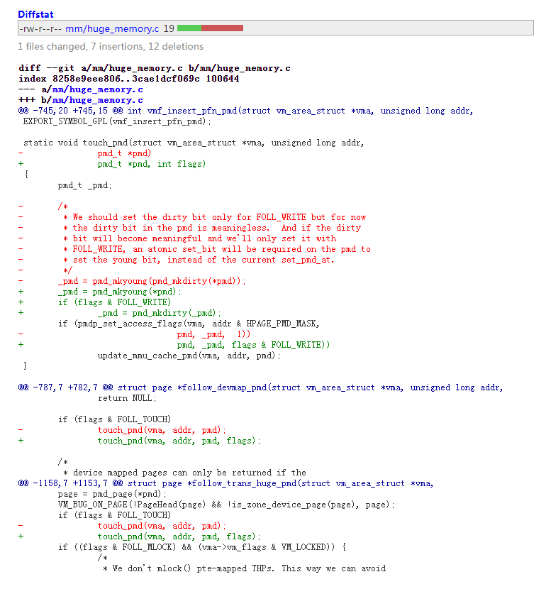

---

layout: post

title: 'CVE-2017-1000405-Huge_Dirtycow'

date: '2020-07-20'

header-img: "img/home-bg.jpg"

tags:
     - kernel cve analyze  
author: 'De4dCr0w'

---

<!-- more -->


## 前言

### 搭建调试环境

CONFIG_TRANSPARENT_HUGEPAGE

检查/sys/kernel/mm/transparent_hugepage/enabled 是否开启


### 透明大内存页(THP:Transparent Huge Pages)

通常linux的内存页为4kb大小，为了满足系统和程序的特殊需求，linux允许2M和1G大内存页。常规的虚拟地址翻译下图所示，PGD，PMD均作为页表目录，当启用大内存页时，PMD不再表示页表目录而是和PTE合并共同代表页表项(PTE)。



THP内存页主要被用于匿名anonymous,shmem,tmpfs三种内存映射，即：

（1）anonymous:通过mmap映射到内存是一个匿名文件及不对应任何实际磁盘文件。

（2）shmem:共享内存。

（3）tmpfs:是一种虚拟文件系统，存在于内存，因此访问速度会很快，当使用tmpfs类型挂载文件系统释放，它会自动创建

开启THG：

> echo always > /sys/kernel/mm/transparent_hugepage/enabled


### 零页(zero page)

当程序申请匿名内存页时，linux系统为了节省时间和空间并不会真的申请一块物理内存，而是将所有申请统一映射到一块预先申请好值为零的物理内存页，当程序发生写入操作时，才会真正申请内存页，这一块预先申请好值为零的页即为零页(zero page)，且零页是只读的。


## 漏洞分析

针对CVE-2016-5195漏洞，对THP的补丁如下：

```
@@ -783,6 +783,12 @@ struct page *follow_devmap_pmd(struct vm_area_struct *vma, unsigned long addr,
  
  	assert_spin_locked(pmd_lockptr(mm, pmd));
  
 +	/*
 +	 * When we COW a devmap PMD entry, we split it into PTEs, so we should
 +	 * not be in this function with `flags & FOLL_COW` set.
 +	 */
 +	WARN_ONCE(flags & FOLL_COW, "mm: In follow_devmap_pmd with FOLL_COW set");
 +
  	if (flags & FOLL_WRITE && !pmd_write(*pmd))
  		return NULL;
  
 @@ -1128,6 +1134,16 @@ int do_huge_pmd_wp_page(struct vm_fault *vmf, pmd_t orig_pmd)
  	return ret;
  }
  
 +/*
 + * FOLL_FORCE can write to even unwritable pmd's, but only
 + * after we've gone through a COW cycle and they are dirty.
 + */
 +static inline bool can_follow_write_pmd(pmd_t pmd, unsigned int flags)
 +{
 +	return pmd_write(pmd) ||
 +	       ((flags & FOLL_FORCE) && (flags & FOLL_COW) && pmd_dirty(pmd));
 +}
 +
  struct page *follow_trans_huge_pmd(struct vm_area_struct *vma,
  				   unsigned long addr,
  				   pmd_t *pmd,
 @@ -1138,7 +1154,7 @@ struct page *follow_trans_huge_pmd(struct vm_area_struct *vma,
  
  	assert_spin_locked(pmd_lockptr(mm, pmd));
  
 -	if (flags & FOLL_WRITE && !pmd_write(*pmd))
 +	if (flags & FOLL_WRITE && !can_follow_write_pmd(*pmd, flags))
  		goto out;
```
补丁链接：https://github.com/torvalds/linux/commit/8310d48b125d19fcd9521d83b8293e63eb1646aa

和普通的内存页修补相同。按照补丁以及源代码的流程分析，只要满足(flag& FOLL_FORCE) && (flags & FOLL_COW) && pmd_dirty(pmd) ， 并且满足之前pte_present(pte)判断（即页面存在），就可以对页面进行写操作。

```
__get_user_pages(retry)
-> follow_page_mask
 	-> follow_page_pte 

```



漏洞成因在于：

一般情况下，要页面标记为dirty是要经过COW过程，之后得到写权限操作的是COW页面，但获取可读THP内存页时，可以获得一个标记为dirty的页面，并且是未COW的，造成操作的是原页面。调用链为:

```
follow_page_mask -> page = follow_trans_huge_pmd(vma, address, pmd, flags);->touch_pmd->pmd_mkdirty

```
```
1119 struct page *follow_trans_huge_pmd(struct vm_area_struct *vma,
1120                    unsigned long addr,
1121                    pmd_t *pmd,
1122                    unsigned int flags)
1123 {
1124     struct mm_struct *mm = vma->vm_mm;
1125     struct page *page = NULL;
1126 
1127     assert_spin_locked(pmd_lockptr(mm, pmd));
1128 
1129     if (flags & FOLL_WRITE && !pmd_write(*pmd))
1130         goto out;
1131 
1132     /* Avoid dumping huge zero page */
1133     if ((flags & FOLL_DUMP) && is_huge_zero_pmd(*pmd))
1134         return ERR_PTR(-EFAULT);
1135 
1136     /* Full NUMA hinting faults to serialise migration in fault paths */
1137     if ((flags & FOLL_NUMA) && pmd_protnone(*pmd))
1138         goto out;                                                                                                                
1139 
1140     page = pmd_page(*pmd); //获得页面
1141     VM_BUG_ON_PAGE(!PageHead(page) && !is_zone_device_page(page), page);
1142     if (flags & FOLL_TOUCH)
1143         touch_pmd(vma, addr, pmd); //标志为dirty
			……
```

```
747 static void touch_pmd(struct vm_area_struct *vma, unsigned long addr,                                  
 748         pmd_t *pmd)                                                                                    
 749 {   
 750     pmd_t _pmd;                                                                                        
 751     
 752     /*
 753      * We should set the dirty bit only for FOLL_WRITE but for now                                     
 754      * the dirty bit in the pmd is meaningless.  And if the dirty                                      
 755      * bit will become meaningful and we'll only set it with
 756      * FOLL_WRITE, an atomic set_bit will be required on the pmd to                                    
 757      * set the young bit, instead of the current set_pmd_at.
 758      */                                                                                                                          
 759     _pmd = pmd_mkyoung(pmd_mkdirty(*pmd)); //标志为dirty
 760     if (pmdp_set_access_flags(vma, addr & HPAGE_PMD_MASK,                                              
 761                 pmd, _pmd,  1))
 762         update_mmu_cache_pmd(vma, addr, pmd);                                                          
 763 }          
```

此时pte_pretend为1，`不会再次触发缺页错误`，所以通过(flags & FOLL_WRITE && !can_follow_write_pmd(*pmd, flags))判断后，操作的是原页面。

### 漏洞利用

（1）调用follow_page_mask请求获取可写(FOLL_WRITE)THP内存页，发生缺页中断，返回值为NULL，调用faultin_page从磁盘中调入内存页，返回值为0。

（2）随着goto entry再次调用follow_page_mask，请求可写(FOLL_WRITE)内存页，由于内存页没有可写权限，返回值为NULL，调用fault_page复制只读内存页获得FOLL_COW标志，返回值为0。

前面两步和Dirtycow相同，`为了获取FOLL_COW标志`,而DirtyCow的前两步是为了将flags中的FOLL_WRITE位置0。

（3）随着goto entry 再次调用follow由于cond_resched会主动放权，引起系统调度其他程序，另一个程序B使用madvise(MADV_DONTNEED)换出内存页，同时程序B读内存页，那么则会最终调用touch_pmd，将内存页标记为脏的。

（4）程序再次被调度执行，调用follow_page_mask请求获取可写(FOLL_WRITE)内存页，此时满足FOLL_COW和脏的，因此程序获得可写内存页。

（5）后续进行写入操作，只要设置合理THP内存页可以写前面提到的零页（zero pages）,其他共享零页的进程读取修改后的零页数据进行相关操作就会发生crash，触发漏洞。

补丁：



只有在有写请求的情况下，才将页面标为dirty，例如对于申请只读的零物理内存页时，FOLL_WRITE就不满足，阻止了漏洞利用。

## 参考链接

poc 地址：https://github.com/bindecy/HugeDirtyCowPOC

分析文章：

https://medium.com/bindecy/huge-dirty-cow-cve-2017-1000405-110eca132de0

https://www.freebuf.com/column/203162.html

https://www.anquanke.com/post/id/89096

补丁链接：
https://git.kernel.org/pub/scm/linux/kernel/git/stable/linux.git/commit/?h=linux-4.9.y&id=7031ae2ab37d3df53c4a4e9903329a5d38c745ec

补丁commit：a8f97366452ed491d13cf1e44241bc0b5740b1f0

poc 地址：
https://raw.githubusercontent.com/bindecy/HugeDirtyCowPOC/master/main.c