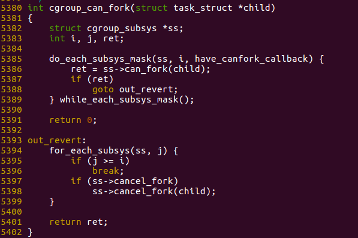
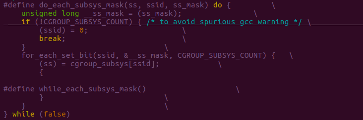
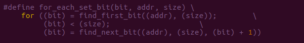
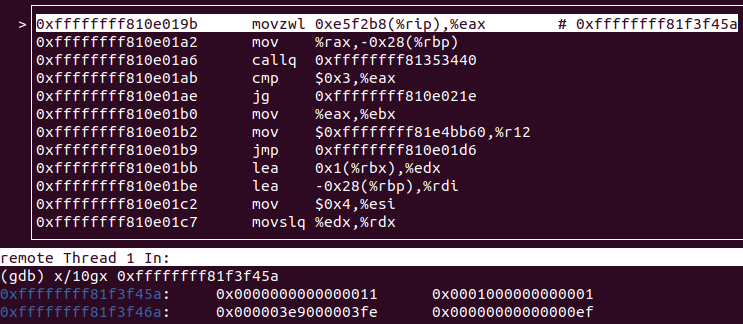
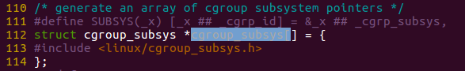
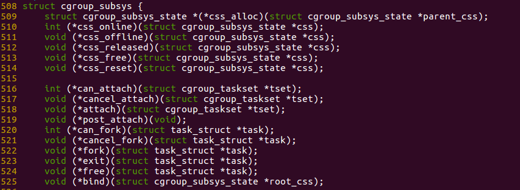
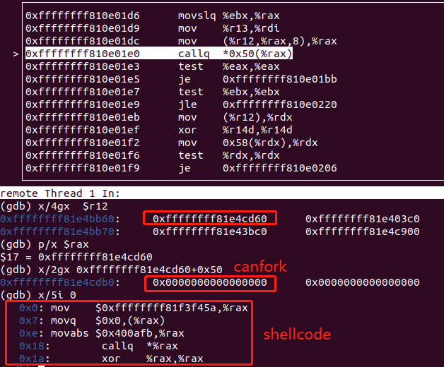
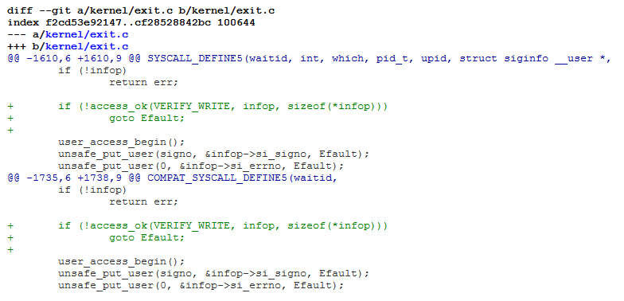
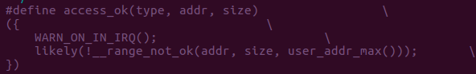

---

layout: post

title: 'CVE-2017-5123 waitid分析'

date: '2020-07-20'

header-img: "img/home-bg.jpg"

tags:
     - kernel cve analyze  
author: 'De4dCr0w'

---

<!-- more -->

### 前言

Exp信息： (Kernel 4.14.0-rc4+)

### 漏洞分析

waitid 系统调用代码：
```
SYSCALL_DEFINE5(waitid, int, which, pid_t, upid, struct siginfo __user *,                              
        infop, int, options, struct rusage __user *, ru)                                               
{                                                                                                      
    struct rusage r;                                                                                   
    struct waitid_info info = {.status = 0};                                                           
    long err = kernel_waitid(which, upid, &info, options, ru ? &r : NULL);                             
    int signo = 0;                                                                                     
                                                                                                       
    if (err > 0) {                                                                                     
        signo = SIGCHLD;                                                                               
        err = 0;                                                                                       
        if (ru && copy_to_user(ru, &r, sizeof(struct rusage)))                                         
            return -EFAULT;                                                                            
    }                                                                                                  
    if (!infop)                                                                                        
        return err;                                                                                                                                                              
                                                                                                       
    user_access_begin();                                                                               
    unsafe_put_user(signo, &infop->si_signo, Efault);                                                  
    unsafe_put_user(0, &infop->si_errno, Efault);                                                      
    unsafe_put_user(info.cause, &infop->si_code, Efault);                                              
    unsafe_put_user(info.pid, &infop->si_pid, Efault);                                                 
    unsafe_put_user(info.uid, &infop->si_uid, Efault);                                                 
    unsafe_put_user(info.status, &infop->si_status, Efault);                                           
    user_access_end();                                                                                 
    return err;                                                                                        
Efault:
……
```

用户态api

```
int waitid(idtype_t idtype, id_t id, siginfo_t *infop, int options);
```
由siginfo传入用户层传入的数据，unsafe_put_user将数据填充到infop结构体中。siginfo 部分结构如下：

```
typedef struct siginfo {                                                                                
    int si_signo;                                                                                       
    int si_errno;                                                                                       
    int si_code;                                                                                        
                                                                                                        
    union {                                                                                             
        int _pad[SI_PAD_SIZE];     
……
```

漏洞成因：

在waitid系统调用中，因为没有检查用户态传入的siginfo指针的有效性，可传入内核地址，导致用户态可以任意内核地址写漏洞。

### 漏洞利用一：

关闭mmap_min_addr 和 SMEP 防护，关闭mmap_min_addr，使得可以mmap 0 地址。

通过改写have_canfork_callback变量。将其第一个字节改为0x11进而执行未定义的can_fork，并mmap 0地址，写入shellcode，完成提权。
函数调用链为:
```
fork->do_fork->copy_process->cgroup_can_fork->do_each_subsys_mask->for_each_set_bit

```

 

 

 

 
将上述的宏展开为：

```
int cgroup_can_fork(struct task_struct *child)                                                         
{   
    struct cgroup_subsys *ss;                                                                          
    int i, j, ret;                                                                                     
    
    do {                                                                  
        unsigned long __ss_mask = (have_canfork_callback);               
        if (!CGROUP_SUBSYS_COUNT) { /* to avoid spurious gcc warning */
            (ssid) = 0;                
            break;                       
        }                         
        size = CGROUP_SUBSYS_COUNT; 
        addr = &__ss_mask
        for ((ssid) = find_first_bit((addr), (size)); (ssid) < (size);(ssid) = find_next_bit((addr), (size), (ssid) + 1))
{   
            (ss) = cgroup_subsys[ssid];            
        	ret = ss->can_fork(child);                                                                     
            if (ret)  goto out_revert;                
        }                              
    } while (false);                                                                        
    return 0;                                                                                          
out_revert:
    for_each_subsys(ss, j) {                                                                           
        if (j >= i)                                                                                    
            break;
        if (ss->cancel_fork)
            ss->cancel_fork(child);                                                                    
    }                                                                                                  
    return ret;                                                                                        
}              
```

其中
```
#define find_first_bit(addr, size)  find_next_bit((addr), (size), 0)
```

find_next_bit表示从第offset个bit位开始，在offset~size区间的第一个值为1的bit位置，如果没有找到满足条件的bit位则返回最大尺寸size。
函数原型：
```
/*
* 在addr表示的bit位图数组中，查找offset~size区间中第一个1bit位的索引值
* addr: unsigned long数组,每个元素表示sizeof(unsigned long)*8个bit位
* size: 查找结束位置
* offset:查询起始位置
*/
```

全局变量have_canfork_callback地址为0xffffffff81f3f45a，实际上是一个位图，原本填充的是0，在调用完find_first_bit，返回的是size大小4，所以跳出循环，不执行ss->can_fork(child); 而通过漏洞在0xffffffff81f3f45a填充signo(0x11)：

 
 

此时返回的是0，因为0x11第一个为1的bit是bit0，所以继续执行：

```
(ss) = cgroup_subsys[0];            
ret = ss->can_fork(child);      
```

其中cgroup_subsys是一个全局的cgroup_subsys struct的指针数组：

 
 
其中保存了一系列的cgroup_subsys结构体指针：
 
  

所以只要将全局变量have_canfork_callback设置为value，满足value&0xf != 0，就可以找到结构体指针数组，并调用can_fork（函数地址默认填充为\x00），最后跳转到0地址执行shellcode提权。

 
 
注：这种方式需要关闭mmap_min_addr 和 SMEP 防护。

利用代码：
https://github.com/nongiach/CVE/blob/master/CVE-2017-5123/exploit/exploit_null_ptr_deref.c

### 漏洞利用二

nsafe_put_user在访问无效内存地址时不会崩溃，仅返回-EFAULT。因此可以遍历内核地址，直到找到一个有效的内核地址。

```
for(i = (char *)0xffff880000000000; ; i+=0x10000000) {
    pid = fork();
    if (pid > 0) 
    {
        if(syscall(__NR_waitid, P_PID, pid, (siginfo_t *)i, WEXITED, NULL) >= 0) 
        {
            printf("[+] Found %pn", i);
            break;
        }
    }
    else if (pid == 0)
        exit(0);
}
```

找到堆的基址，然后通过不停fork出子进程进行堆喷，通过驱动获取每个进程cred->euid和cred->uid的地址，通过waitid：unsafe_put_user(0, &infop->si_errno, Efault); 写0的操作，覆盖cred进行提权。

这只是实验性的利用，要通过驱动获取地址观察cred的大概位置。也可以直接根据驱动获取的cred的地址进行写入，可直接提权。

参考链接：

https://reverse.put.as/2017/11/07/exploiting-cve-2017-5123/

https://blog.csdn.net/weixin_30394633/article/details/96265433

### 漏洞利用三

```
struct rusage r;                                                                                   
    struct waitid_info info = {.status = 0};                                                           
    long err = kernel_waitid(which, upid, &info, options, ru ? &r : NULL);                             
    int signo = 0;                                                                                                  
    if (err > 0) {                                                                                     
        signo = SIGCHLD;                                                                               
        err = 0;                                                                                       
        if (ru && copy_to_user(ru, &r, sizeof(struct rusage)))                                         
            return -EFAULT;                                                                            
}           
```

由于struct rusage r; 未初始化，可能存在内核地址，之后通过copy_to_user进行信息泄露：

用户态调用：
```
syscall(__NR_waitid, P_PID, pid, NULL, WEXITED|WNOHANG|__WNOTHREAD, &rusage);   
```

之后找到SELINUX_ENFORCING、SELINUX_ENABLED，通过写0，可以利用该漏洞关闭SELinux：

```
#define SELINUX_ENFORCING 0xf1cc90
#define SELINUX_ENABLED 0xcb1350     
```                  
        
利用代码：

https://www.openwall.com/lists/oss-security/2017/10/25/2/1

### 漏洞利用四：绕过Chrome沙箱

参考链接：

https://paper.seebug.org/451/

利用代码：

https://github.com/salls/kernel-exploits/blob/master/CVE-2017-5123/exploit_smap_bypass.c

绕过docker容器：

https://www.twistlock.com/labs-blog/escaping-docker-container-using-waitid-cve-2017-5123/


### 参考链接

复现环境：https://github.com/nongiach/CVE/tree/master/CVE-2017-5123

分析文章：

https://bbs.pediy.com/thread-247014.htm

https://paper.seebug.org/451/

补丁：

  

补丁就是添加了access_ok来判断infop传进来的地址是否为用户地址，其实就是判断地址是否是在用户空间的范围内：

 
 
补丁链接：

https://git.kernel.org/pub/scm/linux/kernel/git/torvalds/linux.git/commit/?id=96ca579a1ecc943b75beba58bebb0356f6cc4b51

补丁commit：96ca579a1ecc943b75beba58bebb0356f6cc4b51 

